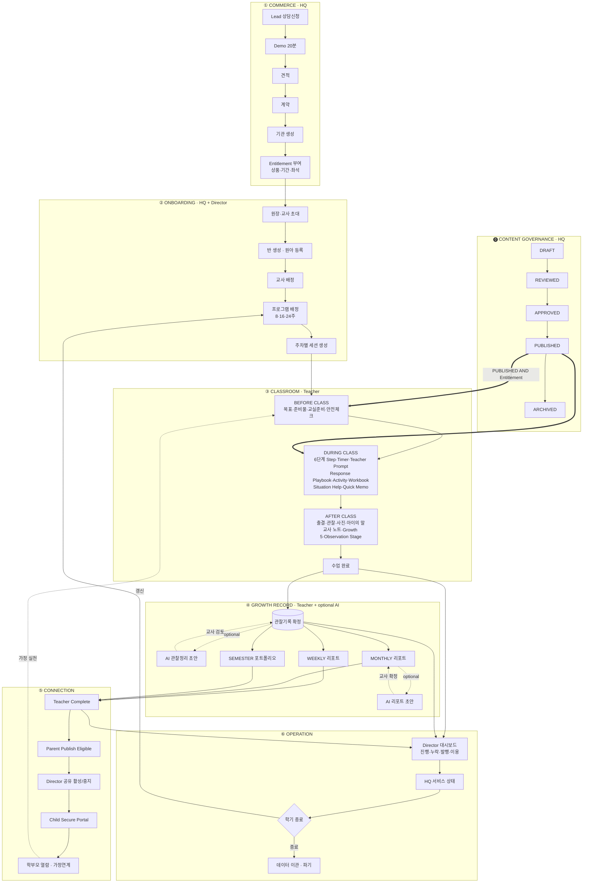

# Project Charter — SOYE KIDS TeachAble Art Play SaaS Platform 2.0

| | |
|---|---|
| 문서 상태 | PHASE 01 승인본 |
| 작성 기준일 | 2026-09-26 |
| 대상 독자 | PM · UX Designer · DB Architect · 개발자 · 교육기획 · 사업 |
| 상위 문서 | 없음 (본 문서가 프로젝트 최상위 기준문서) |
| 관련 문서 | [decision-log.md](./decision-log.md) · [../01-product/product-definition.md](../01-product/product-definition.md) · [../01-product/mvp-scope.md](../01-product/mvp-scope.md) · [../01-product/content-governance.md](../01-product/content-governance.md) · [../01-product/open-items.md](../01-product/open-items.md) |

---

## 1. 프로젝트 목적

### 1-1. 왜 지금 2.0인가

TeachAble Art Play 1.0은 두 개의 제품이 나란히 존재하는 상태다.

- 한쪽에는 **교육 콘텐츠와 교사용 가이드**가 있다. 24주(현재 확정분 8주) 분량의 마음동화·EBOOK·VOD·MV·음원·워크북·창의키트와, 주차별 15섹션 표준 규격을 갖춘 교사용 수업가이드가 존재한다.
- 다른 한쪽에는 **웹 플랫폼**이 있다. 기관·반·원아 관리, 수업 세션, 출결, 관찰기록, 활동사진, AI 기록정리, 성장리포트, 학부모 공유, 원장 대시보드, 본사 운영기능이 상용 수준으로 구현되어 있다.

문제는 **이 둘이 만나지 않는다**는 것이다. 판매하는 콘텐츠는 플랫폼 밖에 있고, 확정된 교사용 가이드는 교사 화면에 도달하지 않으며, 판매 중인 주간 리포트는 제품 안에 실체가 없고, 상품·계약 개념은 데이터베이스에 존재하지 않는다.

2.0의 목적은 **새 제품을 만드는 것이 아니라, 이미 있는 두 자산을 하나의 흐름으로 연결하는 것**이다.

### 1-2. 프로젝트 목적 선언

> 유치원이 TeachAble Art Play를 도입하면, **콘텐츠 제공 → 수업 운영 → 관찰 기록 → 성장 리포트 → 학부모 소통 → 원장 운영관리 → 상품·계약**이 하나의 시스템 안에서 끊기지 않고 흐르게 한다.
>
> 그 결과로
> - **교사**는 수업 준비에 쓰던 시간을 아이를 보는 데 쓴다.
> - **학부모**는 사진 한 장 대신 아이의 변화에 대한 설명을 받는다.
> - **원장**은 놓친 기록과 미발행 리포트를 먼저 발견한다.
> - **본사**는 기관·계약·콘텐츠를 한 곳에서 관리한다.
>
> 그리고 이 전부가 **아이를 평가하지 않으면서** 이루어진다.

### 1-3. 성공의 정의

| 층위 | 성공 기준 |
|---|---|
| **교사** | 주당 추가 업무 60분 이내 / 반. 관찰 15명 20분, 주간 리포트 1명 3분 |
| **학부모** | 공유 링크 열람률 70% 이상 |
| **원장** | 미기록 세션 48시간 내 조치율 80% |
| **본사** | Pilot → 정규 계약 전환 |
| **제품** | 크로스테넌트 노출 0건 (무관용) · Class Mode 중 데이터 손실 0건 |

### 1-4. 명시적 비목표 (Non-Goals)

| 하지 않는 것 | 이유 |
|---|---|
| 아동 발달 평가·진단 | 점수·등급·발달수준·또래비교 필드를 스키마에 만들지 않는다 |
| 교육효과 수치 산출 ("창의성 +37%") | 근거 없는 marketing metric을 제품이 만들지 않는다 |
| AI 자동 리포트 발행 | 교사 확정 없이 어떤 문장도 학부모에게 가지 않는다 |
| 알림장·사진 공유 앱 | 사진은 리포트 근거로서만 선별 노출된다 |
| 일반 LMS | 누리과정 기반 유아 예술·창의 프로그램에 특화 |
| B2C 콘텐츠 구독 | 기관 단위 계약. 학부모는 계정 없이 열람 |
| 교사 성과 평가 | 교사 관련 지표는 **지원 필요 신호**이지 평가가 아니다 |

---

## 2. 최종 Product Definition

### 2-1. 한 문장 정의

> **TeachAble Art Play 2.0은 유치원이 24주 예술·창의 교육 프로그램을 도입해 운영하는 전 과정 — 콘텐츠 제공, 수업 진행, 관찰 기록, 성장 리포트, 학부모 소통, 원장 운영관리, 상품·계약 — 을 하나의 흐름으로 연결하는 B2B 교육운영 SaaS다.**

### 2-2. 구성 요소

| # | 구성 | 설명 |
|---|---|---|
| 1 | **콘텐츠 플랫폼** | 주차별 EBOOK·마음동화·VOD·MV·음원·워크북·교사가이드·활동자료를 권한에 따라 제공한다. 콘텐츠는 **PUBLISHED 상태**와 **Entitlement**를 모두 통과해야 노출된다 |
| 2 | **수업 운영 도구 (Class Mode)** | 교사가 수업 전·중·후를 한 화면 흐름에서 수행한다. 원본 교사가이드 15섹션이 화면 구조가 된다 |
| 3 | **관찰 기록 시스템** | 교사가 아이의 말·시도·방법 변경을 그대로 적고, SOYE Growth 5 지표와 Observation Stage를 **직접** 선택한다 |
| 4 | **성장 리포트 시스템** | Weekly / Monthly / Semester 3계층. 근거는 스냅샷으로 동결되고, AI는 초안만 만들며 교사가 확정한다 |
| 5 | **학부모 소통 채널 (Child Secure Portal)** | 계정 없이 안전한 링크로 아동 단위 누적 기록을 본다 |
| 6 | **원장 운영 도구** | 반별 진행·기록 누락·리포트 발행·콘텐츠 이용을 본다. 교육효과 점수는 만들지 않는다 |
| 7 | **본사 운영 시스템** | 기관·상품·계약·Entitlement·커리큘럼·콘텐츠·배송·리드·지원 |

### 2-3. 제품 경계

```
                  ┌──────────────────────────────────────────┐
                  │  TeachAble Art Play 2.0 (제품 경계)       │
                  │                                          │
  SOURCE          │  Content ─ Curriculum ─ Class Mode        │   Parent
  DOCUMENT  ─────▶│     │          │            │            │──▶ Portal
  (교육 원본)      │     └──────────┴────────────┤            │   (계정 없음)
                  │                Observation ─ Growth      │
  Product/        │                    │           Report    │
  Contract  ─────▶│  Entitlement ──────┴────────────┘        │──▶ Director
  (계약)          │                                          │   Dashboard
                  └──────────────────────────────────────────┘
                              ▲
                       HQ Operation (본사)
```

---

## 3. 사용자

### 3-1. SOYE HQ — 본사 운영자 / 영업

| | |
|---|---|
| **Goal** | 기관을 안정적으로 도입·유지시키고, 콘텐츠·커리큘럼을 품질 통제하며, 계약·배송·지원을 누락 없이 처리한다 |
| **Pain Point** | 기관 프로비저닝이 수동 다단계다. 계약 정보가 시스템에 없어 스프레드시트와 병행한다. 콘텐츠 승인 이력이 남지 않는다 |
| **Primary Job** | 기관 프로비저닝 · Entitlement 설정 · 커리큘럼/콘텐츠 승인·발행 · 리드 처리 · 서비스 상태 점검 |
| **Key Value** | "우리 기관이 지금 어디까지 준비됐는지"를 한 화면에서 판단 |
| **권한 원칙** | `admin`과 `sales`를 분리한다. 영업은 리드·기관 메타데이터만 보고, **아동 관찰기록·활동사진에 접근하지 않는다** |

### 3-2. Director — 원장 / 원감

| | |
|---|---|
| **Goal** | 교육과정이 계획대로 운영되는지 확인하고, 학부모 신뢰를 확보하고, 교사 부담을 관리한다 |
| **Pain Point** | 교사마다 기록 품질이 다르다. 학부모 문의에 근거로 답할 자료가 없다. 평가·장학 때 누리과정 연계를 증빙할 산출물이 없다 |
| **Primary Job** | 반별 진행 확인 · 기록 누락 후속조치 · 완료 리포트 검토 · Child Portal 공유 활성/중지 · 콘텐츠 이용 확인 |
| **Key Value** | **"놓친 것을 시스템이 먼저 알려준다"** |
| **권한 경계** | 관찰 원문 작성 불가 (그 자리에 있었던 교사만). **교사의 draft 리포트와 AI draft는 보지 않는다.** 주간 리포트 매 건 사전승인 책임 없음 |

### 3-3. Teacher — 담임교사

| | |
|---|---|
| **Goal** | 수업을 무리 없이 진행하고, 아이의 모습을 기록으로 남기고, **퇴근 시간을 지킨다** |
| **Pain Point** | 종이/PDF 가이드를 따로 본다. 콘텐츠 준비가 별도다. 관찰기록은 수업 후 기억에 의존한다. 리포트 작성이 추가 업무로 쌓인다 |
| **Primary Job** | 수업 준비 확인 → 수업 진행 → 출결·관찰·사진·아이의 말 기록 → Growth 5/Stage 선택 → 리포트 검토·확정 |
| **Key Value** | **"준비·진행·기록이 한 화면에서 끝난다"** |
| **최우선 제약** | **교사 작업량이 제품의 성패를 결정한다.** 워크북 정량 입력 MVP 제외, Observation Stage 선택형 설계가 모두 여기서 나온다 |

### 3-4. Parent — 보호자

| | |
|---|---|
| **Goal** | 우리 아이가 무엇을 경험하고 어떻게 달라지고 있는지 이해한다 |
| **Pain Point** | 사진 한 장과 "즐겁게 참여했어요" 한 줄로는 알 수 없다. 지난 기록을 다시 볼 수 없다 |
| **Primary Job** | 링크 열기 → 이번 주 읽기 → 지난 기록·학기 포트폴리오 보기 → 가정연계 실천 |
| **Key Value** | **"우리 아이의 이야기가 쌓인다"** |
| **핵심 제약** | 계정 없음. 링크 보안 원칙(256bit·해시만 저장·fragment 전송·만료·중지) 유지. 사진 노출은 보호자 동의 확인 후 |

---

## 4. Core Product Loop



### Loop 성립 조건 (설계 제약)

| # | 조건 | 위반 시 |
|---|---|---|
| **C-1** | 콘텐츠 노출 = `PUBLISHED` **∧** `Entitlement` | 미승인 콘텐츠가 교실에 나가거나, 미계약 기관이 24주를 본다 |
| **C-2** | AI 없이도 ③④⑤가 완주된다 | AI 장애 시 상품 기능 정지 |
| **C-3** | 관찰이 없으면 리포트가 없다 | 근거 없는 리포트 = 신뢰 붕괴 |
| **C-4** | Growth 5 / Observation Stage는 교사만 입력 | AI 판정 = 평가 도구로 전환 |
| **C-5** | 학부모 노출 = 교사 Complete **∧** 원장 공유 활성 | 미검토 문장 유출 |
| **C-6** | 사진은 파기경로 → 동의 → 선별 → 스냅샷 → 노출 순서 | 개인정보 사고 |
| **C-7** | 계약 종료 시 이관·파기 경로가 존재한다 | 데이터 잔존 |

---

## 5. Architecture Invariants

> **불변식이다. 2.0의 어떤 기능도 이것을 근거로 예외를 요구할 수 없다.**
> 근거: REPOSITORY AUDIT 2 (DB / RLS / 권한 / AI 심층 분석). 6개 크로스테넌트 공격 시나리오 전부 방어 확인, CRITICAL 결함 0건.

| # | 불변식 | 내용 | 무너지면 |
|---|---|---|---|
| **AI-1** | **RLS-first · `service_role` 미사용** | 모든 쓰기 RPC는 `SECURITY INVOKER`. Secret Key는 Auth Admin 1곳에서만 사용 | 스키마의 모든 안전 보증이 동시에 무효 |
| **AI-2** | **`private` schema helper 체계** | 권한 판정 함수 전부 `SECURITY DEFINER` + `set search_path = ''` + `auth.uid()` 기반. **user_id를 인자로 받지 않는다** | 호출자가 다른 사람인 척할 수 있다 |
| **AI-3** | **복합 FK 테넌트 무결성** | `(id, organization_id, class_id)` 형태 참조. service_role·superuser·직접 SQL로도 테넌트 조합 위반 불가 | RLS 우회 경로가 생긴다 |
| **AI-4** | **BEFORE `enforce_*` 트리거 = 최종 판정자** | RLS는 service_role을 통과시키지만 트리거는 통과시키지 않는다 | 방어의 최하층이 사라진다 |
| **AI-5** | **컬럼 단위 GRANT** | `attendance_status`만, `record_status`만. `created_by`·`completed_at`·집계 컬럼은 클라이언트가 만질 수 없다 | 서버 계산값이 위조된다 |
| **AI-6** | **낙관적 동시성 (`clock_timestamp()` 토큰)** | `updated_at`을 동시성 토큰으로 사용. `now()`는 트랜잭션 고정이라 토큰으로 쓸 수 없다 | 동시 수정이 조용히 덮어써진다 |
| **AI-7** | **비대칭 권한** | INSERT는 `is_class_teacher`(반 active), UPDATE·SELECT는 `is_assigned_class_teacher`(반 상태 무관). "새로 쓰는 건 운영 중인 반만, 고치는 건 과거 반도" | 보관된 반의 기록을 정정할 수 없거나, 종료된 반에 신규 기록이 생긴다 |
| **AI-8** | **Supabase Client 5분리** | `server` / `client` / `proxy` / `admin` / `public`. 각 런타임의 권한 경계 | 권한 경계가 섞인다 |
| **AI-9** | **Auth 게이트 독립 재검사** | `requireAdmin` / `requireDirector` / `requireTeacher` / `requireStaff`를 페이지·액션마다 독립 호출 | Proxy 우회 호출이 통과한다 |
| **AI-10** | **AI 6계층 분리** | 관찰원문 → AI초안 → 교사확정 → 근거스냅샷 → AI리포트초안 → 최종본문. **계층을 합치지 않는다** | "누가 쓴 문장인가"를 추적할 수 없다 |
| **AI-11** | **근거 스냅샷 동결** | 리포트는 발행 시점 스냅샷만 사용. 라이브 관찰기록을 재조회하지 않는다 | 발행된 리포트를 설명할 수 없게 된다 |
| **AI-12** | **stale 2중 감지** | `source_observation_updated_at` / `source_ai_updated_at` / `source_revision` | 낡은 AI 산출물이 유효한 것처럼 남는다 |
| **AI-13** | **`prompt_version` · `model` · `provider` 기록** | 모든 AI 산출물에 생성 규칙을 남긴다 | AI 설명가능성이 사라진다 |
| **AI-14** | **학부모 공유 보안 설계 전체** | 256bit 토큰 · SHA-256만 저장 · `#fragment` → POST body · pass-the-hash 방지 · 실패 무구분 · `anon` 전용 GRANT · `no-store`/`noindex` | 링크 열거·존재 탐지·로그 유출 |
| **AI-15** | **평가하지 않는다** | 점수·등급·순위·발달단계·위험도 컬럼이 스키마에 **존재하지 않는다** | 제품 철학이 붕괴한다 |
| **AI-16** | **마이그레이션 주석 문화** | "변경하지 않은 것(명시)" 블록, 설계 근거, 반례를 계속 기록한다 | 다음 사람이 왜 그렇게 되어 있는지 알 수 없다 |
| **AI-17** | **DB 변경 전 회귀테스트** | RLS/Auth/Tenant isolation 회귀테스트를 먼저 구축한다 | 기존 방어가 깨졌는지 알 수 없는 상태로 변경한다 |

### 변경 절차

불변식을 바꾸려면 다음을 모두 충족해야 한다.

1. `decision-log.md`에 새 Decision ID로 기록
2. 대체 방어 수단을 명시
3. 회귀테스트로 새 보증을 고정
4. 영향받는 RLS 정책 전수 재검토 결과 첨부

---

## 6. 확정된 Product Decisions

> 전체 목록과 결정 이유는 [decision-log.md](./decision-log.md) 참조. 여기에는 요약만 둔다.

### 6-1. 커리큘럼 · 콘텐츠

| ID | 결정 |
|---|---|
| DEC-001 | 24주 전체를 플랫폼화한다. 콘텐츠 거버넌스 5단계(DRAFT/REVIEWED/APPROVED/PUBLISHED/ARCHIVED)를 둔다 |
| DEC-002 | 콘텐츠(EBOOK·마음동화·VOD·MV·음원·워크북·Teacher Guide·활동자료)를 플랫폼 안에서 제공한다 |
| DEC-003 | Teacher Guide를 PDF 다운로드만으로 제공하지 않고 실제 수업 화면에서 제공한다 |
| DEC-023 | 50분 6단계 골격(도입5·그림책8·활동약속2·핵심활동20·미술창작10·마무리5 + 워크북 별도10)을 원본 표준화 규격 기준으로 채택한다 |
| DEC-026 | 성장키워드 8개(시작·끈기·표현·발견·자존감·협력·기다림·공동체)는 Week 주제다 |
| DEC-028 | Teacher Guide 15섹션 구조가 Curriculum 데이터 모델의 사양서다 |

### 6-2. 수업 운영

| ID | 결정 |
|---|---|
| DEC-004 | Class Mode를 신규 핵심 기능으로 개발한다 (BEFORE / DURING / AFTER) |
| **DEC-029** | **Class Mode P0에서 EBOOK·VOD·MV·음원의 인앱 재생을 제외한다.** P1 Content Delivery Layer 이후 구현 |

### 6-3. 관찰 · 성장

| ID | 결정 |
|---|---|
| DEC-005 | SOYE Growth 5(표현 다양성·형태·공간 구성·창의적 시도·활동 참여·몰입·자기 설명·소통)를 유일한 성장 지표 체계로 한다 |
| DEC-006 | 구 미술 5영역은 과거 기록을 변경하지 않고 inactive/historical 처리한다. 새 Growth 5는 별도 code로 만든다 |
| DEC-007 | Observation Stage 4단계(기록 없음/함께/보고 나서/스스로)는 교사가 직접 선택한다. AI가 판정·추천하지 않는다 |
| DEC-008 | Observation Stage는 점수·등급·발달수준·또래평가가 아니라 "이번 활동에서 관찰된 참여/지원 방식"이다 |
| DEC-012 | 워크북 정량 데이터(색 개수·채운 비율 등)는 MVP 필수 입력으로 만들지 않는다 |
| DEC-025 | 원본 교사가이드 §12의 주차별 관찰영역은 지표가 아니라 차시별 ObservationFocus(교사 안내)다 |

### 6-4. 리포트

| ID | 결정 |
|---|---|
| DEC-010 | 리포트를 Weekly / Monthly / Semester 3계층으로 정의한다 |
| DEC-011 | 기존 3블록(`growth_changes`·`observation_summary`·`next_support`)을 폐기하지 않고 월간/학기에서 재사용한다 |
| DEC-015 | Semester Portfolio는 PDF 묶음이 아니라 아동 단위 누적 산출물로 설계한다 |
| DEC-024 | Weekly 리포트 서식은 원본 §12의 5항목(오늘의 활동·아이의 작품·아이의 말·교사 관찰·가정연계 Tip) + 다음 주 예고로 한다 |
| **DEC-030** | **Weekly Report에 원장의 매 건 사전승인을 요구하지 않는다.** Teacher Complete → Parent Publish Eligible. 원장은 완료 리포트 조회·누락 확인·공유 활성/중지·필요 시 검토를 담당한다. 교사 draft와 AI draft를 원장에게 노출하지 않는 RLS 원칙은 유지한다 |

### 6-5. AI

| ID | 결정 |
|---|---|
| DEC-009 | AI는 optional assistant다. 장애·API Key 미설정·quota 문제에도 수업·관찰·성장리포트가 정상 운영된다 |
| DEC-027 | 원본 표준화 규격 §5의 금지 표현 5범주를 AI 지침 + 제품 문구 검수 기준으로 승격한다 |

### 6-6. 학부모

| ID | 결정 |
|---|---|
| DEC-013 | `organization_members`에 `parent` role을 추가하지 않는다. 현재 secure share 구조를 Child Secure Portal로 발전시킨다 |
| DEC-014 | 사진 제공 순서는 삭제/파기 → 동의 → 교사 사진 선택 → report snapshot → parent exposure로 한다 |

### 6-7. 상품 · 계약

| ID | 결정 |
|---|---|
| DEC-016 | Product / Contract / Entitlement를 DB에서 표현한다. UI 숨김만 하지 않고 Server/DB 수준에서 feature gating한다 |
| DEC-017 | B2B/B2G 특성을 우선한다. 상담·견적·계약·기관활성화를 정상 지원하고, 온라인 결제는 Payment Adapter를 전제로 확장 가능하게 설계한다. PG 사업자는 미확정 |
| DEC-018 | 15명 기준·초과요금 정보는 상품 데이터로 관리하되, 정책 확정 전 자동 청구를 구현하지 않는다 |
| **DEC-031** | **정규 STARTER에 Director Dashboard를 포함하지 않는다는 상품 정의를 시스템에서 강제한다.** Pilot은 정규 STARTER와 다른 별도 entitlement로 취급해 검증에 필요한 Director Dashboard를 허용할 수 있게 한다. 정확한 feature 목록은 PHASE 03에서 확정 |

### 6-8. 데이터 · 품질

| ID | 결정 |
|---|---|
| DEC-019 | 누리과정 연결을 마케팅 문구가 아니라 실제 Curriculum 데이터로 만든다. 원본에 실제 존재하는 연계 수준을 우선 사용하고, 검증된 자료 없이 추측하지 않는다 |
| DEC-020 | 운영 사실 데이터의 최종 출처는 DATABASE다. Editorial Marketing Copy는 static content를 유지할 수 있으나 가격·주차·Growth 5·패키지 기능은 DB와 독립적인 값을 갖지 않는다 |
| DEC-021 | SaaS 2.0에서 DB/RLS를 본격 변경하기 전에 RLS/Auth/Tenant isolation 회귀테스트 체계를 만든다 |
| DEC-022 | REPOSITORY AUDIT 2가 식별한 "반드시 유지해야 할 구조"를 Architecture Invariants로 고정한다 |

### 6-9. Pilot

| ID | 결정 |
|---|---|
| **DEC-032** | **Pilot 범위를 1~2 기관 / 기관당 1~2반 / 반당 최대 15명 / 교사 2~4명 / 4주 / Week 1~4 / Weekly 리포트로 확정한다.** Pilot은 정규 판매상품이 아니라 도입 전 검증용 Offer다 |

---

## 7. 현재 Branch / 기준 commit

| | |
|---|---|
| **Branch** | `saas-v2` |
| **기준 commit** | `faa8f9a` (feat: sync public sales site with final v4 proposal) |
| **Main branch** | `main` |
| 선행 감사 | REPOSITORY AUDIT 1 (코드/기능) · AUDIT 2 (DB/RLS/AI/보안) · AUDIT 3 (24주/상품/리포트/콘텐츠) |
| 본 PHASE 코드 변경 | **0건** |

### 기술 스택 (기준 commit)

| 영역 | 값 |
|---|---|
| Framework | Next.js 16.3.0 (App Router). `src/proxy.ts`가 `middleware.ts`를 대체 |
| UI | React 19.2.8 · TypeScript 5 · Tailwind CSS v4 (`@tailwindcss/postcss`) · pretendard |
| Backend | Supabase (`@supabase/ssr` 0.12.4 · `@supabase/supabase-js` 2.112.3) · PostgreSQL RLS · Storage · Auth |
| AI | `openai` 7.8.0 — Responses API (`client.responses.create`), `store: false`, `maxRetries: 0` |
| 쓰기 경로 | Server Actions 중심 (18개 `*-actions.ts`), API Route Handler 4개 |
| DB | 마이그레이션 21개 파일 / 약 10,500줄 / 테이블 23개 / RLS 정책 66개 / RPC 13개 |
| 미보유 | 테스트 프레임워크 · zod · 결제 SDK · UI 컴포넌트 라이브러리 |

> 이 문서는 기준 commit의 사실을 기록한다. 코드가 변경되면 본 절을 갱신한다.

---

## 8. Source-of-Truth 원칙

### 8-1. 4계층

| 계층 | 정의 | 예 |
|---|---|---|
| **DB** | 운영 사실. 시스템 동작·과금·권한의 근거 | 상품코드·가격·Entitlement·Week·Growth 5·published 콘텐츠·관찰기록·리포트 |
| **SOURCE DOCUMENT** | 교육 원본. DB 콘텐츠의 출처이자 감사 근거 | 교사가이드(MD/PDF) · STARTER 표준화 규격 v1.0 · 강의안 · 상품소개서 v4 |
| **MARKETING CONTENT** | 편집 카피. 설득을 위한 문장·이미지 | 헤드라인 · 서브카피 · 섹션 구성 · DEMO 목업 |
| **GENERATED (AI)** | AI 산출. **절대 최종 출처가 아니다** | `generated_text` · `generated_growth_changes` 등 |

### 8-2. 항목별 판정

| 항목 | 최종 출처 | 비고 |
|---|---|---|
| 상품 코드 · 기간 · 가격 · 초과요금 정보 | **DB** | Marketing은 파생. 독립값 금지 |
| Entitlement · 패키지 기능 | **DB** | UI 숨김만으로 부족 |
| 계약 · 기간 · 좌석 | **DB** | |
| Curriculum 버전 · Week · Lesson · Step · Activity | **DB** | DB는 SOURCE DOCUMENT에서 이관 |
| **교육 내용의 정당성** | **SOURCE DOCUMENT** | DB가 원본과 다르면 원본이 옳다 (이관 오류) |
| 50분 골격 · 성장키워드 8개 | **SOURCE DOCUMENT** → DB | |
| Growth 5 · Observation Stage | **DB** | 신설 |
| ObservationFocus · Nuri 연계 | **SOURCE DOCUMENT** → DB | 원본 §12 · §3 |
| 금지 표현 목록 | **SOURCE DOCUMENT** | AI 지침 + UX 문구 검수 |
| Asset 목록·수량 | **DB** | Asset 파일 자체는 Storage/CDN |
| 관찰기록 원문 | **DB** (교사 입력) | AI가 덮지 않는다 |
| 리포트 근거 | **DB 스냅샷** | 라이브 재조회 금지 |
| 리포트 최종 본문 | **DB** (교사 확정) | AI 초안은 별 컬럼 |
| AI 산출물 | **GENERATED** | 출처가 아니다. 교사 확정 후에만 유효 |
| Weekly 리포트 5항목 서식 | **SOURCE DOCUMENT** → 제품 | 원본 §12 |
| 헤드라인 · 이미지 · DEMO 목업 | **MARKETING** | "DEMO" 표기 필수 |
| 법적 고지 | **MARKETING** (`src/data/legal.ts`) | 제품 사실과 **반드시 일치** |

### 8-3. 충돌 해소 규칙

| # | 규칙 |
|---|---|
| **R-1** | DB ≠ SOURCE DOCUMENT → **SOURCE가 옳다.** 이관 오류로 수정 |
| **R-2** | DB ≠ MARKETING (가격·주차·Growth 5·기능) → **DB가 옳다.** Marketing을 고친다 |
| **R-3** | DB ≠ MARKETING (카피·이미지) → 충돌이 아니다 |
| **R-4** | GENERATED ≠ DB → **DB가 옳다.** AI 산출물은 항상 초안 |
| **R-5** | SOURCE DOCUMENT 내부 충돌 → **추측하지 않는다.** 원자료 확인 후 확정 |
| **R-6** | SOURCE 부재 → **`SOURCE NOT AVAILABLE`로 기록한다.** 만들어 넣지 않는다 |
| **R-7** | 법적 고지 ≠ 제품 동작 → **즉시 수정 대상 (최고 우선)** |

### 8-4. 동기화 장치 (구축 대상)

| # | 장치 | 대상 규칙 |
|---|---|---|
| S-1 | 빌드 시 가격·기간·Growth 5·패키지 기능 DB 대조 검증 | R-2 |
| S-2 | Curriculum 이관 파이프라인 (원본 → DB) + diff 리포트 | R-1 |
| S-3 | 금지어 검수 스크립트 (제품 문구 · AI 출력 샘플) | DEC-027 |
| S-4 | 법무 문서 ↔ 제품 기능 체크리스트 | R-7 |
| S-5 | 원본 미해결 항목 추적 | R-5 · R-6 |

---

## 9. 문서 관리

| 항목 | 규칙 |
|---|---|
| 본 문서의 지위 | 프로젝트 최상위 기준문서. 다른 문서가 본 문서와 충돌하면 본 문서가 우선한다 |
| 결정 변경 | 반드시 `decision-log.md`에 새 Decision ID로 기록한 뒤 본 문서를 갱신한다 |
| 미확정 사항 | `../01-product/open-items.md`에서 관리한다. 본 문서에 추측을 적지 않는다 |
| PHASE 진행 | PHASE 02(User Flow/IA) → 03(상품/구매/SaaS) → 04(AI Growth) → 05(DB/ERD/Security Freeze) → 06(UX/UI) → 07(개발계획) → 08(구현) → 09(QA/Security/Pilot) → PRODUCTION |
