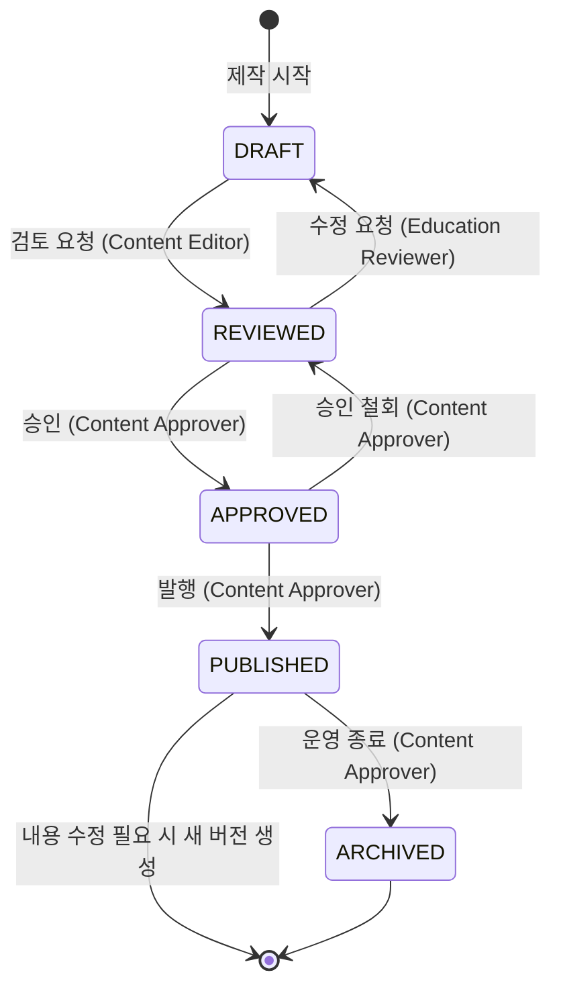

# Content Governance — TeachAble Art Play SaaS Platform 2.0

| | |
|---|---|
| 문서 상태 | PHASE 01 승인본 (제안 수준 — 구현 스키마는 PHASE 05에서 확정) |
| 작성 기준일 | 2026-09-26 |
| Branch / commit | `saas-v2` / `faa8f9a` |
| 관련 결정 | DEC-001 (거버넌스 5단계) · DEC-002 (콘텐츠 플랫폼 제공) · DEC-019 (Nuri 데이터) · DEC-020 (SoT = DB) · DEC-027 (금지 표현) · DEC-028 (15섹션 사양) · DEC-031 (Entitlement 강제) |
| 선행 문서 | [../00-project/project-charter.md](../00-project/project-charter.md) · [product-definition.md](./product-definition.md) |

---

## 0. 왜 거버넌스가 필요한가

SOYE 원본 교육자료는 **확정도가 균일하지 않다.**

| 범위 | 상태 |
|---|---|
| Week 1~6 | 표준화 규격 v1.0이 적용된 확정본 (15섹션 · 주차당 4,000~6,500자) |
| Week 7~8 | PDF는 존재하나 규격 미적용. 표준화 규격 문서 스스로 "원자료 없음"으로 기록 |
| Week 9~24 | `SOURCE NOT AVAILABLE` *[Historical baseline — updated by PHASE 03]*<br>**Updated 2026-09-27 — DEC-063 / PHASE 03**: Week 9~16 = **SOURCE EXISTS · CERTAINTY MIXED** (provenance: 9~16주 스탠다드 교사용 프로그램 설명서 PDF + 미기재 항목 초안) · Week 17~24 = **SOURCE EXISTS · CERTAINTY DRAFT / PROPOSAL** (provenance: 주제 원안 · 주차별 키워드 + 전체 초안 설계). 자료: `TeachAble_ArtPlay_24주_강의교안_데이터구조.pdf` — PROJECT EXTERNAL SOURCE (source verified during PHASE 03 review · original PDF exists in Project materials · PDF is not versioned inside this Git repository). **SOURCE EXISTS ≠ LOCAL REPO OPERATIONAL SOURCE ≠ PRODUCTION READY** — production-approved operational curriculum 미완료 |
| 미해결 데이터 | 대상 연령 · 워크북 페이지 수 · 음원 러닝타임 · 준비물 수량 기준 · 5주차 음원 중복 · 3주차 링 개수 등 7건 |
| 내부 불일치 | 프로그램 구성표의 성장 로드맵 7개 ≠ 성장 스토리 8개 |

확정도가 다른 자료를 **같은 상태로 다루면** 두 가지 사고가 발생한다.

1. **미완성 콘텐츠가 교실에 나간다.** 대상 연령이 미표기된 차시가 만 3세 반에 배정되거나, 워크북 페이지가 확정되지 않은 활동이 수업에 나간다.
2. **완성된 콘텐츠가 발행되지 않고 묶인다.** 누가 검토했는지·승인했는지 기록이 없으면 "이거 내보내도 되나요?"를 매번 사람에게 물어야 한다.

거버넌스 상태가 이 둘을 구분한다.

---

## 1. 상태 정의

| 상태 | 의미 | 누가 보는가 | 기관에 노출 | 다음 전이 |
|---|---|---|---|---|
| **DRAFT** | 제작 중. 내용이 바뀔 수 있다 | Content Editor · SOYES Admin | ❌ | → REVIEWED |
| **REVIEWED** | 내용 검토 완료. 교육적 타당성 · 금지표현 점검 통과 | HQ 전체 | ❌ | → APPROVED · → DRAFT |
| **APPROVED** | 승인 완료. 발행 가능 상태. **아직 기관에 안 보인다** | HQ 전체 | ❌ | → PUBLISHED · → REVIEWED |
| **PUBLISHED** | 발행. **Entitlement를 통과한 기관에 노출** | HQ + 기관 (권한 범위) | ✅ | → ARCHIVED |
| **ARCHIVED** | 운영 종료. 기존 배정 · 기록은 유지, 신규 배정 차단 | HQ + 기존 배정 기관 | 🟡 기존 배정만 | (전이 불가) |

### 1-1. APPROVED와 PUBLISHED를 나누는 이유

둘을 합치면 "승인했으니 지금 나간다"가 되어 **발행 시점을 통제할 수 없다.**

실제로 필요한 상황:

- Week 1~8을 모두 승인해 두고 **학기 시작일에 맞춰 함께 발행**하고 싶다
- 콘텐츠는 승인됐지만 **KIT 배송이 도착하지 않았다**
- 자산(VOD 파일)이 아직 업로드되지 않았다
- 특정 기관의 Entitlement 설정이 끝나지 않았다

`APPROVED`는 "내용에 문제가 없다", `PUBLISHED`는 "지금 쓸 수 있다"를 뜻한다.

### 1-2. ARCHIVED가 되돌아가지 않는 이유

`ARCHIVED`를 `PUBLISHED`로 되돌리면, 그 사이에 해당 콘텐츠로 수업하고 기록을 남긴 기관의 근거가 흔들린다. 되돌리고 싶은 상황은 실제로는 "새 버전을 발행하고 싶다"는 뜻이므로 **새 버전으로 처리한다.**

---

## 2. 전이 규칙

### 2-1. 전이 다이어그램



### 2-2. 전이 게이트

| 전이 | 게이트 조건 | 담당 Role |
|---|---|---|
| **DRAFT → REVIEWED** | 필수 섹션(§1·2·3·4·5·6·11·12·15)이 비어 있지 않다 | Content Editor |
| **REVIEWED → APPROVED** | ① 금지 표현 점검 통과 (§5 6범주)<br>② 필수 메타데이터 완비 (대상 연령 · 운영 시간 · 준비물 수량 기준)<br>③ 누리 연계 5행 존재<br>④ ObservationFocus 존재<br>⑤ 50분 골격 합계 검증 (6단계 합 = 50분) | Education Reviewer → Content Approver |
| **APPROVED → PUBLISHED** | ① 연결된 Asset이 모두 `PUBLISHED` 이상<br>② Program 버전이 확정됨<br>③ Entitlement 매핑 존재 | Content Approver |
| **PUBLISHED → ARCHIVED** | 대체 버전이 `PUBLISHED`이거나, 운영 종료가 확정됨 | Content Approver |
| **REVIEWED → DRAFT** | 사유 기록 필수 | Education Reviewer |
| **APPROVED → REVIEWED** | 사유 기록 필수 | Content Approver |

### 2-3. 불변 규칙

| # | 규칙 |
|---|---|
| **G-1** | **`PUBLISHED` 후 내용 수정 = 새 버전.** 기존 버전은 발행 기록의 근거로 남는다 |
| **G-2** | **반 배정(assignment)은 Program 버전에 고정된다.** 학기 중 콘텐츠가 바뀌어도 운영 중인 반은 영향받지 않는다 |
| **G-3** | **금지표현 점검은 `REVIEWED` 게이트에서 한다.** 원본 규격 §5를 체크리스트로 쓴다 |
| **G-4** | **모든 상태 전이에 who · when을 기록한다.** `reviewed_by/at` · `approved_by/at` · `published_by/at` · `archived_by/at` |
| **G-5** | **`ARCHIVED`는 되돌리지 않는다.** 되돌리고 싶으면 새 버전을 발행한다 |
| **G-6** | **Asset 교체는 자산 단위 버전이다.** Lesson을 재발행하지 않는다 |
| **G-7** | **노출 조건은 `PUBLISHED` ∧ `Entitlement`다.** 둘 중 하나만 통과해도 보이지 않는다 |
| **G-8** | **필수 항목 미완성 시 `APPROVED` 불가.** 원본 미해결 7건이 게이트 대상이다 |
| **G-9** | **상태 전이는 되돌릴 수 있는 방향으로만 허용한다.** `DRAFT ← REVIEWED ← APPROVED`는 가능, `PUBLISHED → APPROVED`는 불가 (이미 기관이 봤다) |

---

## 3. 적용 대상

| 대상 | 자체 상태 | 비고 |
|---|---|---|
| **Program** (커리큘럼 버전) | ✅ 독립 | 현재 `draft`/`published`/`archived` 3단계 → 5단계로 확장 |
| **Week** | ✅ 독립 | Program을 따르되 개별 보류 가능 (Week 7·8을 DRAFT로 두고 1~6만 PUBLISHED) |
| **Lesson** | ✅ 독립 | 현재 `draft`/`published`/`archived` → 5단계 |
| Step / TeacherPrompt / ResponsePlaybook | 🟡 Lesson 상태를 따른다 | 개별 상태를 주면 관리 비용이 가치를 넘는다 |
| Activity / ActivityItem | 🟡 Lesson 상태를 따른다 | 현재 `lesson_activities`에 자체 status 없음 — **유지** |
| Material / Preparation | 🟡 Lesson 상태를 따른다 | |
| NuriLink / ObservationFocus / GrowthLink | 🟡 Lesson 상태를 따른다 | |
| FamilyConnection / SituationPlaybook / QuickGuide | 🟡 Lesson 상태를 따른다 | |
| **Asset** (EBOOK · 마음동화 · VOD · MV · 음원 · 워크북 · Teacher Guide · 활동자료) | ✅ **독립** | 자산별 교체·버전이 실제로 발생한다 (VOD 재편집, 음원 리마스터) |
| Product / Contract | ❌ 별도 체계 | `draft` → `active` → `suspended` → `ended` |
| 관찰기록 / 리포트 | ❌ 별도 체계 | `draft` → `complete` (교사 작업물, 콘텐츠 아님) |

### 3-1. Week 단위 부분 발행 예시

```
Program  TAP-STARTER-08 v1.0        PUBLISHED
  ├─ Week 1  시작       PUBLISHED   ← 기관에 보인다
  ├─ Week 2  끈기       PUBLISHED
  ├─ Week 3  표현       PUBLISHED
  ├─ Week 4  발견       PUBLISHED
  ├─ Week 5  자존감     APPROVED    ← 승인됐지만 아직 안 보인다
  ├─ Week 6  협력       APPROVED
  ├─ Week 7  기다림     DRAFT       ← 규격 미적용
  └─ Week 8  공동체     DRAFT
```

이 구조가 **Pilot(Week 1~4)을 정식 STARTER(Week 1~8)보다 먼저 운영할 수 있게** 한다 (DEC-032).

---

## 4. Role

### 4-1. Role 정의

| Role | 권한 | 신규/기존 |
|---|---|---|
| **Content Editor** | DRAFT 생성 · 수정 · 삭제 · REVIEWED 요청 | 🔴 신규 (HQ 내부) |
| **Education Reviewer** | REVIEWED ↔ DRAFT · 교육 타당성 점검 · 금지표현 점검 | 🔴 신규 (교육 담당) |
| **Content Approver** | APPROVED · PUBLISHED · ARCHIVED · 승인 철회 | 🔴 신규 (최종 책임자) |
| **SOYES Admin** | 전체 (기존 `private.is_soyes_admin()`) | 🟢 기존 |
| **SOYES Sales** | **PUBLISHED 읽기만** | ⚠️ 현재 `admin`과 동일 → **분리 필요** (P0-15) |
| **Director** | PUBLISHED 읽기 (Entitlement 범위) | 🟢 기존 |
| **Teacher** | PUBLISHED 읽기 (Entitlement + 배정 범위) | 🟢 기존 |

### 4-2. 권한 매트릭스

| 동작 | Content Editor | Education Reviewer | Content Approver | SOYES Admin | SOYES Sales | Director | Teacher |
|---|---|---|---|---|---|---|---|
| DRAFT 생성·수정 | ✅ | ❌ | ❌ | ✅ | ❌ | ❌ | ❌ |
| DRAFT 조회 | ✅ | ✅ | ✅ | ✅ | ❌ | ❌ | ❌ |
| REVIEWED 요청 | ✅ | ❌ | ❌ | ✅ | ❌ | ❌ | ❌ |
| REVIEWED → DRAFT (수정 요청) | ❌ | ✅ | ✅ | ✅ | ❌ | ❌ | ❌ |
| REVIEWED → APPROVED | ❌ | ❌ | ✅ | ✅ | ❌ | ❌ | ❌ |
| APPROVED → PUBLISHED | ❌ | ❌ | ✅ | ✅ | ❌ | ❌ | ❌ |
| PUBLISHED → ARCHIVED | ❌ | ❌ | ✅ | ✅ | ❌ | ❌ | ❌ |
| PUBLISHED 조회 | ✅ | ✅ | ✅ | ✅ | ✅ | ✅ (Ent.) | ✅ (Ent.+배정) |
| Asset 업로드 | ✅ | ❌ | ✅ | ✅ | ❌ | ❌ | ❌ |
| Entitlement 매핑 | ❌ | ❌ | ✅ | ✅ | ❌ | ❌ | ❌ |

### 4-3. 겸직에 대한 실무 지침

단일 담당자 체제라면 초기에는 **Content Editor + Content Approver를 한 사람이 겸할 수 있다.**

**중요한 것은 역할이 코드에서 분리되어 있는 것**이고, 사람이 겸직하는 것은 운영 선택이다. 조직이 커지면 사람만 바꾸면 되고, 코드를 바꿀 필요가 없다.

단, **Education Reviewer는 가능하면 분리한다.** 만든 사람이 자기 콘텐츠의 금지표현을 검수하면 놓친다.

### 4-4. 기존 권한 구조와의 관계

현재 `private.is_soyes_admin()`은 `role in ('admin', 'sales')`로 판정하여 **영업 담당자가 admin과 동일한 DB 권한**을 갖는다. 콘텐츠 거버넌스를 도입하면서 이 구조를 다음으로 분리한다.

```
private.is_soyes_admin()        → role = 'admin' 만
private.is_soyes_sales()        → role = 'sales'  (신규)
private.has_content_role(role)  → Content Editor / Education Reviewer / Content Approver (신규)
```

**Architecture Invariant 준수**: 신규 helper도 `SECURITY DEFINER` + `set search_path = ''` + `auth.uid()` 기반이며 **user_id를 인자로 받지 않는다** (AI-2).

---

## 5. Versioning

### 5-1. 버전 대상

| 대상 | 버전 | 이유 |
|---|---|---|
| **Program** | `v1.0` · `v1.1` · `v2.0` | 커리큘럼 개정. 반 배정이 여기에 고정된다 |
| **Asset** | 자산별 독립 버전 | VOD 재편집, 음원 리마스터, 워크북 오탈자 수정 |
| Week / Lesson | Program 버전에 종속 | 개별 버전을 주면 조합 폭발 |

### 5-2. 버전 규칙

| # | 규칙 |
|---|---|
| **V-1** | `PUBLISHED` 상태의 Program 내용을 수정하려면 **새 버전을 만든다.** 기존 버전은 그대로 남는다 |
| **V-2** | **반 배정은 Program 버전에 고정된다.** `class_program_assignments`가 `(program_id, version)`을 참조한다 |
| **V-3** | 새 버전 발행 후에도 **기존 버전은 `PUBLISHED`를 유지**할 수 있다. 진행 중인 반이 있기 때문이다 |
| **V-4** | 기존 버전을 더 쓰지 않을 때 `ARCHIVED`로 전이한다. 이때도 **기존 배정은 계속 동작한다** |
| **V-5** | Asset 교체는 **Lesson을 재발행하지 않는다.** Asset 버전만 올린다 |
| **V-6** | 발행된 리포트의 근거 스냅샷은 **버전 변경의 영향을 받지 않는다** (Invariant AI-11) |

### 5-3. 버전 변경이 기록에 미치는 영향

```
Week 3 Lesson (Program v1.0)
   ↓ 교사가 수업 · 관찰 기록
관찰기록 → AI 초안 → 교사 확정문
   ↓ 리포트 근거로 스냅샷 동결
child_growth_report_sources.*_snapshot   ← Program v1.1 발행되어도 변하지 않는다
   ↓
학부모가 본 리포트                        ← 영원히 동일
```

> **이것이 v2.0에서도 유지해야 할 핵심 자산이다** (Invariant AI-11). 리포트가 무엇을 근거로 쓰였는지가 나중에 변하면, 그 리포트를 설명할 수 없게 된다.

---

## 6. Source Document 관계

### 6-1. 흐름

```
SOURCE DOCUMENT                    DB                          기관
(교육 원본)                        (운영 사실)                  (사용)

교사용 수업가이드 MD/PDF     ──▶   DRAFT                         ❌
표준화 규격 v1.0                     ↓ 검토
프로그램 강의안                     REVIEWED                      ❌
                                     ↓ 승인
                                   APPROVED                      ❌
                                     ↓ 발행
                                   PUBLISHED  ──[Entitlement]──▶ ✅
                                     ↓ 종료
                                   ARCHIVED                      🟡 기존 배정만
```

### 6-2. 이관 원칙 (Source-of-Truth R-1)

| # | 원칙 |
|---|---|
| **S-1** | **DB는 SOURCE DOCUMENT에서 이관된 값을 담는다.** DB가 원본과 다르면 **원본이 옳다** (이관 오류로 처리) |
| **S-2** | **이관 시 원본 추적 정보를 남긴다.** 어느 문서 · 어느 버전 · 어느 섹션에서 왔는지 |
| **S-3** | **원본에 없는 값을 만들지 않는다.** 미표기 항목은 `SOURCE NOT AVAILABLE`로 두고 `APPROVED` 게이트에서 걸린다 |
| **S-4** | **원본 내부 충돌은 추측으로 해소하지 않는다.** 원자료 확인 후 확정한다 (R-5) |
| **S-5** | **이관 파이프라인은 diff 리포트를 생성한다.** 원본이 갱신되면 DB와의 차이를 사람이 확인한다 |

### 6-3. 현재 원본 확보 현황

| 범위 | SOURCE | 이관 가능 | 최대 도달 상태 |
|---|---|---|---|
| Week 1~6 | ✅ 규격 확정본 (15섹션) | ✅ 즉시 | `PUBLISHED` (미해결 항목 해소 후) |
| Week 7~8 | ⚠️ PDF 존재 / 규격 미적용 | 🟡 부분 | `DRAFT` |
| Week 9~16 | 🔴 `SOURCE NOT AVAILABLE` *[Historical baseline — updated by PHASE 03]*<br>**Updated 2026-09-27 — DEC-063 / PHASE 03**: 🟡 **SOURCE EXISTS · MIXED** — PROJECT EXTERNAL SOURCE `TeachAble_ArtPlay_24주_강의교안_데이터구조.pdf` (9~16주 스탠다드 교사용 프로그램 설명서 PDF + 미기재 항목 초안) · repo 미포함 | ❌ → 🟡 미기재 항목 확정 · 규격 적용 · 승인 후 가능 (repo 이관 전) | — · **STANDARD는 DEC-063 기준 Production Service Ready 아님** |
| Week 17~24 | 🔴 `SOURCE NOT AVAILABLE` *[Historical baseline — updated by PHASE 03]*<br>**Updated 2026-09-27 — DEC-063 / PHASE 03**: 🟡 **SOURCE EXISTS · DRAFT / PROPOSAL** — 같은 PROJECT EXTERNAL SOURCE (주제 원안 · 주차별 키워드 + 전체 초안 설계) · repo 미포함 | ❌ → 초안 확정 · 규격 적용 · 승인 후 가능 | — · **PREMIUM은 DEC-063 기준 Production Service Ready 아님** |

> *Updated 2026-09-27 — DEC-063 / PHASE 03*: SOURCE EXISTS(원본 존재) ≠ LOCAL REPO OPERATIONAL SOURCE(repo에서 운영 데이터로 연결 가능) ≠ PRODUCTION READY(승인 콘텐츠 + 필수 기능 충족). 원본의 존재가 `APPROVED` · `PUBLISHED`를 뜻하지 않는다.

### 6-4. `APPROVED` 게이트에 걸리는 원본 미해결 항목

원본 표준화 규격 §7이 스스로 기록한 미해결 데이터가 승인 게이트의 실질 내용이 된다.

| # | 항목 | 상태 | 게이트 영향 |
|---|---|---|---|
| 1 | 대상 연령 (만 3·4·5세 / 혼합) | 전 주차 미표기 | 🔴 Program `age_group` 설정 불가 |
| 2 | 워크북 총 페이지 수 | 2주차만 12P 확인 | 🔴 워크북 Activity 매핑 |
| 3 | 음원 러닝타임 | 전 주차 미표기 | 🟡 Timer · 플레이어 (P1) |
| 4 | 준비물 수량 기준 (1인/1모둠/1반) | 일부 미표기 | 🟡 준비물 체크리스트 |
| 5 | 5주차 음원 4곡이 4주차와 동일 | 의도/오기 미확인 | 🔴 Asset 모델 (재사용 vs 오기) |
| 6 | 3주차 마음다리 링 개수·간격 | 미표기 | 🟡 Activity 상세 |
| 7 | Week 7·8 전체 원자료 | 없음 | 🔴 `DRAFT` 고정 |
| 8 | 프로그램 구성표 불일치 (성장로드맵 7 ≠ 성장스토리 8) | 규격문서가 8개 단일화 요청 | 🔴 Week 주제 확정 |
| 9 | 4주차 성장키워드 (`발견` 권고 vs `(씨앗)`) | 미확정 | 🔴 Week 주제 확정 |
| 10 | 가정연계 4·5·6주차 연속 중복 | 규격문서가 결정 요청 | 🟡 FamilyConnection |

> 이 목록은 [open-items.md](./open-items.md) Blocked By Content에서 추적한다.

---

## 7. PUBLISHED + Entitlement 노출 원칙

### 7-1. 노출 판정

```
콘텐츠가 기관/교사에게 보이는가?

  content.status == 'PUBLISHED'
        AND
  private.has_content_access(organization_id, program_id, week_no)
        AND
  (교사인 경우) private.is_assigned_class_teacher(class_id)
        AND
  organizations.status == 'active'
```

**네 조건 모두를 통과해야 보인다.** 하나라도 실패하면 조회 결과가 0건이다 (권한 오류가 아니라 없는 것으로 보인다).

### 7-2. Entitlement 예시 (DEC-031 — PHASE 03에서 최종 확정)

| 상품 | content_scope | features |
|---|---|---|
| **Pilot** | Week 1~4 | `weekly_report` · `teacher_class_mode` · `parent_portal` · **`director_dashboard`** (검증용) |
| **STARTER** | Week 1~8 | `weekly_report` · `teacher_class_mode` · `parent_portal` |
| **STANDARD** | Week 1~16 | STARTER + `director_dashboard` · `monthly_report` · `semester_report` |
| **PREMIUM** | Week 1~24 | STANDARD + `24_week_content` · `branding` · 기타 |

> 정확한 feature 목록은 PHASE 03에서 확정한다. 위는 방향 예시다.

### 7-3. 게이팅 계층 (DEC-016 · DEC-031)

| 계층 | 역할 | 우회 가능성 |
|---|---|---|
| ① **UI 숨김** | 사용자에게 보이지 않게 | 🔴 Server Action 직접 호출로 우회 |
| ② **Server 게이트** | `requireTeacher()` 등 뒤에서 `has_feature()` 검사 | 🟡 RLS가 없으면 다른 경로로 우회 |
| ③ **RLS 정책** | 조회·쓰기 자체를 차단 | 🟢 `service_role` 외에는 우회 불가 |
| ④ **BEFORE 트리거** | 쓰기 시 최종 검증 | 🟢 `service_role`도 우회 불가 |

> **DEC-031이 요구하는 것은 ①만으로 끝내지 않는 것이다.** 최소 ②+③, 쓰기 경로는 ④까지 적용한다.

### 7-4. Asset 노출의 추가 조건

Asset은 Lesson보다 조건이 하나 더 있다.

```
asset.status == 'PUBLISHED'
   AND  lesson.status == 'PUBLISHED'
   AND  has_content_access(...)
   AND  (서명 URL 발급 시) 만료 시간 내
```

| 요구 | 현재 관찰사진 패턴 | Asset에 적용 |
|---|---|---|
| private bucket | ✅ `observation-media` | ✅ 동일 원칙 |
| 서명 URL 단기 만료 | ✅ 15분 · DB 미저장 | ✅ 동일 |
| 경로 검증 정규식 | ✅ `{org}/{session}/{child}/{uuid}.{ext}` | Asset은 테넌트 무관 → 다른 구조 필요 |
| 메타 행 존재 요구 | ✅ 고아 객체 읽기 불가 | ✅ 동일 |
| 다운로드 허용 여부 | — | 🔴 신규 (VOD는 스트리밍, 워크북은 다운로드) |

---

## 8. 금지 표현 점검 (REVIEWED 게이트)

원본 표준화 규격 §5를 체크리스트로 사용한다 (DEC-027).

| 범주 | 금지어 | 대체 |
|---|---|---|
| **평가·진단** | 잘함/못함, 상·중·하, 우수, 부족, 미흡, 발달지연, 정상, 또래 대비 | 관찰된 행동을 그대로 서술 |
| **인과 단정** | 향상된다, 발달시킨다, 길러진다, 치료한다, 개선한다 | "~하는 경험을 합니다" |
| **통제** | 반드시 ~하게 한다, 끝까지 해야 한다 | "~할 수 있게 지원합니다" |
| **정답 유도** | 정답은 무엇일까요, 누가 제일 잘했나요 | "왜 그렇게 골랐어?" |
| **외부 서비스** | 키즈노트 | **학부모 성장리포트** |
| **비공식 영역** | 정서·자기조절을 누리과정 영역으로 표기 | **SOYE KIDS 핵심경험**으로 분리 |

### 8-1. 점검 범위

| 대상 | 점검 |
|---|---|
| Lesson 전 섹션 (특히 §1 · §6 · §11 · §12 · §14) | ✅ 필수 |
| TeacherPrompt (교사 멘트) | ✅ 필수 |
| ResponsePlaybook (아이 반응별 대응) | ✅ 필수 |
| FamilyConnection (보호자 전달 문장) | ✅ 필수 |
| ObservationFocus | ✅ 필수 |
| Asset 제목 · 설명 | ✅ 필수 |
| NuriLink | ✅ 필수 (비공식 영역 표기 확인) |

### 8-2. 자동화 (S-3 동기화 장치)

금지어 검수 스크립트를 두되, **금지어 목록만으로 한국어를 완전히 걸러낼 수 없다.** 원본 규격의 판단이 그렇다:

> *"금지어 목록으로 사후에 걸러 내는 방식은 한국어에서 반드시 새므로, '무엇을 쓰지 않는가'를 지침에 명시하고 마지막 판단은 사람에게 맡긴다."*

따라서 스크립트는 **1차 필터**이고, `REVIEWED` 전이는 **Education Reviewer의 판단**으로 이루어진다.

---

## 9. 감사 추적

### 9-1. 기록 항목 (G-4)

| 전이 | 기록 |
|---|---|
| DRAFT 생성 | `created_by` · `created_at` |
| DRAFT 수정 | `updated_by` · `updated_at` |
| → REVIEWED | `review_requested_by` · `review_requested_at` |
| REVIEWED → DRAFT | `revision_requested_by` · `revision_requested_at` · **`revision_reason`** |
| → APPROVED | `approved_by` · `approved_at` |
| APPROVED → REVIEWED | `approval_withdrawn_by` · `approval_withdrawn_at` · **`withdrawal_reason`** |
| → PUBLISHED | `published_by` · `published_at` |
| → ARCHIVED | `archived_by` · `archived_at` · **`archive_reason`** |

### 9-2. 기존 패턴 재사용

현재 스키마가 이미 쓰는 방식을 따른다.

| 원칙 | 현재 구현 |
|---|---|
| `created_by` / `updated_by`는 **트리거가 `auth.uid()`로 채운다** | ✅ `class_session_observations` 등 |
| GRANT 컬럼 목록에 감사 컬럼을 넣지 않는다 | ✅ 클라이언트가 위조할 수 없다 |
| `updated_at`은 `clock_timestamp()` | ✅ 동시성 토큰 겸용 (Invariant AI-6) |

---

## 10. 구현 시 열려 있는 항목

| # | 항목 | 이관 |
|---|---|---|
| 1 | 상태를 단일 컬럼으로 둘지, 전이 이력 테이블을 별도로 둘지 | PHASE 05 |
| 2 | Content Role을 `private.admin_users.role` 확장으로 둘지 별도 테이블로 둘지 | PHASE 05 |
| 3 | Week 단위 부분 발행을 Program 상태와 어떻게 조합할지 | PHASE 05 |
| 4 | Asset 저장 위치 (Supabase Storage vs 외부 CDN) 및 스트리밍 방식 | PHASE 05 |
| 5 | Asset 다운로드 허용/차단 정책 (자산 type별) | PHASE 03 |
| 6 | 자산 저작권·라이선스 범위 기록 방식 | PHASE 03 |
| 7 | 이관 파이프라인 구현 형태 (스크립트 vs Admin UI 입력) | PHASE 07 |

> 전체 미확정 목록은 [open-items.md](./open-items.md)에서 관리한다.
