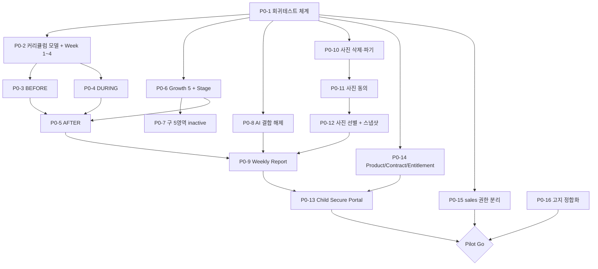

# MVP Scope — TeachAble Art Play SaaS Platform 2.0

| | |
|---|---|
| 문서 상태 | PHASE 01 승인본 |
| 작성 기준일 | 2026-09-26 |
| Branch / commit | `saas-v2` / `faa8f9a` |
| 선행 문서 | [../00-project/project-charter.md](../00-project/project-charter.md) · [../00-project/decision-log.md](../00-project/decision-log.md) · [product-definition.md](./product-definition.md) |
| 관련 결정 | DEC-029 (P0 인앱 재생 제외) · DEC-030 (Weekly 승인 불필요) · DEC-031 (Entitlement 강제 · Pilot 별도) · DEC-032 (Pilot 범위) |

---

## 0. 범위 설정 원칙

| # | 원칙 |
|---|---|
| **1** | **P0는 Pilot에 반드시 필요한 것만.** 기능을 많이 넣는 것이 목표가 아니다 |
| **2** | **회귀테스트가 모든 DB 작업의 선행 조건이다** (DEC-021). RLS 66개 정책과 RPC 13개를 검증할 수단 없이 스키마를 바꾸지 않는다 |
| **3** | **콘텐츠 확보에 종속되는 항목은 P0에 넣지 않는다.** 콘텐츠 트랙은 개발 트랙과 병행하되 P0를 막지 않는다 |
| **4** | **교사 작업량을 늘리는 기능은 P0에서 제외한다.** 워크북 정량 입력이 그 예다 (DEC-012) |
| **5** | **되돌릴 수 없는 것을 먼저 되돌릴 수 있게 만든다.** 사진 삭제·파기 경로가 사진 기능보다 먼저다 (DEC-014) |
| **6** | **판매 중인 상품의 실체를 먼저 만든다.** STARTER의 Weekly Report가 P0인 이유다 |

---

## 1. P0 — Pilot 필수

> **정의**: 1~2 기관 / 1~2반 / 4주 / Week 1~4 / Weekly 리포트 운영이 **성립하기 위한 최소 집합**.
> 하나라도 빠지면 Pilot을 시작할 수 없거나, 시작해도 검증 목표를 달성할 수 없다.

### 1-1. 품질 기반 (선행)

| # | 항목 | 없으면 | 관련 |
|---|---|---|---|
| **P0-1** | **RLS / Auth / Tenant isolation 회귀테스트 체계** | DB를 손대는 순간 기존 방어가 깨졌는지 알 수 없다. **다른 모든 P0 항목의 선행 조건** | DEC-021 |

### 1-2. 커리큘럼 · 수업

| # | 항목 | 없으면 | 관련 |
|---|---|---|---|
| **P0-2** | **커리큘럼 모델 확장 + Week 1~4 이관** — LessonMeta · Step · TeacherPrompt · ResponsePlaybook · Activity · Material · Preparation · ObservationFocus · FamilyConnection · SituationPlaybook · QuickGuide | Class Mode에 보여줄 내용이 없다 | DEC-023 · DEC-028 |
| **P0-3** | **Class Mode BEFORE** — 수업 목표 · 준비물 체크리스트 · 교실 준비 · 안전·개인정보 체크 · 퀵가이드 | 교사가 종이 가이드를 계속 본다 | DEC-003 · DEC-004 |
| **P0-4** | **Class Mode DURING** — 6단계 Step · Timer · Teacher Prompt · Response Playbook · Activity Guide · Workbook Guide · Situation Help · Quick Memo · Next Step | 제품의 핵심 신규 가치가 없다 | DEC-004 · DEC-029 |
| **P0-5** | **Class Mode AFTER** — 출결 · 관찰 · 사진 · 아이의 말 · 교사 노트 (기존 기능 재사용 + 흐름 통합) | 기록이 수업과 분리된다 | DEC-004 |

### 1-3. 관찰 · 성장

| # | 항목 | 없으면 | 관련 |
|---|---|---|---|
| **P0-6** | **Growth 5 신설** (새 code 5개) + **Observation Stage 입력** (지표별 4단계 교사 선택) | 리포트에 지표가 없다 | DEC-005 · DEC-007 |
| **P0-7** | **구 미술 5영역 inactive 처리** | 지표가 10개로 보인다 | DEC-006 |

### 1-4. 리포트

| # | 항목 | 없으면 | 관련 |
|---|---|---|---|
| **P0-8** | **AI 필수 결합 해제** — `sources.ai_draft_id` nullable + 교사 직접 작성 근거 경로 + `.env.example` 정정 | AI 없이 리포트를 만들 수 없다. Pilot 검증 V-7이 불가능 | DEC-009 · *Updated by DEC-071: GR003 · `ai_draft_id` · `reviewed_text_snapshot` · `source_ai_updated_at` 필수 의존 · accepted 조건 모두 제거 대상. 외부 AI(C1) 사용은 AR-8 해결 후 — 미해결 시 Pilot AI OFF* · *Clarified by PHASE 05 DB architecture (DEC-091): 신규 2.0 리포트 경로(`reports` · `report_revisions` · `report_revision_evidence`)를 AI 무의존으로 만들어 달성한다. 운영 중 legacy `ai_draft_id` nullable 변경 · GR003 부분 제거는 하지 않으며, Cutover 후 legacy 리포트는 read-only* |
| **P0-9** | **Weekly Report** — 5항목 서식 · 자동 조립 · 교사 2필드 입력 · Teacher Review → Complete → Publish Eligible | STARTER 상품의 실체가 없다 | DEC-024 · DEC-030 · *Updated by DEC-066 · DEC-073 · DEC-074: Child × Assignment × Week · deterministic · 완료 조건 · Revision · Hide/Unhide · 이중 Snapshot 포함* |

### 1-5. 사진 · 개인정보

| # | 항목 | 없으면 | 관련 |
|---|---|---|---|
| **P0-10** | **사진 삭제 · 파기 경로** — 메타 soft delete + `storage.objects` DELETE 정책 + 고아 객체 정리 | 잘못 올린 아동 사진을 회수할 수 없다. 개인정보 삭제권 불이행 | DEC-014 |
| **P0-11** | **사진 공개 동의 상태 관리** | 동의 없이 노출된다. 원본 §4-C 고정문구를 이행할 수 없다 | DEC-014 |
| **P0-12** | **교사 사진 선별 + 리포트 스냅샷** | 전체 사진이 노출되거나, 발행 후 내용이 바뀐다 | DEC-014 · DEC-024 |

### 1-6. 학부모

| # | 항목 | 없으면 | 관련 |
|---|---|---|---|
| **P0-13** | **Child Secure Portal** — 이번 주 · 활동 · 가정연계 · 지난 기록 · 인쇄/PDF | 학부모 경험이 단건 링크에 머문다. 4주 = 링크 4개 | DEC-013 |

### 1-7. 상품 · 권한

| # | 항목 | 없으면 | 관련 |
|---|---|---|---|
| **P0-14** | **Product / Contract / Entitlement + Feature Gate** (Server/DB 수준) · **Pilot 별도 entitlement** | 상품 구분이 불가능하고, Pilot에 Director Dashboard를 허용할 수 없다 | DEC-016 · DEC-031 |
| **P0-15** | **`sales` 권한 분리** — `is_soyes_admin()`에서 sales 제거 + `is_soyes_sales()` 신설 | 영업이 전 기관 아동 관찰기록·사진을 본다 | AUDIT 2 H3 · *Clarified by DEC-079 · DEC-093: 헬퍼는 `is_hq_admin()` · `is_hq_sales()` (PROPOSED) · Sales는 기관 · 아동 테이블 SELECT 없음 · HQ Admin도 민감 교육 콘텐츠 blanket SELECT 없음* |

### 1-8. 고지 정합성

| # | 항목 | 없으면 | 관련 |
|---|---|---|---|
| **P0-16** | **`.env.example` · 법무 문서 정합화** — AI optional 사실 반영, 사진 처리 고지 점검 | 사실과 다른 고지가 남는다 | DEC-009 · DEC-017 |

### 1-9. P0 제외 (의도적)

| 제외 | 이유 | 이관 |
|---|---|---|
| **EBOOK / VOD / MV / 음원 인앱 재생** | 자산 확보·저장·전송·권한·저작권 설계 선행 필요. Pilot 검증 목표와 무관 | **P1** (DEC-029) |
| Monthly / Semester 리포트 | Pilot은 4주. 월간 1회도 나오지 않는다 | P1 / P2 |
| Semester Portfolio | 학기 종료 산출물 | P2 |
| Content Governance UI | HQ 운영자 1인 체제에서는 4주간 수동 관리 가능 | P1 |
| 온라인 결제 | PG 미확정, 정책 미확정 | P2 |
| 배송 관리 | 4주간 수동 가능 | P2 |
| 워크북 정량 입력 | 교사 부담 (DEC-012) | P2 optional |
| Parent Account | RLS 66개 재검토 필요 | 2.0 이후 |
| Nuri 평가·장학 산출물 | Pilot 4주에는 필요 없다 | P2 |
| 원장 대시보드 확장 카드 | 기존 대시보드로 V-6 검증 가능 | P1 |
| AI Structured Outputs | 기존 파서로 동작. optional 기능 | P1 |
| 리포트 reopen | 정책 미확정 | P1 · *Updated by DEC-073 · DEC-074 (PHASE 04): 정정 = 새 Revision · Emergency Hide/Unhide와 한 흐름이므로 안전 · 정정 경로는 **P0**로 이동. 고급 Revision 관리(history UI · diff · filters · bulk)는 P1+* |
| 오프라인 완전 지원 | 로컬 보존만으로 4주 검증 | P2 |

---

## 2. P1 — 정식 출시 (STARTER 판매 가능 수준)

| # | 항목 | 해결하는 Gap |
|---|---|---|
| **P1-1** | **Content Delivery Layer** — 자산 메타 · 버전 · 버킷/CDN · 서명 URL · 권한 · 이용로그 | 콘텐츠가 플랫폼 밖에 있음 (DEC-002) |
| **P1-2** | **콘텐츠 인앱 재생** — EBOOK 뷰어 · VOD/MV 플레이어 · 오디오 플레이어 · 워크북 뷰어 | DEC-029의 P1 이관분 |
| **P1-3** | **Content Governance** — DRAFT→REVIEWED→APPROVED→PUBLISHED→ARCHIVED + 승인 Role | DEC-001 |
| **P1-4** | **STARTER Week 5~8 이관** (7·8주 규격화 선행) | STARTER 완성 · *Updated by DEC-069: **8주 Summary View**도 Regular STARTER Production Activation 전 Service Ready 필요* |
| **P1-5** | **Monthly Report** — 기존 3블록 재사용 | DEC-010 · DEC-011 · *Updated by DEC-067: 기간 = **Program 4-Week Block** · 원천 = Evidence(canonical) + Weekly Teacher Final(secondary)* |
| **P1-6** | **AI 개선** — Structured Outputs (`json_schema` `strict:true`) · 재생성 보호 · 응답 메타 저장 | AUDIT 2 M1 · M2 · M7 · *Updated by DEC-070 · DEC-071 · DEC-072: C2 · C3 structured output · sourceRefs · 규칙 기반 검증 · generation attempt 이력 · STANDARD · PREMIUM만 (`ai_assist`)* |
| **P1-7** | **원장 대시보드 확장** — 커리큘럼 진행률 · 리포트 발행 누락 · 공유 현황 · 동의 현황 | product-definition §13-2 D-1~D-4 |
| **P1-8** | **리포트 출력** — 원장·교사 · 반 단위 일괄 인쇄/PDF | AUDIT 3 M3 |
| **P1-9** | **리포트 reopen** (+ 사유 · 권한 · 이력) | 주간 다건 운영 시 오타 정정 · *Updated by DEC-073 · DEC-074 (PHASE 04 · 승인): **SAFETY / CORRECTION PATH = P0** — correction revision 생성 · 사유 필수 · 이전 complete revision 불변 · working / latest completed revision · v2 draft 중 Parent는 v1 유지 · hide/unhide · actor/time/reason audit. **ADVANCED REVISION MANAGEMENT = P1+** — rich history UI · side-by-side diff · advanced filters · bulk correction tools ([../04-ai-report/architecture-overview.md §5-1](../04-ai-report/architecture-overview.md))* |
| **P1-10** | **Nuri Mapping 이관** — 원본 §3 실데이터 (5영역 × 교육목표 × 교사가 볼 행동) | DEC-019 |
| **P1-11** | **Portal 성장 · 작품 탭** | product-definition §12-2 |
| **P1-12** | **anon rate limit** — `lead_submissions` INSERT · share resolve | AUDIT 2 M3 · M4 |
| **P1-13** | **기관 정지·재활성 UI** + 정합성 가드 (`week_no ≤ duration_weeks`) | AUDIT 3 M6 |
| **P1-14** | **Marketing ↔ DB 단일출처화** — 가격 · 주차 · Growth 5 · 패키지 기능 + 빌드 시 대조 검증 | DEC-020 |
| **P1-15** | **50분 골격 통일** — `src/data/site-copy.ts` `classSteps` 5단계 → 원본 6단계 | DEC-023 |
| **P1-16** | **Payment Adapter 인터페이스** (PG 미연결) | DEC-017 |
| **P1-17** | **Teacher Guide In-Class 렌더링 완성** — 15섹션 전체 | DEC-003 · DEC-028 |
| **P1-18** | **DEFINER 함수 보호 주석** — `growth_report_attendance_counts` "GRANT 금지" | AUDIT 2 M9 |

---

## 3. P2 — 확장 (STANDARD · PREMIUM)

| # | 항목 | 비고 |
|---|---|---|
| **P2-1** | **STANDARD Week 9~16 · PREMIUM Week 17~24 제작 · 이관** | 🔴 **콘텐츠 트랙 의존** (`SOURCE NOT AVAILABLE`) *[Historical baseline — updated by PHASE 03]* · **Updated 2026-09-27 — DEC-063 / PHASE 03**: 원본은 PROJECT EXTERNAL SOURCE로 존재 (9~16 MIXED · 17~24 DRAFT / PROPOSAL · `TeachAble_ArtPlay_24주_강의교안_데이터구조.pdf` · repo 미포함). 과제는 처음부터 제작이 아니라 **원본 확정 → 규격 적용 → 승인 → repo 이관**. Production-approved operational curriculum 미완료 |
| **P2-2** | **Semester Portfolio** — 아동 단위 누적 산출물 | DEC-015 |
| **P2-3** | **콘텐츠 이용 로그 + 대시보드 실데이터** | 현재 하드코딩 DEMO 배열 |
| **P2-4** | **배송 관리** — KIT · 워크북 (주차별 · 기관별) | |
| **P2-5** | **교사 부담 지표** — 미기록 세션 · 리포트 대기 (지원 신호) | |
| **P2-6** | **온라인 구매 · 결제** | PG 확정 후 |
| **P2-7** | **워크북 optional evidence** — 특정 Workbook 정량 입력 | DEC-012 |
| **P2-8** | **Nuri 평가·장학 산출물** — 차시별 연계표 출력 | |
| **P2-9** | **원 브랜딩** (PREMIUM) | 실체 미확정 |
| **P2-10** | **Class Mode 오프라인 완전 지원** | |
| **P2-11** | **데이터 이관 · 파기 자동화** (계약 종료) | |
| **P2-12** | **Parent Account 검토** | RLS 66개 전수 재검토 필요 |
| **P2-13** | **Cross Week** — 선행 예고 · 자산 재사용 | |
| **P2-14** | **Part 계층** — 24주 묶음 | |
| **P2-15** | **HQ 지원 기능** — 문의·오류 접수 · 기관별 이력 | |

---

## 4. Pilot 범위 (DEC-032)

### 4-1. 확정 범위

| 항목 | 값 |
|---|---|
| **기관** | 1~2개 |
| **반** | 기관당 1~2개 |
| **원아** | 반당 최대 15명 |
| **교사** | 2~4명 |
| **기간** | **4주** |
| **커리큘럼** | **Week 1~4** (시작 · 끈기 · 표현 · 발견) |
| **리포트** | **Weekly** (아동당 4회) |
| **상품** | **Pilot — 정규 판매상품 아님. 도입 전 검증용 Offer** |
| **Entitlement** | 정규 STARTER와 **다른 별도 entitlement.** 검증에 필요한 Director Dashboard 허용 (DEC-031) |
| **콘텐츠** | 오프라인 제공 (인앱 재생은 P1) |

### 4-2. 예상 데이터 규모

| 항목 | 계산 | 값 |
|---|---|---|
| 세션 | 2기관 × 2반 × 4주 | 최대 **16회** |
| 출결 레코드 | 16세션 × 15명 | 최대 **240건** |
| 관찰 레코드 | 동일 | 최대 **240건** |
| Growth 5 링크 | 240 × 지표 평균 2~3 | 약 **500~700건** |
| 사진 | 240 × 평균 2장 | 약 **480장** |
| Weekly 리포트 | 4반 × 15명 × 4주 | 최대 **240건** |
| Portal 링크 | 아동 수 | 최대 **60개** |

> Weekly 리포트 240건이 **DEC-030(원장 사전승인 불필요)의 근거**다. 4주 Pilot만으로도 원장 승인 대기가 240건 발생한다.

### 4-3. Week 1~4 선정 이유

| 이유 |
|---|
| 원본 표준화 규격이 적용된 확정본이 1~6주차이고, 그 중 앞 4주가 **적응 → 도전 → 표현 → 발견**으로 성장키워드 흐름의 한 묶음을 이룬다 |
| 4주는 주간 리포트 4회를 발행해 "반복 운영이 지속 가능한가"를 볼 수 있는 최소 기간이다 |
| 4주차는 미술이 입체(마라카스)이고 누리 주영역이 자연탐구로 바뀌므로, **1~3주차와 다른 유형의 수업 운영**을 함께 검증할 수 있다 |

---

## 5. Pilot 성공 기준

### 5-1. 반드시 검증 (Pilot의 존재 이유)

| # | 가설 | 측정 | 성공 기준 |
|---|---|---|---|
| **V-1** | 교사가 **화면으로 수업을 진행**할 수 있다 | Class Mode DURING 완주율 · 이탈 지점 | **8세션 중 7회 이상 완주** |
| **V-2** | 관찰 기록이 **수업 후 20분 내** 끝난다 | AFTER 시작~완료 시간 (15명 기준) | **중위 20분 이내** |
| **V-3** | 주간 리포트가 **아동당 3분 내** 완성된다 | 리포트 생성~Complete 시간 | **중위 3분 이내** |
| **V-4** | Growth 5 + Stage를 교사가 **평가로 느끼지 않는다** | 교사 인터뷰 (주차별) | **"점수 매기는 느낌" 응답 0명** |
| **V-5** | 학부모가 Portal을 **열고 이해한다** | 링크 열람률 · 재방문 · 인터뷰 | **열람률 70% 이상** |
| **V-6** | 원장이 **누락을 먼저 발견**한다 | followUps 조치율 | **미기록 세션 48시간 내 조치 80%** |
| **V-7** | **AI 없이 전 기능이 동작**한다 | AI 비활성 상태로 1주 운영 | **수업 · 관찰 · 리포트 전부 정상** |
| **V-8** | **테넌트 격리가 유지된다** | 회귀테스트 + 2기관 동시 운영 | **크로스테넌트 노출 0건 (무관용)** |

### 5-2. 부수 검증

| # | 항목 |
|---|---|
| V-9 | 50분 6단계 골격이 실제 교실에서 유지되는가 (실제 소요 vs 권장) |
| V-10 | 분할 운영(35+15)이 필요한 빈도 |
| V-11 | 준비물 체크리스트가 실제 준비 시간을 줄이는가 |
| V-12 | Situation Help(§14)를 교사가 실제로 열어보는가 |
| V-13 | 사진 선별 1~3장이 충분한가 |
| V-14 | 가정연계 실천율 (보호자 인터뷰) |
| V-15 | 오프라인/네트워크 불안정 발생 빈도 |
| V-16 | 교사가 원하는 추가 정보는 무엇인가 |
| V-17 | Quick Memo가 AFTER 입력을 실제로 줄이는가 |
| V-18 | ObservationFocus(§12) 안내가 관찰 품질에 영향을 주는가 |

### 5-3. 운영 KPI (Pilot 측정)

| 영역 | 지표 | 목표 |
|---|---|---|
| **수업** | 수업 진행률 (완료/계획) | ≥ 90% |
| | Class Mode 완주율 | ≥ 85% |
| | 정시 진행률 (45~60분) | ≥ 70% |
| **관찰** | 관찰 기록률 (관찰완료/출석) | ≥ 90% |
| | 기록 완결률 (`complete`/전체) | ≥ 95% |
| | 아이의 말 포함률 | ≥ 60% |
| | Growth 5 선택률 (1개 이상) | ≥ 80% |
| | 사진 첨부율 | ≥ 50% |
| | 미기록 세션 조치 시간 | 중위 ≤ 48시간 |
| **리포트** | 주간 발행률 (발행/(아동×주차)) | ≥ 90% |
| | 발행 지연 (주차 종료→Complete) | 중위 ≤ 3일 |
| | 공유율 (Portal 활성/전체 아동) | ≥ 95% |
| | 학부모 열람률 | ≥ 70% |
| | 리포트 수정률 (Complete 후 정정 요청) | ≤ 5% |
| **교사 시간** | 수업 준비 (BEFORE) | ≤ 10분 |
| | 관찰 기록 (15명) | 중위 ≤ 20분 |
| | 주간 리포트 (1명) | 중위 ≤ 3분 |
| | **주당 총 추가 업무 / 반** | **≤ 60분** |
| **안정성** | Server Action 오류율 | ≤ 0.5% |
| | AI 실패율 (`failed`+`invalid_output`) | ≤ 5% |
| | 사진 업로드 실패율 | ≤ 1% |
| | Class Mode 중 데이터 손실 | **0건** |
| | 크로스테넌트 노출 | **0건** |
| | RLS 회귀테스트 통과율 | **100%** |
| **지속** | 주간 활성 교사 | ≥ 90% |
| | 원장 주간 대시보드 방문 | ≥ 1회/주 |
| | 4주 완주 기관 | **100%** |
| **지원** | 교사 문의 / 반 / 주 | ≤ 1건 |
| | "어떻게 하는지 모르겠다" 유형 비율 | ≤ 30% |
| | 평균 해결 시간 | ≤ 1영업일 |
| | 동일 유형 반복 문의 | ≤ 3회 |

### 5-4. 측정하지 않는 것

창의성 향상률 · 발달 점수 · 아동 성장 지수 · 교사 성과 순위 · 반별 성장 비교 · Growth 5 종합점수

---

## 6. Pilot Go 조건

### 6-1. 제품 조건

| # | 조건 | 검증 방법 |
|---|---|---|
| **G-1** | **P0 16항목 완료** | 항목별 완료 확인 |
| **G-2** | **Week 1~4 커리큘럼 DB 이관 완료** | 4개 Lesson의 15섹션 데이터가 Class Mode에 렌더되는지 확인 |
| **G-3** | **RLS / Auth / Tenant 회귀테스트 통과 (100%)** | 자동 테스트 실행 |
| **G-4** | **사진 삭제 · 동의 경로 동작 확인** | 업로드 → 삭제 → Storage 객체 제거까지 실제 확인 |
| **G-5** | **AI 비활성 모드 전 기능 통과** | `OPENAI_API_KEY` 제거 상태로 수업·관찰·Weekly 리포트 완주 |
| **G-6** | **Pilot entitlement 동작 확인** | Director Dashboard 접근 허용 / 정규 STARTER 차단 확인 |
| **G-7** | **Child Portal 보안 확인** | 토큰 변조 · share_id 변조 · 만료 · 중지 각 케이스 |

### 6-2. 운영 조건

| # | 조건 |
|---|---|
| **G-8** | **기관 보호자 동의 확보** (사진 촬영·공유. 원본 §4-C 기준) |
| **G-9** | **개인정보처리방침 · 이용약관 현행화** (AI 위탁 · 사진 처리 · 결제 없음 명시) |
| **G-10** | **교사 사전 오리엔테이션** (1회 · 30분 이내). Growth 5 / Stage의 의미 설명 포함 |
| **G-11** | **지원 채널 확보** (교사 즉시 문의 · 1영업일 내 응답) |
| **G-12** | **롤백 계획** (Pilot 중단 시 데이터 처리 · 파기 절차) |
| **G-13** | **테스트 데이터 격리** (`SERVICE16_PILOT` cleanup plan 기반) |

### 6-3. 기존 자산 재사용

| 자산 | 위치 | 용도 |
|---|---|---|
| `service16_first_kindergarten_checklist.md` | `D:\소예키즈\SERVICE16_PILOT\` | Pilot 첫 기관 체크리스트 기반 |
| `service16_test_data_cleanup_plan.md` | 동일 | 테스트 데이터 정리 계획 기반 |
| `/admin/readiness` (7항목) | 구현됨 | G-2 · G-13 점검 |

> 위 두 문서는 PHASE 01에서 판독하지 않았다. **PHASE 09(QA/Security/Pilot)에서 판독 후 재사용한다.**

---

## 7. P0 → Pilot 의존 관계



### 임계 경로

```
P0-1 회귀테스트
  → P0-2 커리큘럼 모델 + Week 1~4 이관
  → P0-4 Class Mode DURING
  → P0-5 AFTER
  → P0-9 Weekly Report
  → P0-13 Child Secure Portal
  → Pilot Go
```

**병행 가능**: P0-10~12(사진 트랙) · P0-14~15(권한·상품 트랙) · P0-16(문서 트랙)

---

## 8. 병행 트랙 (개발과 독립)

| # | 트랙 | 왜 지금 시작해야 하는가 | 산출물 |
|---|---|---|---|
| **T-1** | **콘텐츠 트랙** — Week 7·8 규격화 → Week 9~24 제작 · *Updated 2026-09-27 — DEC-063 / PHASE 03: Week 9~24는 PROJECT EXTERNAL SOURCE로 원본이 존재하므로 "제작"은 원본 확정(9~16 미기재 항목 · 17~24 초안) · 규격 적용 · 승인 · repo 이관을 뜻한다* | **가장 긴 리드타임.** PHASE 02~08과 무관하게 지금 시작해야 STANDARD·PREMIUM 판매가 가능해진다 | 규격 적용 확정본 |
| **T-2** | **원본 미해결 항목 확인** — 대상 연령 · 워크북 페이지 · 음원 러닝타임 · 준비물 수량 · 5주차 음원 중복 · 3주차 링 개수 · 구성표 불일치 · 4주차 키워드 · 가정연계 중복 | Curriculum 모델 확정과 Content Governance `APPROVED` 게이트의 전제 | 확정 답변 |
| **T-3** | **사업 정책 트랙** — 환불 · 자동갱신 · 해지 · 결제주기 · Entitlement feature 목록 · STARTER 대시보드 강제 범위 | PHASE 03 진입 조건 | 정책 문서 |
| **T-4** | **자산 인벤토리** — VOD · 음원 · EBOOK · MV 실물 파일 + 저작권·라이선스 범위 | PHASE 05(저장·전송 아키텍처) 진입 조건 | 자산 목록 + 권리 확인서 |
| **T-5** | **회귀테스트 도구 선정** — pgTAP vs 통합 테스트 vs 조합 | P0-1의 전제 | 도구 결정 |

---

## 9. 우선순위 요약

| 우선 | 항목 수 | 목표 | 차단 요소 |
|---|---|---|---|
| **P0** | 16 | **Pilot 운영 성립** | T-5 (회귀테스트 도구) · Week 1~4 이관 |
| **P1** | 18 | **STARTER 정식 판매** | T-1 (Week 7·8) · T-4 (자산) · T-3 (정책 일부) |
| **P2** | 15 | **STANDARD · PREMIUM 판매** | **T-1 (Week 9~24) — 최대 병목** |

### 상품별 판매 가능성

| 상품 | 콘텐츠 | 리포트 | 플랫폼 | 판정 |
|---|---|---|---|---|
| **Pilot (4주)** | Week 1~4 확정본 | Weekly | P0 | 🟢 **P0 완료 시 가능** |
| **STARTER 8주** | Week 1~6 확정 / 7~8 규격화 필요 | Weekly | P0 + P1 | 🟡 **T-1 일부 완료 후** |
| **STANDARD 16주** | Week 9~16 `SOURCE NOT AVAILABLE` *[Historical baseline — updated by PHASE 03]* · **Updated 2026-09-27 — DEC-063 / PHASE 03**: SOURCE EXISTS · MIXED (PROJECT EXTERNAL SOURCE) · production-approved content 미완료 | Monthly · Semester · *Updated by DEC-057: **Weekly 포함*** | P1 | 🔴 **콘텐츠 제작 선행** · *Updated: DEC-063 기준 **Production Service Ready 아님** (약속한 Weekly · Monthly · Semester · Dashboard · Week 1~16 전체 Ready 필요)* |
| **PREMIUM 24주** | Week 17~24 `SOURCE NOT AVAILABLE` *[Historical baseline — updated by PHASE 03]* · **Updated 2026-09-27 — DEC-063 / PHASE 03**: SOURCE EXISTS · DRAFT / PROPOSAL (PROJECT EXTERNAL SOURCE) · production-approved content 미완료 | 전부 | P1 · P2 | 🔴 **콘텐츠 제작 선행** · *Updated: DEC-063 기준 **Production Service Ready 아님*** |

> ⚠️ 공개 홈페이지는 현재 STANDARD · PREMIUM을 판매 중이다. 콘텐츠 제작 일정과 판매 고지의 정합성은 **사업 판단 사항**이며 [open-items.md](./open-items.md) Blocked By Business Policy에서 관리한다.
