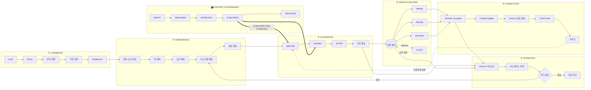

# Product Definition — TeachAble Art Play SaaS Platform 2.0

| | |
|---|---|
| 문서 상태 | PHASE 01 승인본 |
| 작성 기준일 | 2026-09-26 |
| Branch / commit | `saas-v2` / `faa8f9a` |
| 대상 독자 | PM · UX Designer · DB Architect · 개발자 |
| 선행 문서 | [../00-project/project-charter.md](../00-project/project-charter.md) · [../00-project/decision-log.md](../00-project/decision-log.md) |
| 연계 문서 | [mvp-scope.md](./mvp-scope.md) · [content-governance.md](./content-governance.md) · [open-items.md](./open-items.md) |
| 근거 | REPOSITORY AUDIT 1 / 2 / 3 · SOYE KIDS STARTER 표준화 규격 v1.0 · 교사용 수업가이드 1~6주차 |

---

## 목차

1. [Executive Summary](#1-executive-summary)
2. [Product Definition](#2-product-definition)
3. [Target Users](#3-target-users)
4. [Product Pillars](#4-product-pillars)
5. [Core Product Loop](#5-core-product-loop)
6. [KEEP / IMPROVE / NEW](#6-keep--improve--new)
7. [Curriculum Product Model](#7-curriculum-product-model)
8. [Class Mode](#8-class-mode)
9. [Growth Observation](#9-growth-observation)
10. [Growth Report](#10-growth-report)
11. [AI Product Principles](#11-ai-product-principles)
12. [Parent Product](#12-parent-product)
13. [Director Product](#13-director-product)
14. [HQ Product](#14-hq-product)
15. [SaaS Lifecycle](#15-saas-lifecycle)

---

## 1. Executive Summary

### 1-1. 현재 서비스

TeachAble Art Play는 유치원 대상 예술·창의 교육 프로그램을 **콘텐츠**(마음동화·EBOOK·VOD·MV·음원·워크북·창의키트)와 **교사용 가이드**로 공급하고, 별도로 **웹 플랫폼**(교사 수업운영·관찰기록·AI 기록정리·학부모 성장리포트·원장 대시보드·본사 운영기능)을 제공한다.

플랫폼 뼈대는 상용 수준이다. RLS-first 멀티테넌시, 복합 FK 테넌트 무결성, BEFORE 트리거 최종 방어, human-in-the-loop AI, 근거 스냅샷, 256비트 학부모 보안 공유가 구현되어 있고, AUDIT 2에서 6개 크로스테넌트 공격 시나리오 전부 **방어됨**으로 판정되었으며 CRITICAL 결함은 0건이었다.

교육 콘텐츠 쪽도 비어 있지 않다. **STARTER 1~6주차는 표준화 규격 v1.0이 적용된 확정본**(주차당 15섹션 / 4,000~6,500자)이 존재하고, 7·8주차 PDF도 있다.

### 1-2. 문제

문제는 보안도 코드 품질도 교육 콘텐츠 부재도 아니다. **판매하는 상품과 제품이 만나지 않는다.**

| # | 문제 | 실체 (AUDIT 근거) |
|---|---|---|
| **P1** | **콘텐츠가 플랫폼 밖에 있다** | PREMIUM 기준 디지털 자산 약 144~180건을 판매하지만 저장·전달·이용집계 구조가 0%. Storage 버킷은 관찰사진용 `observation-media` 1개뿐, DB에 자산 URL 필드 0개, `public/`에 실제 VOD·음원·EBOOK 파일 0건 |
| **P2** | **교사가 가이드를 화면에서 못 본다** | `lesson_activities`는 Admin 화면에서만 참조. 교사에게는 `week_no · session_no · title · status`만 내려가고 `objective`(≤1000자)조차 전달되지 않는다 |
| **P3** | **주간 리포트 상품에 실체가 없다** | STARTER(99,000원)의 유일한 리포트. 원본이 5항목 서식을 확정했는데 구현은 3블록 서술형이고 사진·아이의 말·가정연계 Tip은 학부모 DTO에 필드조차 없다 |
| **P4** | **상품 개념이 DB에 없다** | `organizations`는 `name · institution_type · status` 3필드. 계약·기간·좌석·기능권한이 표현되지 않아 "STARTER는 대시보드 제외"를 강제할 수단이 없다 |
| **P5** | **지표 체계가 갈라져 있다** | DB(미술 5영역) ≠ 홈페이지(Growth 5) ≠ 교사가이드(주차별 관찰영역) ≠ 성장키워드 8개. 홈페이지는 이미 Growth 5를 공개했다 |
| **P6** | **AI가 성장리포트의 단일 장애점** | `child_growth_report_sources.ai_draft_id NOT NULL` + `review_status='accepted'` 요구 → API 키 없으면 리포트 생성이 `GR003`으로 차단. `.env.example`은 "AI만 비활성"이라고 적혀 있어 사실과 다르다 |
| **P7** | **사진을 삭제할 수 없다** | `class_session_observation_media`와 `storage.objects` 양쪽에 UPDATE·DELETE 정책 0개. 잘못 올린 아동 사진을 아무도 회수할 수 없다 |
| **P8** | **16·24주 콘텐츠가 원본에도 없다** | `D:\소예키즈` 3단계 전수 탐색 결과 16주·24주 자료 0건 → `SOURCE NOT AVAILABLE`. STANDARD·PREMIUM은 판매 중이지만 제작 전이다 · *Updated 2026-09-27: 로컬 탐색 기준 판정이었다. 원본은 Project External Source로 존재 (Week 9~16 MIXED · 17~24 DRAFT/PROPOSAL). production-approved 운영 콘텐츠는 아직 없다 → DEC-063 · 03-commerce BC-1 · BC-2* |

### 1-3. SaaS 2.0 변화

```
1.0   콘텐츠 공급  +  기록 도구          (두 개가 나란히 있다)
2.0   교육운영 SaaS                      (하나의 루프로 연결된다)
```

| 축 | 1.0 | 2.0 |
|---|---|---|
| 콘텐츠 | 오프라인 전달 | **Content Delivery Layer** (자산·버전·권한·이용로그) |
| 교사 | 출결·관찰 입력 도구 | **Class Mode** — 수업 전/중/후 단일 흐름 |
| 커리큘럼 | 일정 뼈대 (제목·주차) | **교육 구조** (Step·Prompt·Asset·Nuri·ObservationFocus·Family) |
| 관찰 | 태그 5개 체크 | **Growth 5 + Observation Stage** (교사 선택, AI 판정 금지) |
| 리포트 | 3블록 서술형 1종 | **Weekly / Monthly / Semester 3계층** |
| 학부모 | 리포트 1건 링크 | **Child Secure Portal** (누적 경험, 계정 없이) |
| 원장 | 운영 누락 탐지 | 유지 + **콘텐츠 이용 · 리포트 발행 · 교사 부담** |
| 상품 | TS 파일 마케팅 데이터 | **Product / Contract / Entitlement (DB + Server 게이팅)** |
| AI | 성장리포트 필수 의존 | **Optional assistant** (없어도 전부 동작) |
| 품질 | 테스트 0 | **RLS/Auth/Tenant 회귀테스트 선행** |

### 1-4. 최종 목표

> 유치원이 24주 프로그램을 도입하면, **콘텐츠·수업·기록·리포트·운영·계약이 하나의 시스템 안에서 끊기지 않고 흐른다.**
> 교사는 수업 준비에 쓰던 시간을 아이를 보는 데 쓰고, 학부모는 사진 한 장 대신 아이의 변화를 설명받고, 원장은 운영 누락을 미리 알고, 본사는 기관·계약·콘텐츠를 한 곳에서 관리한다.
> 그리고 이 전부가 **아이를 평가하지 않으면서** 이루어진다.

---

## 2. Product Definition

### 2-1. 한 문장

> **TeachAble Art Play 2.0은 유치원이 24주 예술·창의 교육 프로그램을 도입해 운영하는 전 과정 — 콘텐츠 제공, 수업 진행, 관찰 기록, 성장 리포트, 학부모 소통, 원장 운영관리, 상품·계약 — 을 하나의 흐름으로 연결하는 B2B 교육운영 SaaS다.**

### 2-2. 무엇인가

| # | 구성 | 설명 |
|---|---|---|
| 1 | **콘텐츠 플랫폼** | 주차별 EBOOK·마음동화·VOD·MV·음원·워크북·교사가이드·활동자료를 권한에 따라 제공. `PUBLISHED` **∧** `Entitlement`를 모두 통과해야 노출 |
| 2 | **수업 운영 도구** | 교사가 수업 전·중·후를 한 화면 흐름에서 수행 (Class Mode). 원본 15섹션 가이드가 화면 구조가 된다 |
| 3 | **관찰 기록 시스템** | 교사가 아이의 말·시도·방법 변경을 그대로 적고, Growth 5와 Observation Stage를 직접 선택 |
| 4 | **성장 리포트 시스템** | Weekly / Monthly / Semester. 근거는 스냅샷으로 동결. AI는 초안만, 교사가 확정 |
| 5 | **학부모 소통 채널** | 계정 없이 안전한 링크로 아동 단위 누적 기록 열람 (Child Secure Portal) |
| 6 | **원장 운영 도구** | 반별 진행·기록 누락·리포트 발행·콘텐츠 이용. 교육효과 점수는 만들지 않는다 |
| 7 | **본사 운영 시스템** | 기관·상품·계약·Entitlement·커리큘럼·콘텐츠·배송·리드·지원 |

### 2-3. 무엇이 아닌가

| 아님 | 이유 |
|---|---|
| 아동 발달 평가·진단 도구 | 점수·등급·발달수준·또래비교 필드가 스키마에 **없고 만들지 않는다** |
| AI 자동 리포트 생성기 | AI는 optional. 교사 확정 없이 어떤 문장도 학부모에게 가지 않는다 |
| 알림장·사진 공유 앱 | 사진은 리포트 근거로서만 선별 노출된다 |
| 일반 LMS | 누리과정 기반 유아 예술·창의 프로그램 특화 |
| B2C 콘텐츠 구독 | 기관 단위 계약. 학부모는 계정 없이 열람 |
| 교사 성과 평가 도구 | 교사 관련 지표는 지원 필요 신호이지 평가가 아니다 |

---

## 3. Target Users

### 3-1. SOYE HQ — 본사 운영자 / 영업

| | |
|---|---|
| **Goal** | 기관을 안정적으로 도입·유지시키고, 콘텐츠·커리큘럼을 품질 통제하며, 계약·배송·지원을 누락 없이 처리한다 |
| **Pain Point** | 기관 생성·초대·반·원아·교사배정·프로그램배정이 전부 수동 다단계다. 계약 정보가 시스템에 없어 스프레드시트와 병행한다. 콘텐츠 승인 이력이 남지 않는다 |
| **Primary Job** | 기관 프로비저닝 · Entitlement 설정 · 커리큘럼/콘텐츠 승인·발행 · 리드 처리 · 서비스 상태 점검 |
| **Key Value** | "우리 기관이 지금 어디까지 준비됐는지"를 한 화면에서 판단 (기존 `/admin/readiness` 확장) |
| **권한 원칙** | `admin`과 `sales`를 분리한다. 영업은 리드·기관 메타데이터만 보고 **아동 관찰기록·활동사진에 접근하지 않는다** |
| 현재 상태 | `private.is_soyes_admin()`이 `role in ('admin','sales')`로 판정하여 영업이 전 기관 아동 기록에 접근 가능 → 분리 필요 |

### 3-2. Director — 원장 / 원감

| | |
|---|---|
| **Goal** | 교육과정이 계획대로 운영되는지 확인하고, 학부모 신뢰를 확보하고, 교사 부담을 관리한다 |
| **Pain Point** | 교사마다 기록 품질이 다르다. 학부모 문의에 근거로 답할 자료가 없다. 평가·장학 때 누리과정 연계를 증빙할 산출물이 없다 |
| **Primary Job** | 반별 진행 확인 · 기록 누락 후속조치 · 완료 리포트 검토 · Child Portal 공유 활성/중지 · 콘텐츠 이용 확인 |
| **Key Value** | **"놓친 것을 시스템이 먼저 알려준다"** |
| **권한 경계** | 관찰 원문 작성 불가 · 교사 draft 리포트와 AI draft 비열람 · 주간 리포트 매 건 사전승인 책임 없음 (DEC-030) · 기관 status 변경 불가 · 교사 초대·배정 불가(현재 HQ 전용) |

### 3-3. Teacher — 담임교사

| | |
|---|---|
| **Goal** | 수업을 무리 없이 진행하고, 아이의 모습을 기록으로 남기고, **퇴근 시간을 지킨다** |
| **Pain Point** | 종이/PDF 가이드를 따로 본다. 콘텐츠를 찾아 재생하는 준비가 별도다. 관찰기록은 수업 후 기억에 의존한다. 리포트 작성이 추가 업무로 쌓인다 |
| **Primary Job** | 수업 준비 확인 → 수업 진행 → 출결·관찰·사진·아이의 말 기록 → Growth 5/Stage 선택 → 리포트 검토·확정 |
| **Key Value** | **"준비·진행·기록이 한 화면에서 끝난다"** |
| **최우선 제약** | **교사 작업량이 제품의 성패를 결정한다.** 목표: 수업 준비 10분 / 관찰 15명 20분 / 리포트 1명 3분 / 주당 총 추가업무 60분 이내 |
| 파생 결정 | 워크북 정량 MVP 제외(DEC-012) · Stage 선택형(DEC-007) · Weekly 5항목 중 2개만 교사 입력(DEC-024) |

### 3-4. Parent — 보호자

| | |
|---|---|
| **Goal** | 우리 아이가 무엇을 경험하고 어떻게 달라지고 있는지 이해한다 |
| **Pain Point** | 사진 한 장과 "즐겁게 참여했어요" 한 줄로는 알 수 없다. 지난 기록을 다시 볼 수 없다 |
| **Primary Job** | 링크 열기 → 이번 주 읽기 → 지난 기록·학기 포트폴리오 보기 → 가정연계 실천 |
| **Key Value** | **"우리 아이의 이야기가 쌓인다"** |
| **핵심 제약** | 계정 없음 · 링크 보안 원칙 유지 · 사진 노출은 보호자 동의 확인 후 (원본 §4-C 전 주차 고정문구) |

---

## 4. Product Pillars

| # | Pillar | 정의 | 핵심 산출물 | 현재 성숙도 |
|---|---|---|---|---|
| **P1** | **Curriculum & Content** | 24주 교육 구조와 디지털 자산을 버전·승인·권한과 함께 제공 | Program · Week · Lesson · Step · Activity · Asset · Material · Nuri | 🔴 **10%** (뼈대만, 자산계층 0) |
| **P2** | **Class Operation** | 교사가 수업 전·중·후를 한 흐름으로 수행 | Class Mode · Teacher Prompt · Timer · Situation Help | 🔴 **20%** (출결·관찰만) |
| **P3** | **Observation & Growth** | 평가하지 않으면서 아이의 변화를 기록 | 관찰기록 · Growth 5 · Observation Stage · 사진 · 아이의 말 | 🟡 **55%** (기록 완성, 지표·단계 부재) |
| **P4** | **Growth Record & Report** | 근거에 묶인 주간·월간·학기 산출물 | Weekly · Monthly · Semester Portfolio · 근거 스냅샷 | 🟡 **45%** (3블록 1종만) |
| **P5** | **Parent Connection** | 계정 없이 안전하게 누적 경험 제공 | Child Secure Portal · 동의 · 선별 사진 · 가정연계 | 🟡 **35%** (단건 링크 완성) |
| **P6** | **Director Operation** | 운영 누락을 미리 발견 | 대시보드 · 후속조치 · 발행현황 · 콘텐츠 이용 | 🟢 **65%** (핵심 완성) |
| **P7** | **Commerce & Entitlement** | 상품·계약·권한을 DB에서 표현 | Product · Contract · Entitlement · Feature Gate · Payment Adapter | 🔴 **5%** (리드 수집만) |
| **P8** | **Trust & Safety** *(횡단)* | 멀티테넌시·개인정보·AI 거버넌스·회귀테스트 | RLS · 복합FK · 트리거 · 동의·파기 · prompt_version · 테스트 | 🟢 **80%** (삭제경로·테스트 부재) |

> **P8은 기능 Pillar가 아니라 전 Pillar를 관통하는 제약이다.** AUDIT 2가 확인한 자산이 여기 있고, 2.0에서 깎지 않는다.

---

## 5. Core Product Loop



### Loop 성립 조건

| # | 조건 | 위반 시 |
|---|---|---|
| **C-1** | 콘텐츠 노출 = `PUBLISHED` ∧ `Entitlement` | 미승인 콘텐츠가 교실에 나가거나 미계약 기관이 24주를 본다 |
| **C-2** | AI 없이도 ③④⑤가 완주된다 | AI 장애 시 상품 기능 정지 |
| **C-3** | 관찰이 없으면 리포트가 없다 | 근거 없는 리포트 = 신뢰 붕괴 |
| **C-4** | Growth 5 / Stage는 교사만 입력 | AI 판정 = 평가 도구로 전환 |
| **C-5** | 학부모 노출 = 교사 Complete ∧ 원장 공유 활성 | 미검토 문장 유출 |
| **C-6** | 사진은 파기경로 → 동의 → 선별 → 스냅샷 → 노출 순서 | 개인정보 사고 |
| **C-7** | 계약 종료 시 이관·파기 경로가 존재한다 | 데이터 잔존 |

---

## 6. KEEP / IMPROVE / NEW

### 6-1. KEEP — 그대로 유지

| 영역 | 항목 |
|---|---|
| **Security** | RLS-first · `private` helper 체계 · 복합 FK · `enforce_*` 트리거 · 컬럼 GRANT · `service_role` 미사용 · Client 5분리 |
| **Auth** | `requireAdmin/Director/Teacher/Staff` 독립 재검사 · 기관 status 즉시 차단 · 역할 계통 분리 |
| **Data** | 낙관적 동시성 (`clock_timestamp()` 토큰) · 원자적 RPC · SQLSTATE 체계 · 비대칭 권한 · `on delete restrict` |
| **AI** | 6계층 분리 · `prompt_version`/`model`/`provider` · `store:false` · retry 0 · 타임아웃 · 개인정보 비전송 타입 강제 · 금지어 지침 |
| **Report** | 근거 스냅샷 · `source_revision` · complete 잠금 · 3블록 텍스트 · draft/AI draft 원장 비노출 |
| **Parent** | share 보안 설계 전체 (256bit · 해시만 저장 · fragment · pass-the-hash 방지 · 실패 무구분 · `anon` 전용) |
| **Director** | 대시보드 `followUps` · `reliable` · `truncated` · `windowDays` |
| **Philosophy** | 점수·등급·발달단계·또래비교 필드를 만들지 않는다 |
| **Docs** | 마이그레이션 주석 문화 ("변경하지 않은 것" 블록) |

### 6-2. IMPROVE — 기존을 확장·수정

| # | 대상 | 변경 방향 | 근거 |
|---|---|---|---|
| I-1 | **AI 필수 결합 해제** | `sources.ai_draft_id` nullable + 교사 직접 작성 근거 경로 | DEC-009 · P6 |
| I-2 | **미디어 삭제·파기 경로** | soft delete + `storage.objects` DELETE 정책 + 고아 정리 | DEC-014 · P7 |
| I-3 | **`sales` 권한 분리** | `is_soyes_admin()`에서 sales 제거 + `is_soyes_sales()` 신설 | AUDIT 2 H3 |
| I-4 | **커리큘럼 모델 확장** | `story_title`·`growth_keyword`·`core_message`·Step·Prompt·Asset·Nuri·ObservationFocus·Family | DEC-028 |
| I-5 | **교사에게 수업 정보 전달** | `objective`·`duration_minutes`·`lesson_activities`를 staff 질의에 포함 | DEC-003 · P2 |
| I-6 | **관찰에 Growth 5 + Stage** | 지표·단계 표현 추가. 구 미술 5영역은 inactive·historical | DEC-005 · DEC-006 · DEC-007 |
| I-7 | **리포트 3계층화** | `report_type` + 주기별 입력·출력 정의. 3블록은 월간/학기 재사용 | DEC-010 · DEC-011 |
| I-8 | **리포트 목록 상한** | `MAX_GROWTH_REPORT_LIST = 200` → 페이징 (15명×24주=360) | AUDIT 3 H7 |
| I-9 | **AI Structured Outputs** | 성장리포트 provider를 `json_schema` `strict:true` | AUDIT 2 M1 |
| I-10 | **AI 재생성 보호** | `reviewed_text` 파괴 전 확인 + 이전 버전 보존 + `reviewed_by/at` 리셋 정합성 | AUDIT 2 M2 · L1 |
| I-11 | **AI 응답 메타 저장** | `usage`·`finish_reason`·`response_id` | AUDIT 2 M7 |
| I-12 | **학부모 공유 → 아동 단위 포털** | 리포트당 링크 → 아동당 링크(누적) | DEC-013 |
| I-13 | **원장 대시보드 보강** | 커리큘럼 진행률 · 리포트 발행 누락 · 공유 현황 · 동의 현황 · 콘텐츠 이용 | §13 |
| I-14 | **리포트 출력** | 원장·교사 인쇄/PDF (기존 `report-print.css` 패턴 재사용) | AUDIT 3 M3 |
| I-15 | **anon 남용 방어** | `lead_submissions` INSERT · share resolve rate limit | AUDIT 2 M3·M4 |
| I-16 | **정합성 가드** | `week_no ≤ duration_weeks` 트리거 · `duration_weeks` 상품 연동 | AUDIT 3 M6·M7 |
| I-17 | **DEFINER 함수 보호 주석** | `growth_report_attendance_counts`에 "GRANT 금지" 명시 | AUDIT 2 M9 |
| I-18 | **Marketing ↔ DB 단일출처** | 가격·주차·Growth 5·패키지 기능을 DB 기준으로 | DEC-020 |
| I-19 | **50분 골격 통일** | `classSteps` 5단계 → 원본 6단계 | DEC-023 |
| I-20 | **`.env.example` · 법무 문서 정합화** | AI optional 사실 반영 · 결제 도입 시 약관 개정 | DEC-009 · DEC-017 |

### 6-3. NEW — 신규 구축

| # | 신규 | 규모 | 의존 |
|---|---|---|---|
| **N-1** | **Content Delivery Layer** — 자산 메타·버전·버킷/CDN·서명URL·이용로그 | 🔴 대 | 콘텐츠 원본 확보 |
| **N-2** | **Class Mode** — BEFORE / DURING / AFTER | 🔴 대 | I-4 · I-5 |
| **N-3** | **Content Governance** — 5단계 + 승인 Role | 🟠 중 | — |
| **N-4** | **Product / Contract / Entitlement + Feature Gate** | 🟠 중 | 상품 정책 |
| **N-5** | **Weekly Report** (5항목 서식) | 🟠 중 | I-6 · I-7 · N-8 |
| **N-6** | **Semester Portfolio** (아동 단위 누적) | 🟠 중 | I-7 |
| **N-7** | **Child Secure Portal** | 🟠 중 | I-12 · N-8 |
| **N-8** | **사진 동의 + 교사 선별 + 리포트 스냅샷** | 🟠 중 | I-2 |
| **N-9** | **Nuri Mapping** (차시 ↔ 5영역 × 교육목표 × 관찰행동) | 🟡 소 | 원본 이관 |
| **N-10** | **RLS/Auth/Tenant 회귀테스트 체계** | 🟠 중 | **다른 모든 것보다 먼저** |
| **N-11** | **Payment Adapter** (인터페이스만) | 🟡 소 | 정책 |
| **N-12** | **Teacher Guide In-Class 렌더링** (15섹션) | 🟠 중 | I-4 · N-2 |
| **N-13** | **Curriculum 이관 파이프라인** (원본 → DB) | 🟡 소 | I-4 |
| **N-14** | **Data Export / 파기** (계약 종료) | 🟡 소 | I-2 |

---

## 7. Curriculum Product Model

> 관계 수준의 개념 모델이다. **SQL·테이블·컬럼을 정의하지 않는다** (PHASE 05에서 확정).

### 7-1. 계층 구조

```
Product            STARTER / STANDARD / PREMIUM              판매 단위
  └─ Program       TAP-STARTER-08 v1.0                       교육 단위 · 버전 보유
       └─ Part     (선택적 묶음: "적응·도전" 등)               24주에서 필요
            └─ Week        1~24주 · 성장키워드 · 주제
                 └─ Lesson  주차 내 차시 (1주 1차시 기본, 분할운영 시 2차시)
                      ├─ LessonMeta         §1·2   수업 관점 · 한눈에 보기
                      ├─ Step               §5·6·7·8·11  50분 6단계
                      │    ├─ TeacherPrompt      §6   교사 멘트 예시
                      │    ├─ ResponsePlaybook   §6   아이 반응별 대응
                      │    └─ StepAsset          §10  사용 시점별 콘텐츠
                      ├─ Activity           §7·8·9  핵심활동 / 미술창작 / 워크북
                      │    └─ ActivityItem       워크북 페이지별 활동·발문
                      ├─ Material           §4-A  준비물 (구분·품목·수량기준)
                      ├─ Preparation        §4-B·C  공간 세팅 / 안전·개인정보
                      ├─ Asset              EBOOK·마음동화·VOD·MV·음원·워크북·Guide·활동자료
                      ├─ NuriLink           §3   누리 5영역 × 교육목표 × 교사가 볼 행동
                      ├─ ObservationFocus   §12  주차별 관찰영역 × 관찰행동 × 기록에 담을 것
                      ├─ GrowthLink         Growth 5 중 이 차시에서 주로 보이는 지표
                      ├─ FamilyConnection   §13  절차 · KIT 구성 · 보호자 핵심문장
                      ├─ SituationPlaybook  §14  상황 × 피할 반응 × 권장 대응
                      └─ QuickGuide         §15  1페이지 요약
```

### 7-2. 원본 15섹션 매핑

| § | 원본 섹션 | 모델 엔티티 | Class Mode |
|---|---|---|---|
| 1 | 수업을 시작하기 전에 | LessonMeta.perspective | BEFORE |
| 2 | 수업 한눈에 보기 (10필드) | LessonMeta | BEFORE |
| 3 | 교육목표 및 누리과정 연계 | **NuriLink** (5행) | BEFORE · Report |
| 4-A | 준비물 | **Material** | BEFORE |
| 4-B | 공간 세팅 | Preparation.space | BEFORE |
| 4-C | 안전 및 개인정보 확인 | Preparation.safety | BEFORE |
| 5 | 권장 시간표 (6단계 × 5열) | **Step** | DURING |
| 6 | 실제 수업 진행안 | Step + **TeacherPrompt** + **ResponsePlaybook** | DURING |
| 7 | 핵심활동 (20분) | **Activity** (`core`) | DURING |
| 8 | 미술·창작활동 (10분) | **Activity** (`creative`) | DURING |
| 9 | 워크북·교구 (별도 10분) | **Activity** (`workbook`) + ActivityItem | DURING(확장) |
| 10 | EBOOK·음원·MV 활용 | **StepAsset** (사용시점 + 역할) | DURING |
| 11 | 마무리 대화 (5분) | Step (`closing`) + TeacherPrompt | DURING |
| 12 | 관찰 및 기록 | **ObservationFocus** + Weekly 서식 | AFTER |
| 13 | 가정연계 | **FamilyConnection** | AFTER · Parent |
| 14 | 수업 중 이런 상황이 생기면 | **SituationPlaybook** | DURING |
| 15 | 교사용 1페이지 퀵 가이드 | QuickGuide | BEFORE · DURING |

### 7-3. 50분 표준 골격 (DEC-023)

| 순서 | 단계 | 시간 | 성격 | Step type |
|---|---|---|---|---|
| 1 | 도입 | 5분 | 경험 떠올리기 | `intro` |
| 2 | 그림책 | 8분 | 이야기로 주제 만나기 | `story` |
| 3 | 활동 약속 | 2분 | 안전·참여 약속 | `agreement` |
| 4 | 핵심활동 | 20분 | 몸·교구로 직접 경험 | `core` |
| 5 | 미술·창작 | 10분 | 경험을 작품으로 남기기 | `creative` |
| 6 | 마무리 | 5분 | 말로 남기기 | `closing` |
| — | **워크북** | **별도 10분** | 경험 확장 (50분 밖) | `workbook` |

**예외** 6주차: 핵심 15분 + 미술 15분 (대형 공동작업), 총 50분 동일
**분할 운영** 절단선은 ③↔④ 또는 ④↔⑤ 사이만. 1회차 35분 / 2회차 15분 + 워크북 10분

### 7-4. Week 주제 (성장키워드 8개 · DEC-026)

| 주차 | 성장키워드 | 프로그램명 | 원자료 |
|---|---|---|---|
| 1 | 시작 | 유치원 가는 날 | ✅ 확정본 |
| 2 | 끈기 | 끝까지 해보자 | ✅ 확정본 |
| 3 | 표현 | 마음을 말해줘 | ✅ 확정본 |
| 4 | 발견 | 소예의 씨앗 | ✅ 확정본 |
| 5 | 자존감 | 우린 모두 특별해 | ✅ 확정본 |
| 6 | 협력 | 우리들의 비밀기지 | ✅ 확정본 |
| 7 | 기다림 | *(원자료 필요)* | ⚠️ PDF 존재 / 규격 미적용 |
| 8 | 공동체 | *(원자료 필요)* | ⚠️ PDF 존재 / 규격 미적용 |
| 9~24 | — | — | 🔴 `SOURCE NOT AVAILABLE` · *Updated 2026-09-27: SOURCE EXISTS (9~16 MIXED · 17~24 DRAFT/PROPOSAL · Project External) · production pending* |

### 7-5. Asset 모델

| 축 | 값 |
|---|---|
| **type** | `ebook` · `story`(마음동화) · `vod` · `mv` · `audio` · `workbook` · `teacher_guide` · `activity_material` · `kit_guide` |
| **binding** | Program / Week / Lesson / Step / Activity |
| **usage_point** | §10 기준: 등원·도입 / 친구 만나기 / 공간 탐험 / 마무리 / 별도 콘텐츠 시간 |
| **role** | §10의 "수업 흐름 속 역할" 서술 |
| **governance** | DRAFT → REVIEWED → APPROVED → PUBLISHED → ARCHIVED |
| **entitlement** | 어떤 상품이 접근하는가 |
| **delivery** | 저장 위치 · 서명 방식 · 다운로드 허용 여부 · 만료 |

**1주차 실례** (원본 §2·§4·§10): EBOOK 1 + 음원 4곡(유치원 가는 길 / 안녕! 친구야 / 우리 반을 소개해요 / 함께라서 좋아) + MV 1 + 워크북 1(4장) + 미션카드 1세트 + 교실 미니어처 세트 + 가정연계 KIT
→ **주차당 디지털 자산 약 7~8건.** 8주 ≈ 60건 · 24주 ≈ **180건**

### 7-6. Cross Week

원본에서 확인된 실제 연결:

| 유형 | 실례 | 모델 |
|---|---|---|
| **선행 예고** | 6주차 가정연계가 "8주차 우리 반 성장 숲 대형 현수막" 언급 | `CrossWeekRef(from=6, to=8, kind='preview')` |
| **자산 재사용** | 5주차 음원 4곡이 4주차와 동일 (⚠️ 의도/오기 미확인) | `AssetReuse(week=5, source_week=4)` |
| **성장 궤적** | 성장키워드 8개가 하나의 로드맵 | `Week.growth_keyword` + 순서 |
| **작품 누적** | 이름표 → 메달 → 팔찌 → 마라카스 → 꽃 → 비밀기지 | Semester Portfolio 대표작품 |

### 7-7. Versioning 원칙

| 규칙 | 이유 |
|---|---|
| Program은 버전을 갖는다 (`v1.0`) | 운영 중인 커리큘럼이 학기 중에 바뀌면 안 된다 |
| 배정(assignment)은 **버전에 고정** | 콘텐츠 변경으로 기록 근거가 흔들리지 않게 |
| `PUBLISHED` 후 수정 = 새 버전 | 기존 기록·리포트의 근거 보존 |
| `ARCHIVED`는 기존 배정 유지, 신규 배정 차단 | 현재 `curriculum_programs.status`와 동일 철학 |

### 7-8. 콘텐츠 확보 현황

| 상품 | Week | Lesson 상세 | Asset 목록 | Nuri | ObservationFocus | 판정 |
|---|---|---|---|---|---|---|
| STARTER 1~6주 | ✅ | ✅ 규격 확정 | ✅ | ✅ | ✅ | **즉시 이관 가능** |
| STARTER 7~8주 | ✅ | ⚠️ 규격 미적용 | ⚠️ | 🔴 | 🔴 | **규격화 필요** |
| STANDARD 9~16주 | 🔴 | 🔴 | 🔴 | 🔴 | 🔴 | `SOURCE NOT AVAILABLE` · *Updated 2026-09-27: SOURCE EXISTS (MIXED · Project External) · repo 이관 · 승인 전* |
| PREMIUM 17~24주 | 🔴 | 🔴 | 🔴 | 🔴 | 🔴 | `SOURCE NOT AVAILABLE` · *Updated 2026-09-27: SOURCE EXISTS (DRAFT/PROPOSAL · Project External) · repo 이관 · 승인 전* |

---

## 8. Class Mode

### 8-1. 설계 원칙

| # | 원칙 |
|---|---|
| 1 | **한 세션 = 한 화면 흐름.** 교사가 다른 탭·종이·USB를 열지 않는다 |
| 2 | **수업 중에는 읽을 것이 최소.** 퀵가이드(§15) 수준. 상세는 BEFORE에서 읽는다 |
| 3 | **오프라인 내성.** 교실 Wi-Fi는 끊긴다. 수업 중 입력은 로컬 우선 → 재연결 시 동기화 |
| 4 | **AFTER는 기억이 아니라 흐름으로 남긴다.** 수업 중 Quick Memo가 AFTER의 초기값 |
| 5 | **어떤 화면도 아이를 평가하게 유도하지 않는다.** "잘함/못함" 선택지가 존재하지 않는다 |

### 8-2. BEFORE CLASS

| 블록 | 원본 | P0 | 확장 |
|---|---|---|---|
| 수업 목표 | §2 핵심메시지 · §1 관점 | ✅ 읽기 | 원장 공유 |
| 예상 시간 | §2 50분 (분할 35+15) | ✅ 표시 | 분할 운영 선택 → Step 분배 |
| 준비물 | §4-A (구분·품목·수량) | ✅ **체크리스트** | 재고·배송 연동 |
| 교실 준비 | §4-B | ✅ 읽기 | 사진 예시 |
| 안전·개인정보 체크 | §4-C | ✅ **체크리스트** (사진 동의 확인 포함) | 기관 동의 상태 연동 |
| 누리 연계 | §3 | 🟡 접힌 상태 | 평가·장학 출력 |
| 퀵가이드 | §15 | ✅ 인쇄/저장 | — |
| 콘텐츠 사전확인 | §10 | 🟡 자산 목록만 | 사전 다운로드·프리로드 |

### 8-3. DURING CLASS

```
[Step 1/6  도입 · 5분]                         ⏱ 04:12  ▮▮▯▯▯▯
─────────────────────────────────────────────────────────────
오늘 처음 만난 것은 무엇일까?

교사 멘트                                     [아이 반응 대응 ▾]
· "오늘 여기 오면서 어떤 게 제일 먼저 보였어?"
· "처음 보는 곳이 많지? 궁금한 곳이 있을까?"
· "조금 낯설어도 괜찮아. 우리 같이 천천히 둘러볼 거야."

연계 콘텐츠  음원 ① 유치원 가는 길        (P1: 인앱 재생)
─────────────────────────────────────────────────────────────
[✎ 지금 본 것 메모]                 [◀ 이전]      [다음 ▶]
                                          [⚠ 상황 도움말]
```

| 요소 | 원본 | **P0 (DEC-029)** | P1 / P2 |
|---|---|---|---|
| Step 네비게이션 | §5 6단계 | ✅ | 분할 운영 모드 |
| **Timer** | §5 단계별 분 | ✅ 단계 타이머 + 진행바 | 자동 진행·알림·실제시간 누적 |
| **Teacher Prompt** | §6 멘트 3~4개 | ✅ | 즐겨찾기·교사 커스텀 |
| **Response Playbook** | §6 반응별 대응표 | ✅ 접기/펼치기 | 상황 태그 → 관찰 초기값 |
| **Activity Guide** | §7·8 | ✅ 진행방법·교사언어 | 사진 예시·활동 타이머 |
| **Workbook Guide** | §9 페이지별 발문 | ✅ 읽기 | 워크북 뷰어 · optional evidence |
| **Situation Help** | §14 | ✅ 상시 접근 | 상황 기록 → 원장 리포트 |
| **Quick Memo** | — | ✅ 아동 무지정 짧은 메모 | 음성 메모 |
| **Next Step** | §5 | ✅ | — |
| Story / EBOOK | §2·6 | 🔵 제목·발문만 | **P1 인앱 EBOOK 뷰어** |
| VOD / MV | §10 | 🔵 목록·사용시점 | **P1 인앱 플레이어 + 이용로그** |
| Music | §10 음원 4곡 | 🔵 목록·사용시점 | **P1 인앱 오디오 플레이어** |
| 오프라인 | — | 🟡 진행 상태 로컬 보존 | P2 완전 오프라인 + 동기화 |

> **DEC-029**: EBOOK / VOD / MV / Audio의 플랫폼 내 직접 재생은 **P1 Content Delivery Layer 이후**. P0의 본체는 가이드·프롬프트·타이머·기록 흐름이다.

### 8-4. AFTER CLASS

| 블록 | P0 | 확장 |
|---|---|---|
| **Attendance** | ✅ 기존 재사용 (`present`/`absent`/`late`/`left_early`) | 사유 메모 |
| **Observation** | ✅ 기존 `teacher_note` (≤2000) | 음성 → 텍스트 |
| **Photo** | ✅ 기존 업로드 (private bucket) | 즉시 촬영 · 자동 아동 태깅 |
| **Child Voice** | ✅ 기존 `child_voice` (≤1000) | 음성 녹음 |
| **Growth 5** | ✅ **신규** — 지표 선택 (다중, 필수 아님) | 지표별 서술 |
| **Observation Stage** | ✅ **신규** — 지표별 4단계 교사 선택 | 근거 메모 |
| **ObservationFocus 안내** | ✅ §12 주차별 관찰영역 표시 (**참고, 입력 아님**) | — |
| AI 관찰정리 | 🟡 optional 버튼 (기존) | 문장 보조 |
| **Complete** | ✅ `record_status='complete'` | 미기록 아동 알림 |
| 사진 선별 (리포트용) | ✅ P0 (Weekly에 필요) | 대표 사진 우선순위 |

### 8-5. 진입 / 이탈 규칙

| 규칙 | 근거 |
|---|---|
| 배정된 반 + 활성 배정 + `published` 프로그램/차시일 때만 진입 | 기존 `parentsActive` 로직 재사용 |
| 수업 상태 `scheduled` → `in_progress` → `completed` | 기존 `class_sessions.status` |
| `cancelled` 세션은 기록 불가 | 기존 `private.is_recordable_session` |
| 보관(archived) 반은 진입 불가, 과거 기록 수정 가능 | Architecture Invariant AI-7 |
| 수업 중 이탈 시 진행 위치 복원 | 신규 |
| 콘텐츠 노출 = `PUBLISHED` ∧ `Entitlement` | Loop 조건 C-1 |

---

## 9. Growth Observation

### 9-1. 4개 분류 체계의 지위 (해소 완료)

| 체계 | 출처 | 내용 | **2.0 지위** |
|---|---|---|---|
| **A. 미술 5영역** | DB 시드 `observation_domains` | 색채 표현 / 형태·공간 구성 / 표현의 세밀도 / 창의적 확장 / 활동 완결성 | ⛔ **historical / inactive** (DEC-006) |
| **B. SOYE Growth 5** | 홈페이지 `growthObservationItems` + 사용자 확정 | 표현 다양성 / 형태·공간 구성 / 창의적 시도 / 활동 참여·몰입 / 자기 설명·소통 | ✅ **유일한 성장 지표** (DEC-005) |
| **C. 주차별 관찰영역** | 원본 교사가이드 §12 | (1주차) 환경 적응 / 사회관계 / 의사소통 / 생활자립 / 안전·신체 | ✅ **ObservationFocus — 차시별 교사 안내** (DEC-025) |
| **D. 성장키워드 8개** | 원본 규격 §1 | 시작·끈기·표현·발견·자존감·협력·기다림·공동체 | ✅ **Week 주제** (DEC-026) |

> **C를 지표로 오해하면 주차마다 측정 축이 달라져 시계열 비교가 원리적으로 불가능해진다.** B만 지표, C는 안내, D는 주제다.

### 9-2. SOYE Growth 5 — 제품 정의

| # | 지표 | 제품적 의미 | 관찰 예시 |
|---|---|---|---|
| 1 | **표현 다양성** | 색·재료·방법을 몇 갈래로 시도했는가 (많음이 좋음이 아니라 **갈래가 보였는가**) | 한 색 → 여러 색 조합, 새 재료 사용 |
| 2 | **형태·공간 구성** | 화면/입체 안에서 형태를 배치하고 공간을 다룬 모습 | 겹치기, 위아래 구분, 여백 사용 |
| 3 | **창의적 시도** | 제시된 방법 외의 방식을 스스로 꺼냈는가 | 도구를 다르게 씀, 규칙을 바꿔봄 |
| 4 | **활동 참여·몰입** | 활동에 머문 방식 (시간이 아니라 **머묾의 양상**) | 반복 시도, 끝까지 머묾, 다시 돌아옴 |
| 5 | **자기 설명·소통** | 자기 선택을 말·몸짓으로 전했는가 | "노란색이 기분 좋은 색이라서" |

### 9-3. Observation Stage — 제품 정의 (DEC-007 · DEC-008)

| code | 한국어 UX | 의미 |
|---|---|---|
| `NOT_OBSERVED` | **기록 없음** | 이번 활동에서 그 모습이 나오지 않았거나 관찰하지 못했다 |
| `WITH_TEACHER` | **함께** | 교사와 함께하는 방식으로 참여했다 |
| `AFTER_MODELING` | **보고 나서** | 교사·친구의 모습을 본 뒤에 참여했다 |
| `INDEPENDENT` | **스스로** | 스스로 시작해서 참여했다 |

> **이 값은 점수 · 등급 · 발달수준 · 또래평가가 아니다.**
> 「이번 활동에서 관찰된 참여 / 지원 방식」이다.
> **AI가 이 단계를 판정하거나 추천하지 않는다.**

### 9-4. 용어·UX 원칙 (평가 오해 방지)

원본 표준화 규격 §5(금지 표현) · §12(기록 원칙)를 제품 규칙으로 승격 (DEC-027).

| # | 원칙 | 구현 |
|---|---|---|
| **U-1** | **"단계"는 순위가 아니라 참여·지원 방식이다** | UI에 ①②③④ 번호·화살표·색 그라데이션을 쓰지 않는다. **순서 없는 4개 선택지**로 배치 |
| **U-2** | **"기록 없음"은 결핍이 아니다** | 고정 문구: *"빈 칸은 그 활동에서 그 모습이 나오지 않았다는 뜻이며, 못했다는 뜻이 아닙니다."* |
| **U-3** | **"스스로"가 목표가 아니다** | "스스로 달성률" · "함께 → 스스로 향상" 같은 진척 표현을 만들지 않는다 |
| **U-4** | **지표 간 합산·평균·개수를 계산하지 않는다** | 5지표 점수 합계 · 레이더차트 · 종합등급 **금지** |
| **U-5** | **또래 비교를 어떤 화면에도 두지 않는다** | 반 평균 · 백분위 · 상위% 금지 |
| **U-6** | **금지어 목록을 제품 문구 검수 기준으로 사용** | 평가·진단 / 인과 단정 / 통제 / 정답 유도 / 외부 서비스 / 비공식 영역 6범주 |
| **U-7** | **AI는 단계를 판정·추천·검증하지 않는다** | AI 입력에 Stage를 포함하지 않고, AI 출력에서 Stage를 파싱하지 않는다 |
| **U-8** | **기록 문장의 기준은 "아이가 한 말·시도·바꾼 방법"** | §12 고정문구를 입력 화면 안내문으로 사용 |
| **U-9** | **시계열은 "변화"로만 표현한다** | "3월: 한두 가지 색 → 6월: 여러 색 조합하고 이유 설명" 형식. ⚠️ **단계 증감(↑) 표기 여부는 미확정** → [open-items.md](./open-items.md) |

### 9-5. 금지 표현 목록 (원본 규격 §5)

| 범주 | 금지어 |
|---|---|
| 평가·진단 | 잘함/못함, 상·중·하, 우수, 부족, 미흡, 발달지연, 정상, 또래 대비 |
| 인과 단정 | 향상된다, 발달시킨다, 길러진다, 치료한다, 개선한다 |
| 통제 | 반드시 ~하게 한다, 끝까지 해야 한다 |
| 정답 유도 | 정답은 무엇일까요, 누가 제일 잘했나요 |
| 외부 서비스 | 키즈노트 → **학부모 성장리포트** |
| 비공식 영역 | 정서·자기조절을 누리과정 영역으로 표기 → **SOYE KIDS 핵심경험**으로 분리 |

### 9-6. 입력 부담 설계

| 항목 | 부담 | 결정 |
|---|---|---|
| Growth 5 선택 | 지표당 1탭 × 아동 | ✅ P0. **전 지표 필수 아님** — 보인 것만 |
| Stage 선택 | 선택한 지표당 1탭 | ✅ P0 |
| 아동당 목표 시간 | 관찰문 + 아이의 말 + 지표·단계 | **90초 이내** |
| 반 15명 목표 | | **20분 이내** |
| 워크북 정량 (색 개수·채운 비율) | 아동당 수치 N개 | 🔴 **MVP 제외** (DEC-012). 향후 특정 Workbook optional evidence |

---

## 10. Growth Report

### 10-1. 3계층 비교 (DEC-010)

| | **WEEKLY** | **MONTHLY** | **SEMESTER** |
|---|---|---|---|
| **목적** | 이번 주에 무슨 일이 있었는지 전달 | 한 달의 변화를 설명 | 학기 전체 성장 이야기 |
| **주 사용자** | 학부모 | 학부모 + 원장 | 학부모 + 원장 + (평가·장학) |
| **발행 주기** | 주 1회 | 월 1회 | 학기 1회 |
| **포함 상품** | STARTER 이상 (= STARTER · STANDARD · PREMIUM · PILOT) · *Updated by DEC-057: STANDARD Weekly 포함 확정* | STANDARD 이상 | STANDARD 이상 · *DEC-055: Monthly Entitlement를 필수 dependency로 두지 않음* |
| **입력 (근거)** | 해당 주 관찰 1~2건 + Growth 5/Stage + 선별 사진 + 아이의 말 + §13 가정연계 + 다음 주 Lesson | 4~5주 관찰 + Growth 5 흐름 + 대표 활동 · *Updated by DEC-067: 기간 = **Program 4-Week Block** (Week 1~4 · 5~8 …) · 달력 월 아님* | 16~24주 전체 + Growth 5 누적 + 대표 작품·발화 + Nuri · *Updated by DEC-068: Child × Assignment × **Reporting Term** · Monthly 비의존* |
| **출력** | 이번 주 활동 / Growth 5 / 관찰단계 / 아이의 말 / 교사 관찰 / 선택된 사진 / 가정연계 / 다음 주 예고 | 이번 달 성장 변화 / 대표 관찰 / Growth 5 흐름 / 대표 활동 / 교사 서술 / 가정연계 | 학기 성장 이야기 / 주차별 변화 / Growth 5 누적 흐름 / 대표 작품 / 대표 발화 / 누리과정 연결 / 교사 종합기록 |
| **교사 작업량 목표** | **3분 이내 / 아동** | 10분 이내 | 20분 이내 |
| **AI 역할** | ⚪ 거의 없음 (구조가 정해져 있다). 필요 시 문장 다듬기 · *Updated by DEC-066 · DEC-070: P0 Generative AI 없음 · 문장 다듬기(C3)는 P1 · `ai_assist` 포함 상품(STANDARD · PREMIUM)만* | 🟡 초안 생성 (3블록 재사용) · *C2 · `ai_assist` 필요* | 🟡 초안 생성 + 주차별 요약 · *C2 · `ai_assist` 필요* |
| **3블록 재사용** | ❌ (5항목 서식) | ✅ `growth_changes`·`observation_summary`·`next_support` | ✅ + 확장 |
| **Parent UX** | 짧게 읽고 사진 보고 가정연계 실천 | 변화를 이해 | 보관·공유하고 싶은 산출물 |

### 10-2. WEEKLY 5항목 서식 (DEC-024 · 원본 §12)

| 항목 | 원본 작성 예시 | 데이터 출처 | 입력 주체 |
|---|---|---|---|
| **오늘의 활동** | *"《유치원 가는 날》 그림책을 만난 뒤 교실·놀이실·화장실·놀이터를 함께 탐험하고 나만의 이름표를 만들었습니다."* | Lesson.story_title + Activity 제목 | **자동 조립** |
| **아이의 작품** | *"나만의 이름표 (자리에 부착)"* | Lesson.take_home + 선별 사진 | 자동 + **교사 선택** |
| **아이의 말** | 【아이가 실제로 한 말 한두 마디를 그대로】 | `child_voice` (기존) | **교사 입력** |
| **교사 관찰** | 【사물함을 어떤 단서로 찾았는지, 어떤 색을 골랐는지 등 실제 행동】 | `teacher_note` + Growth 5 / Stage | **교사 입력** |
| **가정연계 Tip** | *"입학 기념 액자를 함께 꾸미며 '오늘 어떤 곳을 봤어?'라고 물어봐 주세요."* | Lesson.FamilyConnection | **자동 조립** |
| **다음 주 예고** | — | 다음 Lesson 주제·성장키워드 | **자동 조립** |

> **5항목 중 교사 입력은 2개뿐**이고 나머지는 커리큘럼 데이터에서 자동 조립된다. 사진 선택 1~3장을 더하면 끝이다. 이것이 "주 1회 × 15명"을 현실화하는 유일한 방법이다.

### 10-3. 발행 흐름 (DEC-030)

```
관찰 확정 (record_status = 'complete')
   ↓
[교사] 리포트 생성 → 근거 자동 수집 → 5항목 자동 조립
   ↓
[교사] 사진 선택 (1~3장) + 아이의 말 · 교사 관찰 확인
   ↓ (optional) AI 문장 보조
[교사] Teacher Review
   ↓
[교사] Teacher Complete  →  status = 'complete' (잠금)
   ↓
Parent Publish Eligible
   ↓
[원장] Child Portal 공유 활성 / 중지
   ↓
[학부모] 열람
```

**원장의 역할** (매 건 사전승인 아님):

- complete 리포트 조회
- 미발행 / 누락 현황 확인
- Child Portal 공유 활성 / 중지
- 필요 시 리포트 검토

**유지되는 RLS 원칙**: Teacher가 complete하기 전의 draft와 AI draft는 **Director에게 노출하지 않는다.**

### 10-4. 데이터 모델 함의 (개념)

| 요구 | 함의 |
|---|---|
| `report_type` (weekly / monthly / semester) | 주기 구분 · 필터 · 화면 분기 · 상품 게이팅 |
| 주차 참조 | 리포트 ↔ Week 연결 (주간은 1:1) |
| Growth 5 / Stage 스냅샷 | 기존 `domain_labels_snapshot text[]`으로는 부족 → 구조화 필요 |
| 사진 스냅샷 | 리포트 확정 후 사진 목록이 바뀌지 않게 |
| 가정연계 스냅샷 | 커리큘럼 개정에도 발행본 불변 |
| 다음 주 예고 스냅샷 | 발행 시점의 다음 Lesson 고정 |
| `ai_draft_id` nullable | AI 없이 근거 등록 (DEC-009) |
| 기간 프리셋 | "이번 주" · "이번 달" · "이번 학기" 버튼 · *Updated by DEC-066 · DEC-067 · DEC-068: 자유 기간 입력 대신 논리 식별자 — Weekly = Assignment × Week · Monthly = Program 4-Week Block · Semester = Reporting Term* |
| 목록 페이징 | 15명 × 24주 = 360건 > 현재 상한 200 |
| 공유 단위 | 리포트당 → **아동당** (DEC-013) |
| reopen | 주간 24건 중 오타 정정 경로 + 사유 → 정책 미확정 · *Updated by DEC-073 · DEC-074: 정정 = 새 Revision (사유 필수 · 완료본 직접 수정 · rollback 금지) · working vs latest completed revision · Evidence + Final Content 이중 Snapshot* |

---

## 11. AI Product Principles

### 11-1. AI가 하는 것

| # | 역할 | 대상 |
|---|---|---|
| 1 | **관찰 메모 정리** — 교사가 적은 문장을 읽기 쉽게 다듬음 | 관찰기록 |
| 2 | **리포트 초안 작성** — 근거 스냅샷을 바탕으로 서술 초안 | 월간 · 학기 (주간은 최소) |
| 3 | **문장 보조** — 표현 다듬기 | 교사 요청 시 |

> *Updated by DEC-070 (PHASE 04)*: 위 1 · 2 · 3은 각각 **C1 Observation Cleanup · C2 Period Narrative Draft · C3 Writing Assist**다. 판매 권한은 `ai_assist` 1개 — STARTER **EXCLUDED** · STANDARD · PREMIUM **INCLUDED** (C1+C2+C3 = 상품소개서 "AI 성장기록 플랫폼 Full") · PILOT **C1만**. 사용 가능 = `ai_assist` ∧ 해당 Report Entitlement ∧ Service Ready. 상세: [../04-ai-report/ai-architecture.md](../04-ai-report/ai-architecture.md)

### 11-2. AI가 하지 않는 것

| # | 금지 | 이유 |
|---|---|---|
| 1 | **진단** (발달지연·정서문제·장애가능성) | 의료·심리 소견이 아니다 |
| 2 | **평가** (잘함/못함·우수·부족) | 원본 §5 금지어 |
| 3 | **점수 · 등급 · 백분위** | 스키마에 필드가 없다 |
| 4 | **Observation Stage 자동 판정·추천·검증** | DEC-007 · U-7 |
| 5 | **Growth 5 자동 선택** | 동일 |
| 6 | **또래 비교** | U-5 |
| 7 | **관찰되지 않은 사실 생성** | 근거에 없는 내용 |
| 8 | **인과 단정** (향상된다·발달시킨다·길러진다) | 원본 §5 |
| 9 | **교사·보호자에 대한 조언·지시** | 역할 범위 밖 |
| 10 | **교사 확정 없이 학부모에게 도달** | Human-in-the-loop |

### 11-3. AI Optional 원칙 (DEC-009)

| 상황 | 요구 동작 |
|---|---|
| `OPENAI_API_KEY` 미설정 | Class Mode · 관찰 · Growth 5 · Stage · **주간/월간/학기 리포트 전부 정상.** AI 버튼만 비활성 |
| API 장애 / 타임아웃 | 해당 요청만 실패. 다른 기능 무영향 |
| Quota 소진 | 동일 |
| 모델 폐기 | 동일 |

**필요 변경**: `child_growth_report_sources.ai_draft_id` NOT NULL 해제 + `create_or_refresh_child_growth_report`의 `review_status='accepted'` 요구 완화 + 교사 직접 작성 근거 경로 + `.env.example` 주석 정정.

### 11-4. Human-in-the-loop (6계층 · Invariant AI-10)

```
관찰 원문 (교사)             ← 사실
   ↓
AI 초안 (generated_text)      ← AI. 학부모에게 도달 불가
   ↓ 교사가 읽고 수정
교사 확정문 (reviewed_text)   ← 교사 책임
   ↓ 스냅샷 동결
리포트 근거 (*_snapshot)
   ↓
AI 리포트 초안 (generated_*)  ← AI. 학부모에게 도달 불가
   ↓ 교사가 적용하고 수정
최종 본문                     ← 교사 책임
   ↓ 원장 공유 활성
학부모
```

**6계층을 합치지 않는다.** 이것이 "누가 쓴 문장인가"를 DB에서 추적 가능하게 하는 유일한 구조다.

### 11-5. Evidence Provenance

| 요구 | 현재 | 2.0 |
|---|---|---|
| 어느 관찰이 근거인가 | ✅ `sources.observation_id` | 유지 |
| 그때 무엇이 적혀 있었나 | ✅ `*_snapshot` 6종 | + Growth 5 / Stage / 사진 |
| 어떤 규칙으로 생성됐나 | ✅ `prompt_version` · `model` · `provider` | + `usage` · `finish_reason` · `response_id` |
| 근거가 바뀌었나 | ✅ `source_*_updated_at` · `source_revision` | 유지 |
| 누가 언제 적용했나 | ✅ `applied_by/at` · `reviewed_by/at` | + 재생성 시 리셋 정합성 |
| 원본 응답이 무엇이었나 | 🔴 미저장 | 🟡 메타만. **본문 저장 여부 미확정** |

### 11-6. Fallback

| 실패 | 사용자 경험 |
|---|---|
| `not_configured` | "AI 정리 기능이 설정되지 않았습니다. 직접 작성해 주세요." + 입력란 정상 |
| `no_source` | "정리할 관찰기록이 없습니다." |
| `failed` (네트워크·타임아웃) | "잠시 후 다시 시도해 주세요." + **자동 재시도 없음** (비용 예측성) |
| `invalid_output` | "결과를 확인할 수 없었습니다. 다시 시도하거나 직접 작성해 주세요." |
| stale (`AI_SOURCE_CHANGED` · `GA005`) | "관찰기록이 수정되어 초안이 만료되었습니다. 다시 생성해 주세요." |

로그에 **API key · 프롬프트 · 아동 원문 · 응답 본문을 기록하지 않는다** (현재 구현 유지).

### 11-7. 개인정보

| 항목 | 현재 | 2.0 |
|---|---|---|
| 식별 필드 전송 | 🟢 타입에 필드 자체가 없음 (이름·UUID·기관·반·교사·사진) | 유지 |
| 자유입력 내 실명 | 🟡 가능 (코드 주석이 한계 인정) | ⚠️ 위탁 고지·동의 범위 확인. 필요 시 전송 전 경고 |
| `store: false` | 🟢 | 유지 + ZDR 자격 확인 |
| 국외이전 고지 | ⚠️ `/privacy` 실내용 확인 필요 | 점검 항목 |

### 11-8. 자동 안전장치 부재 (기록)

현재 AI 출력이 금지 규칙을 지켰는지 **검증하는 코드는 없다.** 안전선의 실효는 (a) 모델의 지시 준수 + (b) 교사 검토에 달려 있다. 이는 human-in-the-loop 설계와 부합하지만, 2.0에서 **교사 검토 UI를 강화**해 (b)의 실효를 높여야 한다.

---

## 12. Parent Product — Child Secure Portal

### 12-1. 개념 (DEC-013)

> **아동 1명 = 링크 1개.** 그 링크를 열면 그 아이의 기록이 **쌓여서** 보인다.
> 계정도 앱도 비밀번호도 없다. 원장이 만들고 언제든 중지할 수 있는 링크 하나다.

| | 현재 | 2.0 |
|---|---|---|
| 공유 단위 | 리포트 1건 = 링크 1개 | **아동 1명 = 링크 1개** |
| 24주 운영 시 | 링크 24개 (운영 불가) | 링크 1개 |
| 누적 열람 | 불가 | 가능 |

### 12-2. 화면 구성

| 화면 | 내용 | 우선 |
|---|---|---|
| **이번 주** | 최신 주간 리포트 5항목 + 선별 사진 + 가정연계 | **P0** |
| **활동** | 주차별 활동 목록 (차시명 · 날짜) | **P0** |
| **가정연계** | 이번 주 KIT · 실천 안내 + 보호자 핵심문장 | **P0** |
| **지난 기록** | 발행된 주간/월간 리포트 목록 | **P0** |
| 인쇄 / PDF | `window.print()` + print CSS (기존) | **P0** |
| **성장** | Growth 5 흐름 (변화 서술 중심, 등급·차트 아님) | P1 |
| **작품** | 선별된 사진 · 완성 작품 | P1 |
| **학기 포트폴리오** | 학기 종료 시 종합 산출물 | P2 |

### 12-3. 보안 설계 (Invariant AI-14 확장)

| 요소 | 현재 | 2.0 |
|---|---|---|
| 토큰 | 256bit `randomBytes(32)` → base64url 43자 | 유지 |
| 저장 | SHA-256 hex만 (원본 미저장) | 유지 |
| 전송 | `#fragment` → POST body (서버 로그·Referer 미기록) | 유지 |
| pass-the-hash | DB가 `sha256(입력)` 계산해 비교 | 유지 |
| 실패 응답 | 형식/없음/틀림/만료/중지 **무구분** `{ok:false}` 200 | 유지 |
| EXECUTE | `anon` 전용, `authenticated` 명시 회수 | 유지 |
| 헤더 | `no-store` · `no-referrer` · `noindex,nofollow,noarchive,nosnippet` · `nosniff` | 유지 |
| 노출 범위 | 리포트 1건 | **아동 1명 · 발행완료 리포트만** |
| 만료 | 30일 (트리거) | ⚠️ 아동 단위는 학기(약 6개월) 필요 → **미확정** |
| 중지 | 원장만 (`revoked_at`) | 유지 |
| rate limit | 🔴 없음 | ✅ 추가 |
| DEFINER RPC | 읽기 전용 1개 | 확장 시에도 **읽기 전용 유지** |

### 12-4. 사진 제공 순서 (DEC-014)

```
① 삭제 / 파기 경로 구축     ← 되돌릴 수 없는 것을 먼저 되돌릴 수 있게
② 보호자 동의 상태 관리      ← 원본 §4-C 고정문구의 시스템화
③ 교사 사진 선별            ← 전체 노출이 아니라 대표 1~3장
④ 리포트 스냅샷             ← 발행 후 변하지 않게
⑤ 학부모 노출               ← 마지막
```

**기술 쟁점 (미확정)**: `storage.objects` SELECT 정책은 `authenticated` 전용이고 SQL에서 Storage 서명을 만들 수 없다. anon에게 사진을 주려면 **(a) `service_role`로 서명** (현재 "Auth Admin 전용" 원칙 확장) 또는 **(b) 발행 시 리사이즈 사본을 별도 버킷에 생성** 중 선택이 필요하다 → [open-items.md](./open-items.md) Architecture Decision.

### 12-5. Parent Account (범위 밖)

| 항목 | 판단 |
|---|---|
| 도입 시점 | **2.0 범위 밖** (DEC-013) |
| 도입 시 영향 | `organization_members.role`에 `parent` 추가 시 **RLS 정책 66개 전수 재검토.** 특히 `private.is_active_org_member()`가 커리큘럼 읽기를 열어주므로 **학부모에게 교사용 수업안이 노출될 위험** |
| 선행 조건 | 회귀테스트 체계 (DEC-021) |

---

## 13. Director Product

### 13-1. 보존 (변경하지 않음)

| 요소 | 이유 |
|---|---|
| 오늘의 수업 요약 (`scheduled`/`inProgress`/`completed`/`cancelled`) | 운영 현재 상태 |
| 출결 요약 (`targetSessions`/`recordedSessions`/`withoutRecordSessions`) | 누락 탐지 |
| 관찰 요약 (`totalRecords`/`completeRecords`/`sessionsWithoutRecord`) | 동일 |
| **`attendanceFollowUps` · `observationFollowUps`** | **이 제품의 핵심 가치.** 놓친 것을 먼저 알려준다 |
| **`reliable: boolean`** | 데이터 신뢰 범위를 숨기지 않는다 |
| **`truncated` · `sessionsTruncated`** | 조회 상한 초과를 알린다 |
| `windowStart` / `windowDays` | 집계 창 명시 |
| 최근 리포트 목록 | — |
| **draft 리포트 · AI draft 비노출** | 교사가 다듬는 중인 문장을 원장이 보면 초안 단계에서 자기검열하게 된다 (DEC-030) |

### 13-2. 추가 (운영 지표 중심)

| # | 추가 | 내용 | 우선 |
|---|---|---|---|
| D-1 | **커리큘럼 진행률** | 반별 24주 중 몇 주차 진행 (계획 대비) | P1 |
| D-2 | **리포트 발행 현황** | 주차별 발행/미발행 아동. **단일 수치가 아니라 누락 목록** | P1 |
| D-3 | **공유 현황** | 아동별 Portal 링크 활성/미생성/중지 | P1 |
| D-4 | **동의 현황** | 사진 공개 동의 미확인 아동 | P1 |
| D-5 | **리포트 출력** | 반 단위 일괄 인쇄/PDF | P1 |
| D-6 | **콘텐츠 이용 현황** | 주차별 자산 재생·열람 건수 (실데이터) | P2 |
| D-7 | **교사 부담 지표** | 교사별 미기록 세션·리포트 대기. **평가가 아니라 지원 필요 신호** | P2 |
| D-8 | **준비물·KIT 현황** | 다음 주차 준비물 확인 / 배송 상태 | P2 |
| D-9 | **누리 연계 산출물** | 평가·장학용 차시별 누리 연계표 출력 | P2 |

### 13-3. 만들지 않는 것

| 금지 | 이유 |
|---|---|
| 교육효과 % ("창의성 +37%") | 근거 없는 marketing metric |
| 아동별 점수 · 등급 · 순위 | U-4 |
| 반별 / 교사별 아동 성장 비교 | U-5 + 교사 평가 도구화 |
| Growth 5 종합 점수 · 레이더차트 | U-4 |
| 교사 성과 순위 | D-7은 지원 신호이지 평가가 아니다 |

### 13-4. Entitlement 관계 (DEC-031)

| 상품 | Director Dashboard |
|---|---|
| **STARTER (정규)** | ⛔ **미포함 — 시스템에서 강제** (UI 숨김 + Server/DB feature gate) |
| STANDARD | ✅ 포함 |
| PREMIUM | ✅ 포함 + 원 브랜딩 |
| **Pilot** | ✅ **별도 entitlement로 허용** (검증 항목 V-6에 필요) |

### 13-5. 권한 확장 검토

| 현재 제약 | 판단 |
|---|---|
| 교사 초대·배정 불가 (HQ 전용) | ⚠️ 위임 여부 **미확정** |
| 관찰 원문 작성 불가 | ✅ 유지 (그 자리에 있었던 교사만) |
| draft 리포트 비열람 | ✅ 유지 |
| AI 초안 비열람 | ✅ 유지 (스키마 최강 격리) |
| 기관 status 변경 불가 | ✅ 유지 (자기 정지 해제 차단) |
| 주간 리포트 매 건 승인 | ❌ 요구하지 않음 (DEC-030) |

---

## 14. HQ Product

| 영역 | 기존 | 신규 | 우선 |
|---|---|---|---|
| **기관** | 생성·조회·수정 · readiness 7항목 점검 (원장/반/교사/원아/배정/수업/리포트) | 정지·재활성 UI (현재 SQL 수동) · 이관·파기 | P1 |
| **상품** | 🔴 없음 | Product 정의 (code · 기간 · 가격 · 기능 · 초과요금 정보) | **P0** |
| **계약** | 🔴 없음 | Contract (기관 · 상품 · 기간 · 좌석 · 상태) | **P0** |
| **Entitlement** | 🔴 없음 | 계약 → 기능·콘텐츠 접근 권한 + **Server/DB 게이팅** | **P0** |
| **커리큘럼** | 프로그램·차시·활동 CRUD | Step · Prompt · Asset · Nuri · ObservationFocus · Family 편집 + **버전 관리** | **P0** |
| **콘텐츠** | 🔴 없음 | 자산 업로드·교체·버전 + **거버넌스 5단계** | P1 |
| **배송** | 🔴 없음 | KIT · 워크북 배송 상태 (주차별 · 기관별) | P2 |
| **서비스 상태** | readiness 7항목 | + 콘텐츠 이용 · AI 사용량·비용 · 오류율 · 공유 현황 | P1 |
| **Lead** | `lead_submissions` 조회·상태 변경 (new→contacted→qualified→converted→closed) | 견적·계약 연결 + **rate limit / bot 방어** | P1 |
| **지원** | 🔴 없음 | 문의·오류 접수 · 기관별 이력 | P2 |
| **권한** | ⚠️ `admin` = `sales` 동일 | **`sales` 분리** — 리드·기관메타만, 아동 관찰·사진 제외 | **P0** |

### 14-1. Content Governance Role (§ content-governance.md)

| Role | 권한 |
|---|---|
| Content Editor | DRAFT 생성·수정 · REVIEWED 요청 |
| Education Reviewer | REVIEWED ↔ DRAFT · 교육 타당성·금지표현 점검 |
| Content Approver | APPROVED · PUBLISHED · ARCHIVED |
| SOYES Admin | 전체 |
| **SOYES Sales** | **PUBLISHED 읽기만** |

---

## 15. SaaS Lifecycle

```
① LEAD              공개 홈 → LeadFormDialog → lead_submissions
                    pilot / demo / consult / purchase_interest
                    ✅ 구현됨 (+ rate limit 필요)
        ↓
② DEMO              20분 데모 (교사 · 리포트 · 원장 화면)
                    ⚪ 오프라인 · 🟡 데모 계정/샘플 데이터 체계 필요
        ↓
③ CONTRACT          견적 → 계약 → (결제)
                    🔴 신규. Payment Adapter 전제, PG 미확정
                    B2B/B2G 우선: 상담 · 견적 · 계약 · 기관활성화
        ↓
④ ORGANIZATION      기관 생성 · institution_type
                    ✅ 구현됨
        ↓
⑤ ENTITLEMENT       Contract → 상품 · 기간 · 좌석 → 기능 · 콘텐츠 권한
                    🔴 신규. P0
        ↓
⑥ ONBOARDING        원장 초대 → 교사 초대 → 반 생성 → 원아 등록
                    → 교사 배정 → 프로그램 배정 → 세션 생성
                    ✅ 구현됨 / 🟡 readiness 체크리스트 확장
        ↓
⑦ SERVICE           [주 단위 반복]
                    BEFORE → DURING → AFTER
                    → 관찰 → (optional AI) → 리포트 → Teacher Complete
                    → Director 공유 → 학부모 → 대시보드 → 후속조치
                    🟡 부분 구현 (Class Mode 신규)
        ↓
⑧ RENEWAL / END     학기 종료
                    ├─ 갱신      → 새 Contract · 새 프로그램 배정
                    ├─ 업그레이드 → STARTER → STANDARD
                    └─ 종료      → 포트폴리오 발행 → 데이터 이관 → 파기
                    🔴 신규. 파기 경로 부재가 현재 위험
```

### 15-1. 상태 전이 요구

| 엔티티 | 상태 | 현재 |
|---|---|---|
| Lead | `new` → `contacted` → `qualified` → `converted` → `closed` | ✅ |
| **Contract** | `draft` → `active` → `suspended` → `ended` | 🔴 신규 |
| Organization | `active` ↔ `suspended` | 🟡 (UI 없음) |
| Class | `active` → `archived` | ✅ |
| Session | `scheduled` → `in_progress` → `completed` / `cancelled` | ✅ |
| Observation | `draft` → `complete` | ✅ |
| AI Draft | `generated` → `accepted` | ✅ |
| Report | `draft` → `complete` (+ reopen 필요) | 🟡 |
| Share | `active` → `revoked` / `expired` | ✅ |
| **Content** | `DRAFT` → `REVIEWED` → `APPROVED` → `PUBLISHED` → `ARCHIVED` | 🔴 신규 |

### 15-2. Commerce 원칙 (DEC-017 · DEC-018)

| 원칙 | 내용 |
|---|---|
| B2B/B2G 우선 | 상담 · 견적 · 계약 · 기관 활성화를 먼저 정상 지원 |
| Payment Adapter | 결제 구현을 인터페이스 뒤로 분리. PG 사업자 미확정 |
| 미확정 정책 | 환불 · 자동갱신 · 해지 · 결제주기를 **제품이 먼저 만들지 않는다** |
| 초과요금 | 데이터로 관리, **자동 청구 미구현** |
| 법무 정합 | 결제 도입 시 이용약관 · 개인정보처리방침 개정 필수 |

---

## 부록 A. 원본 자료 판독 근거

| 자료 | 위치 | 판독 범위 |
|---|---|---|
| **STARTER 표준화 규격 v1.0** | `참고자료/1~6주차.zip` → `00_STARTER_표준화_규격.md` | ✅ 전문 |
| **교사용 수업가이드 1~6주차 (MD)** | 동일 zip | ✅ 구조 전체 + 1·6주차 전문 |
| 교사용 수업가이드 PDF 1~8주차 | `참고자료/SOYE_KIDS_STARTER_1-8주차_교사용_수업가이드_PDF.zip` | 파일 목록 (1 시작/2 끈기/3 표현/4 발견/5 자존감/6 협력/7 기다림/8 공동체) |
| 1주차 프로그램 강의안 | `참고자료/소예키즈_유치원_1주차_프로그램_강의안.pdf` | 존재 확인 |
| 프로그램 구성 8주차 | `참고자료/프로그램 구성 8주차.png` | ⚠️ 미판독 (이미지). 규격문서가 내부 불일치 지적 |
| 홈페이지 참고 | `참고자료/홈페이지1.pdf` · `홈페이지.jpg` | 존재 확인 |
| 16 · 24주 커리큘럼 | — | 🔴 `SOURCE NOT AVAILABLE` (`D:\소예키즈` 3단계 전수 탐색 0건) · *Updated 2026-09-27: Project External Source `TeachAble_ArtPlay_24주_강의교안_데이터구조.pdf`에 존재 (9~16 MIXED · 17~24 DRAFT/PROPOSAL) · repo 미포함* |
| 상품소개서 v4 | 세션 첨부 (재판독 불가) | `src/data/packages.ts`가 대리 출처 · *Updated 2026-09-27: `TeachAble_Art_Play_유치원_상품소개서_v4.pdf`는 Project External Source로 존재 · repo에 versioned source로 미포함* |
| 샘플 주간 리포트 3p | 세션 첨부 (재판독 불가) | 원본 §12가 5항목 서식을 교차 확인 |
| 연구자료 12종 | 세션 첨부 (재판독 불가) | AUDIT 1/2 기록 사실만 인용 |

## 부록 B. 문서 간 참조

| 질문 | 문서 |
|---|---|
| 프로젝트 목적 · 불변식 · 기준 commit | [../00-project/project-charter.md](../00-project/project-charter.md) |
| 결정 이력 · 결정 이유 · 변경 규칙 | [../00-project/decision-log.md](../00-project/decision-log.md) |
| P0/P1/P2 · Pilot 범위 · Go 조건 | [mvp-scope.md](./mvp-scope.md) |
| 콘텐츠 상태 · 전이 · Role · 버전 | [content-governance.md](./content-governance.md) |
| 미확정 사항 | [open-items.md](./open-items.md) |
