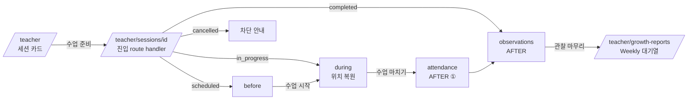
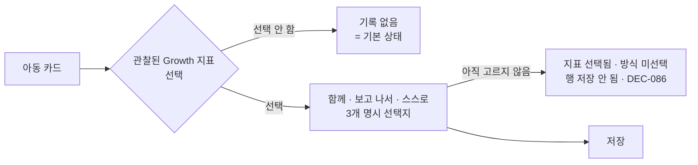

# Class Mode Flow — TeachAble Art Play SaaS Platform 2.0

| | |
|---|---|
| 문서 상태 | PHASE 02 승인본 (검토 반영) |
| 작성 기준일 | 2026-09-26 |
| Branch / 기준 commit | `saas-v2` / `0ceb8ad` |
| 관련 문서 | [role-flows.md](./role-flows.md) · [report-portal-flow.md](./report-portal-flow.md) · [state-error-model.md](./state-error-model.md) · [../01-product/product-definition.md §8 · §9](../01-product/product-definition.md) |
| 관련 결정 | DEC-004 · DEC-007 · DEC-008 · DEC-023 · DEC-028 · DEC-029 · DEC-033 ~ DEC-038 · DEC-046 · DEC-047 |

> 저장 구조 · RLS는 PHASE 05, 레이아웃 · 카피는 PHASE 06에서 정한다. 본 문서는 흐름과 정보 우선순위만 정한다. *→ PHASE 06 확정: [../06-ux-design/class-mode-observation.md](../06-ux-design/class-mode-observation.md) (DEC-098 · DEC-099 · DEC-100)*

---

## 1. 경로와 구간 (DEC-033)



| 구간 | 경로 | CURRENT → TARGET |
|---|---|---|
| 진입 | `/teacher/sessions/[sessionId]` | 신규 route handler (화면 없음) |
| BEFORE | `/teacher/sessions/[sessionId]/before` | 신규 |
| DURING | `/teacher/sessions/[sessionId]/during` | 신규 |
| AFTER ① 출결 | `/teacher/sessions/[sessionId]/attendance` | 기존 수정 (Class Mode 헤더 · 다음 버튼) |
| AFTER ② 관찰 | `/teacher/sessions/[sessionId]/observations` | 기존 수정 (아동별 집중 모드 · Growth 5 / Stage · Quick Memo 패널) |

Class Mode 중에는 StaffShell 메뉴를 숨기고 단계 표시(BEFORE · DURING · AFTER)와 "나가기"만 둔다.

---

## 2. ENTRY — 진입 조건과 실패

| 조건 | 재사용할 CURRENT 로직 | 실패 시 |
|---|---|---|
| 인증된 교사 | `requireTeacher()` | `/login` |
| 활성 기관 · 활성 멤버십 | `fetchActiveMemberships` (기관 정지 시 탈락) | `/login?error=no_access` |
| 담당 반 | RLS `is_assigned_class_teacher` | "찾을 수 없거나 접근 권한이 없습니다" (무구분, DEC-044) |
| 유효 세션 · 취소 아님 | `private.is_recordable_session` | 취소 안내 → 오늘로 |
| 활성 반 | `parentsActive` | 보관 반: BEFORE / DURING 진입 불가, AFTER에서 기존 기록 수정만 (AI-7) |
| 발행 프로그램 · 차시 | `parentsActive` | "수업 내용이 아직 준비되지 않았습니다" |
| 유효 Entitlement · 이용 기간 | **신규** (class-aware · DEC-083) | 이용 기간 외 안내 ([permission-matrix.md §4](./permission-matrix.md#4-entitlement-ux)) |
| **필수 커리큘럼 데이터** | **신규** (Required Content Set, DEC-096) | **차단**: "수업 내용이 아직 준비되지 않았습니다" (DEC-037) |
| 선택 · 부가 섹션 | — | 해당 섹션만 숨기고 진행 |

---

## 3. BEFORE — `/teacher/sessions/[sessionId]/before`

**목표**: 별도 PDF 없이 10분 이내 준비.

| 블록 | 원본 | 성격 |
|---|---|---|
| 헤더: Week · 성장키워드 · 차시명 · 핵심 메시지 · 수업 목표 · 예상 시간 (50분 + 워크북 10분) | §1 · §2 | Read-only |
| 6단계 요약 (단계명 · 분) | §5 | Read-only |
| 준비물 (구분 · 품목 · 수량 기준) | §4-A | **A. Optional check** |
| 공간 세팅 | §4-B | Read-only |
| 안전 확인 · 사진/개인정보 확인 | §4-C | **B. Required confirmation** |
| 오늘 사진 비동의 아동 목록 | P0-11 연동 | Read-only (촬영 주의) |
| 누리과정 연계 | §3 | Read-only · 기본 접힘 |
| 퀵가이드 | §15 | Read-only · 인쇄 |
| 콘텐츠 목록 (자산명 · 사용 시점) | §10 | Read-only · **재생 없음** (DEC-029) |

### 3-1. Check Persistence (DEC-036)

| 구분 | 예 | P0 보존 | 수업 시작 조건 |
|---|---|---|---|
| **A. Optional preparation check** | 준비물 | 사용자 편의. 서버 감사기록 필수 아님 | 아님 |
| **B. Required safety/privacy confirmation** | 안전 · 사진/개인정보 | **서버 보존** — who · when · session · confirmation state | **필수** |

| 상태 | 동작 |
|---|---|
| 필수 확인 미완료 | [수업 시작] 비활성 · 남은 필수 항목 수 표시 |
| 필수 확인 완료 | [수업 시작] 활성 → `scheduled → in_progress` (기존 `transitionStaffSessionAction` 재사용) → DURING 1단계 |
| 재진입 | 필수 확인 상태는 서버에서 복원한다. 선택 체크는 복원되지 않을 수 있다 |
| 다른 교사 · 다른 기기 | 필수 확인은 세션 단위로 공유된다 (세션 단위 확인 기록 · who · when — DEC-085) |
| 오늘 보드 · 원장 화면의 [수업 시작] | 직접 전환하지 않는다 → §3-2 (DEC-046) |

### 3-2. 수업 시작 경로 단일화 (DEC-046)

Class Mode 적용 세션(P0 Pilot 포함)에서 `scheduled → in_progress`는 **아래 경로 하나뿐**이다.

```
scheduled
  → BEFORE
  → required safety/privacy confirmation   (DEC-036)
  → Teacher [수업 시작]
  → in_progress
```

| 화면 | CURRENT | TARGET |
|---|---|---|
| `/teacher` 오늘 화면 [수업 시작] | 직접 `in_progress` 전환 | **전환하지 않는다.** `/teacher/sessions/[sessionId]` (→ BEFORE)로 이동 |
| `/director/sessions` 원장 [수업 시작] | 직접 `in_progress` 전환 | **전환하지 않는다.** 원장은 교사의 필수 확인을 대신하지 않는다. 조회 · 출결 정정 · 취소는 유지 |
| HQ 프로그램 배정 화면 상태 변경 | `in_progress` 전환 가능 | 필수 확인 없는 `in_progress` 전환 경로를 두지 않는다 |
| 비상 강제 상태변경 | — | **없음.** `scheduled → in_progress` 강제 경로는 두지 않는다 (DEC-085) |

### 3-3. 수업 완료 경로 단일화 (DEC-047)

Class Mode 적용 세션의 정상 상태 흐름은 아래 하나뿐이다.

```
scheduled → BEFORE → required safety/privacy confirmation → Teacher [수업 시작]
  → in_progress → DURING → Teacher [수업 마치기] → completed
```

| 화면 | CURRENT | TARGET |
|---|---|---|
| `/teacher` 오늘 화면 빠른 [완료] (`scheduled → completed`) | 가능 | **제거** |
| `/director/sessions` `scheduled → completed` 직접 완료 | 가능 | **제거** |
| HQ 프로그램 배정 화면 `scheduled → completed` | 가능 | **불허** |
| 취소 (`scheduled → cancelled` · `in_progress → cancelled`) | 가능 | **유지** |
| 1.0 과거 `completed` 기록 | — | **변경하지 않는다** |
| Recovery (*Clarified by DEC-085*) | — | `in_progress → completed`만 · Director · authorized HQ Admin · 사유 필수 · actor · timestamp · audit · **P0 지원** · 일반 [수업 마치기]와 분리. `scheduled → completed`는 Recovery로도 불가 |

---

## 4. DURING — `/teacher/sessions/[sessionId]/during`

원본 확정 50분 6단계 (DEC-023): ① 도입 5 · ② 그림책 8 · ③ 활동 약속 2 · ④ 핵심활동 20 · ⑤ 미술·창작 10 · ⑥ 마무리 5 · (워크북 별도 10분 확장)

| 영역 | 내용 | 노출 |
|---|---|---|
| 상단 고정 | 단계 n/6 · 단계명 · 권장 시간 · **Timer** (남은 시간 · 일시정지) | 항상 |
| 1순위 | 핵심 한 문장 · Teacher Prompt 3~4개 | 항상 |
| 2순위 | Response Playbook · Activity Guide · 이 단계 준비물 | 펼침 |
| 콘텐츠 사용 시점 | "음원 ① — 이 단계에서 사용" 텍스트 | 항상 · **재생 버튼 없음** |
| 상시 버튼 | ⚠ 상황 도움말(§14) · ✎ Quick Memo | 항상 |
| 하단 | ◀ 이전 · 다음 ▶ / 6단계에서 **[수업 마치기]** | 항상 |
| 확장 | 워크북 (별도 10분) — 6단계 뒤 선택 단계. 완료를 막지 않는다 | 선택 |

| 동작 | 규칙 |
|---|---|
| Step 시작 | 단계 진입 시 Timer 시작. 시작 시각 기준 계산 (새로고침 내성) |
| Pause / Resume | 교사 수동 |
| 시간 종료 | **안내만 한다.** 자동으로 다음 Step으로 넘기지 않는다 |
| Next / Previous | 자유 이동. 건너뛰기를 막지 않는다 |
| 수업 중 이탈 | 오늘 화면으로. 세션 카드에 "진행 중 · n단계 · 이어서" |
| 새로고침 · 재진입 | **Step 위치 · Timer 기준 시각**: 기기 로컬 보존으로 복원 (P0). 로컬 기록이 없으면 1단계 + 안내. **Quick Memo**: 서버에서 복원 (DEC-035) |
| Session status | DURING 동안 `in_progress` |
| **completed 전환** | **[수업 마치기]** (확인 1회) → `in_progress → completed` → AFTER ①. 6단계 전에도 가능 |
| 네트워크 끊김 | Step 진행은 로컬로 계속된다. Quick Memo는 미전송 표시 후 재연결 시 전송. 상태 전환 실패 시 "연결 후 다시 시도" · *Clarified by DEC-098 · DEC-099: P0는 offline queue · 자동 재전송을 약속하지 않는다 — 빠른 메모 상태는 저장 중 · 저장됨 · 저장 실패 ("저장하지 못했습니다. 연결을 확인하고 다시 시도해 주세요.") · 상단 banner "인터넷 연결이 끊겼습니다. 연결되면 다시 시도해 주세요." · 서버 전환은 연결 복구 후* |
| 완전 Offline Sync | P2 (AD-12) |

---

## 5. Quick Memo (DEC-035)

| 항목 | 내용 |
|---|---|
| 위치 | DURING 상시 버튼 → 짧은 입력. 아동 지정 없음 |
| 저장 | **교사 전용 서버 임시저장** (자동 저장). 전송 전에는 "저장 중 / 미전송" 표시 · *Clarified by DEC-099: 이름 "빠른 메모" · 상태 **저장 중 · 저장됨 · 저장 실패** (offline queue를 암시하는 "미전송" 표현은 쓰지 않음)* |
| 접근 | **작성 교사 본인만** (같은 반 다른 교사에게도 비공유 · *Clarified by DEC-087*) |
| 비노출 | Director · HQ · Parent · AI 입력 |
| AFTER 연결 | AFTER ② 화면에 Quick Memo 패널로 **참고 표시**. 교사가 필요한 내용만 직접 Observation에 옮긴다. **자동 이관·자동 아동 배정 없음** |
| 지위 | 최종 Observation이 아니다. 리포트 근거가 되지 않는다 |
| 보존 기간 · 삭제 | CO-2 (저장 단위 · 접근은 DEC-087) |

---

## 6. AFTER

### 6-1. ① 출결 — `/attendance` (기존 수정)

- Class Mode 헤더 + [관찰 기록으로] 다음 버튼 추가.
- 권고: [모두 출석] 후 예외만 수정하는 빠른 경로 (PHASE 06에서 CURRENT 일괄 기능 확인).
- 원장 출결 정정 권한(CURRENT `requireStaff`)은 유지한다.

### 6-2. ② 관찰 — `/observations` (기존 수정)

| 영역 | 내용 |
|---|---|
| 아동 목록 | 15명. 상태 라벨: **결석 · 미작성 · 작성 중 · 완료** (텍스트, 점수 아님) + 전체 진행 "완료 9 / 출석 14" |
| 결석 아동 | 흐리게 표시 · 관찰 대상 제외 (필요 시 열 수 있음) |
| ObservationFocus | 상단 1줄 "이번 차시에서는 이런 모습을 보세요" (§12). 펼침 상세. **입력 항목이 아니다** (DEC-025) |
| 아동 카드 | 아이의 말 → 교사 관찰 → Growth 5 / Stage (§8) → 사진 → (보조) AI 정리 |
| Quick Memo 패널 | DURING 메모 참고 (§5) |
| 버튼 | **[관찰 완료하고 다음 아이]** (= Observation complete + 다음 아동) · [임시저장] (= draft 저장) · [나중에 작성] · 이전 / 다음 · *Clarified by DEC-099 (구 표기 "저장하고 다음 아이" — 저장과 완료를 구분). [관찰 마무리]는 일괄 complete가 아니며 결석 아동을 자동 complete하지 않는다* |
| 하단 | **[관찰 마무리]** — 미작성 n명이면 "나중에 작성으로 두고 마무리" 확인 → Weekly 대기열 |
| AI | optional. AI 없이 complete 가능 (DEC-009). AI 버튼은 카드 하단 보조 위치 |

**목표**: 반 전체 관찰 기록 중위 20분 이내 (아동당 약 80초).

---

## 7. "완료" 의미 구분 (DEC-034)

| 용어 | 의미 | 전환 | 주체 |
|---|---|---|---|
| **Session completed** | 교실 수업 진행 종료 | DURING [수업 마치기] · `in_progress → completed`. `scheduled → completed` 직접 전환 없음 (DEC-047) | 교사 (진행 중 세션의 운영 정정은 Director · authorized HQ Admin의 별도 Recovery — 사유 · audit · DEC-085) |
| **Observation complete** | 아동 1명의 관찰 기록 완료 | AFTER ② [관찰 완료하고 다음 아이] (DEC-099) · `record_status = complete` | 교사 |
| **Weekly complete** | 아동 1명의 주간 리포트 작성 완료 · 잠금 | 리포트 검토 [작성완료] | 교사 |

- UI 문구는 세 가지를 구분한다. 예: "수업 종료" / "관찰 완료" / "리포트 작성완료" (정확한 카피는 PHASE 06). *→ PHASE 06 확정: 버튼 "수업 마치기" · "관찰 완료하고 다음 아이" · "리포트 완료" / 상태 "수업 종료" · "관찰 완료" · "완료" (DEC-098 · DEC-099 · DEC-101)*
- Session completed 후 Observation 미작성이 Director follow-up("관찰 기록 없음")에 잡히는 것은 **의도된 동작**이다.

---

## 8. Growth 5 / Observation Stage UX (DEC-038)



| 항목 | 내용 |
|---|---|
| Product Concept | 4 states: 기록 없음 · 함께 · 보고 나서 · 스스로 (DEC-007 · DEC-008 유지) |
| Explicit Teacher Choices | 지표를 선택했을 때만 3개: **함께 · 보고 나서 · 스스로** |
| 기본 상태 | 모든 지표 = 기록 없음. "기록 없음" 버튼을 누르게 하지 않는다 |
| 지표 배치 | 5개를 같은 크기 · 같은 중립색 · 번호 없이. 필수 선택 아님 — 관찰된 것만 |
| 선택지 배치 | 원본 정의 순서로 가로 균등 배치. 강조색은 "선택됨" 1가지. 서술형 보조 문구 가능 (예: 교사와 함께 참여 / 모습을 본 뒤 참여 / 스스로 시작) — 카피는 PHASE 06 · *→ DEC-100 확정: 섹션 이름 "관찰 포인트" · 함께 = 교사나 친구와 함께, 또는 도움 속에서 나타난 모습 · 보고 나서 = 예시나 다른 사람의 모습을 본 뒤 이어 해 본 모습 · 스스로 = 추가적인 도움이나 예시 없이 아이가 스스로 시도하거나 이어간 모습 (예시의 "스스로 시작"은 historical)* |
| 금지 | 1/2/3/4 · Low/Medium/High · ↑↓ · Progress Bar · 점수 색 · 레이더차트 · "스스로 달성률" · 합계 · 반 평균 |
| AI | Growth 5 · Stage를 AI 입력에 포함하지 않고, AI 출력에서 파싱하지 않는다 (U-7) |
| 저장 방식 | **DEC-086으로 확정** (IA-3 · AD-3 해소): 행 없음 = 기록 없음 · 행이 있으면 stage NOT NULL · 저장 코드 `together` · `after_modeling` · `independent`. 방식 미선택 상태의 안내 UX는 PHASE 06 → *DEC-100: 저장 불가 · "방식을 선택하거나 이 관찰 포인트 선택을 해제해 주세요."* |

### 8-1. 고정 안내문 위치

| # | 위치 | 문구 취지 |
|---|---|---|
| 1 | AFTER ② Growth 5 영역 제목 바로 아래 (항상 1줄) | "이 기록은 점수나 발달 수준이 아니라 이번 활동에서 관찰된 참여 방식을 기록합니다." |
| 2 | 선택되지 않은 지표 영역의 도움말 | "기록 없음은 못했다는 의미가 아닙니다." |
| 3 | 원장 관찰 조회 화면 상단 | 1과 동일 |
| 4 | 학부모 Weekly의 교사 관찰 항목 하단 | 1의 학부모용 표현 (Stage 노출 방식은 IA-13) |
| 5 | 교사 오리엔테이션 자료 (G-10) | 1 · 2 |

---

## 9. P0 / P1 / P2 경계

| 영역 | P0 | P1 | P2 |
|---|---|---|---|
| BEFORE | 목표 · 6단계 요약 · 준비물(선택 체크) · 공간 · **필수 안전·개인정보 확인(서버 보존)** · 누리(접힘) · 퀵가이드 · 콘텐츠 목록 | 분할 운영(35+15) 선택 · 사진 예시 · 기관 동의 상태 상세 | 재고·배송 연동 · 사전 다운로드 |
| DURING | 6단계 · Timer(수동 진행) · Prompt · Playbook · Activity · Workbook Guide · Situation Help · **Quick Memo(서버)** · 위치 로컬 복원 | **EBOOK · VOD · MV · Audio 인앱 재생** (DEC-029) · 이용 로그 · 교사 커스텀 프롬프트 | 완전 Offline Sync · 음성 메모 |
| AFTER | 출결 · 관찰 · 사진 · 아이의 말 · 교사노트 · **Growth 5 / Stage** · ObservationFocus 안내 · Quick Memo 참고 · optional AI | 지표별 서술 · 미기록 아동 알림 | 워크북 optional evidence (DEC-012) |
| 연결 | 관찰 마무리 → Weekly 대기열 | — | — |
