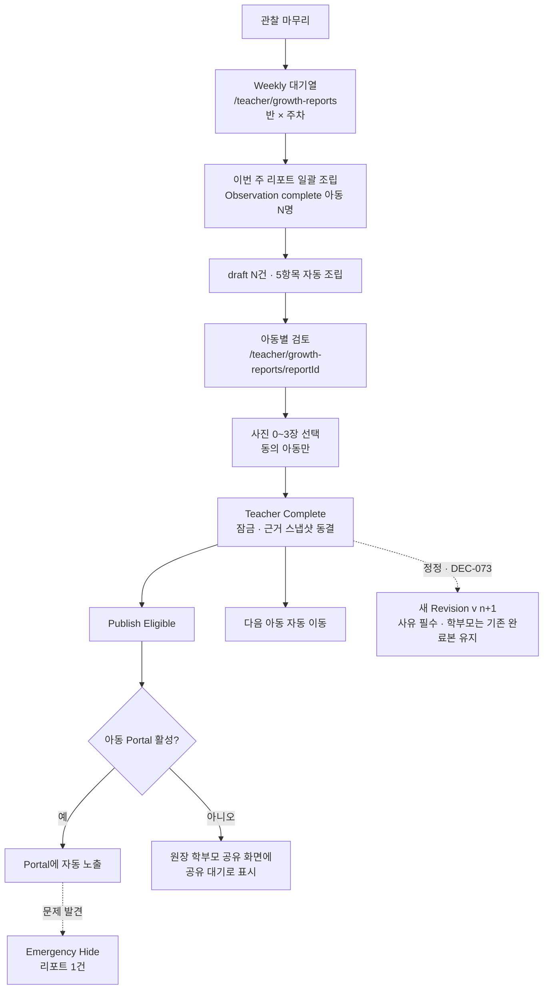
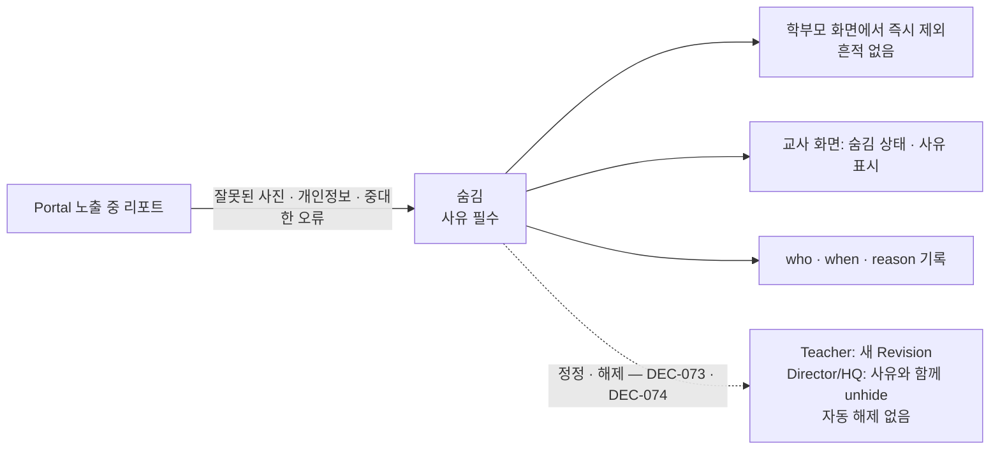
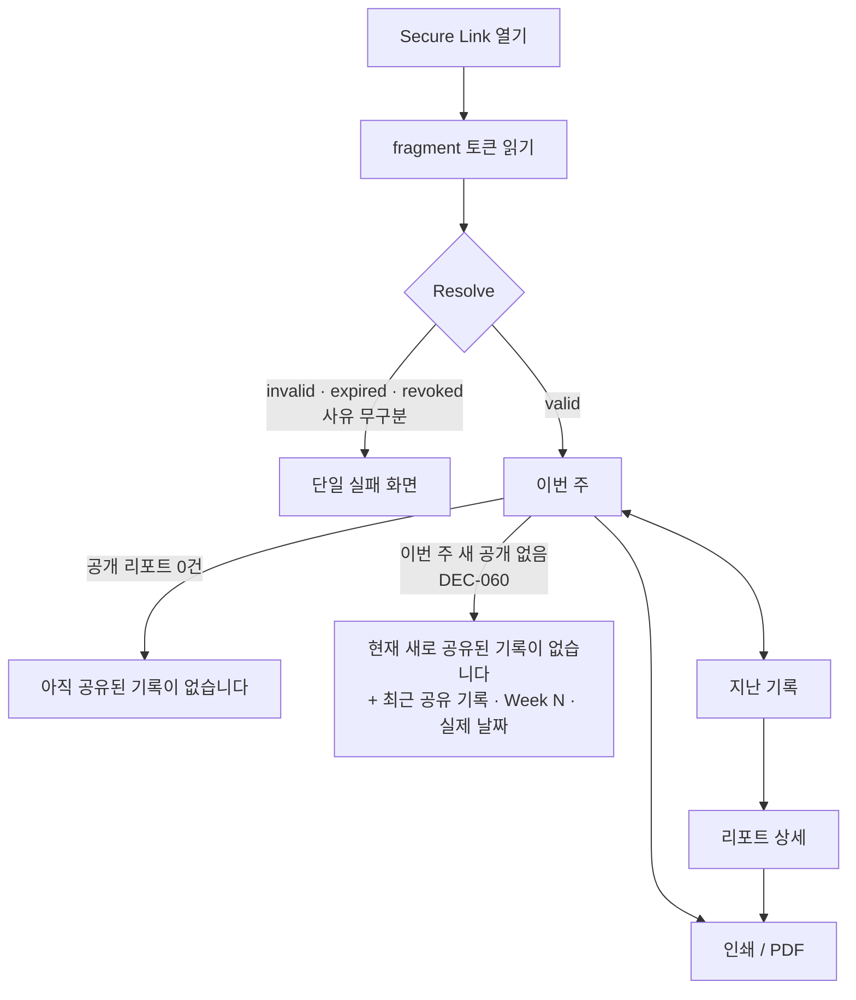

# Report & Portal Flow — TeachAble Art Play SaaS Platform 2.0

| | |
|---|---|
| 문서 상태 | PHASE 02 승인본 (검토 반영) |
| 작성 기준일 | 2026-09-26 |
| Branch / 기준 commit | `saas-v2` / `0ceb8ad` |
| 관련 문서 | [class-mode-flow.md](./class-mode-flow.md) · [permission-matrix.md](./permission-matrix.md) · [state-error-model.md](./state-error-model.md) · [../01-product/product-definition.md §10 · §12](../01-product/product-definition.md) |
| 관련 결정 | DEC-009 · DEC-010 · DEC-013 · DEC-014 · DEC-024 · DEC-030 · DEC-034 · DEC-039 ~ DEC-044 |

---

## 1. Weekly Report Flow

> *Updated by DEC-073 · DEC-074 (PHASE 04)*: 위 도식의 구 "reopen (PROPOSED)"는 **새 Revision**으로 확정되었다. Complete = 교사 확인 · Revision Snapshot 확정이며, 학부모 노출은 **계산값**(latest completed revision ∧ not hidden ∧ Portal active ∧ 계약 허용)이다. 상세: [../04-ai-report/report-lifecycle.md](../04-ai-report/report-lifecycle.md)

### 1-1. 단위와 대기열 (DEC-039)

| 항목 | 내용 |
|---|---|
| 단위 | **아동 × 주차 (week_no)**. 자유 기간 입력 없음 |
| 분할 운영 | 한 주에 세션 2개면 두 관찰을 모두 근거로 쓴다 |
| 대기열 | 반 × 주차별 아동 행. 상태: **준비됨**(Observation complete) · **관찰 미완료** · **결석** · **작성 중** · **완료** · **숨김**(긴급 숨김된 완료 리포트) · *Clarified by DEC-101: 표시 명칭 "작성 가능 · 관찰 필요 · 결석(작성 대상 아님) · 작성 중 · 완료 · 숨김"* |
| 생성 | [이번 주 리포트 만들기 (N명)] — 준비됨 아동 draft를 한 번에 조립 |
| AI | **P0 Weekly에는 AI 없음.** 문장 다듬기는 P1 · *Updated by DEC-070: 문장 다듬기(C3)는 `ai_assist` 포함 상품(STANDARD · PREMIUM)만* |
| 비교 | 지난주 대비 표기 없음 |

### 1-2. 5항목 + 다음 주 예고 (DEC-024)

| 항목 | 출처 | 교사 작업 |
|---|---|---|
| 오늘의 활동 | Lesson 그림책 제목 + Activity | 없음 (확인) |
| 아이의 작품 | Lesson.take_home + 선택 사진 스냅샷 | **사진 0~3장 선택** |
| 아이의 말 | Observation `child_voice` 복사 | 필요 시 다듬기 |
| 교사 관찰 | Observation `teacher_note` + Growth 5 / Stage | 필요 시 다듬기 |
| 가정연계 Tip | Lesson.FamilyConnection | 없음 |
| 다음 주 예고 | 다음 Lesson 주제 · 성장키워드 | 없음 |

- *Clarified by DEC-066 · DEC-103: 위 표는 DEC-024 시점 항목 목록이다. Weekly 섹션 **순서**는 DEC-066을 따른다 — 이번 주 활동 주제 → 아이의 말과 선택 → 교사 관찰 기록 → 작품·활동 장면 → 가정에서 나눌 이야기 → 다음 주 예고. 사진은 0~3장 선택 · 선택 사항 (DEC-039 · DEC-101).*
- 리포트에서 고친 문장은 **리포트 사본에만** 반영된다. 관찰 원문은 바뀌지 않는다 (AI-10 · AI-11).
- **목표**: 아동당 중위 3분 이내.

### 1-3. 경우별 처리

| 경우 | 처리 |
|---|---|
| Observation 미완료 (출석) | draft를 만들지 않는다. 대기열에 "관찰 미완료 → 관찰로" (C-3) |
| 결석 아동 | 리포트를 만들지 않는다. 대기열에 "결석" (교사 화면). Portal에는 **"결석"을 성장기록으로 표시하지 않고 사유도 구분하지 않는다** — *Updated by DEC-060* (구 IA-11) |
| 사진 없음 | "아이의 작품"을 작품명만으로 표시. 차단하지 않는다 |
| 사진 비동의 · 미확인 | 사진 선택 비활성 + 사유 표시 (교사 화면에만) |
| `child_voice` 없음 | 부드러운 경고. Complete 가능. 학부모 화면에서 해당 항목 숨김 |
| 자동 조립 결과 확인 | 읽기 전용 블록. 커리큘럼 오류 신고는 P1 |
| 수정 | 아이의 말 · 교사 관찰 문장 · 사진 선택만 수정 가능 |
| Complete | 확인 1회 → 잠금 → 다음 아동 자동 이동 |
| 완료 후 정정 | **PROPOSED placeholder** — "정정 요청" 자리만. 정책은 PH3-3 · *Updated by DEC-073: **새 Revision**(사유 필수). 정정 draft 작성 중 학부모는 기존 완료본을 계속 본다. 완료본 직접 수정 · rollback 금지* |

---

## 2. Teacher Complete → Publish Eligible

| 단계 | 의미 | 원장 조치 |
|---|---|---|
| Teacher Complete | Weekly complete (DEC-034). 내용 잠금 · 스냅샷 동결 | 없음 |
| Publish Eligible | Portal에 나갈 수 있는 상태 | 없음 (**사전승인 없음**, DEC-030) |
| 노출 | Publish Eligible ∧ 아동 Portal 활성 ∧ 숨김 아님 | 아동 Portal 활성은 **아동당 1회** (DEC-040) |

- Director는 complete 리포트를 조회하고, 미발행·누락을 확인하고, Portal을 활성/중지하고, 필요 시 검토한다.
- draft · AI draft · Quick Memo는 Director에게 노출하지 않는다.

---

## 3. Emergency Hide (DEC-043 · P0)

| 항목 | 내용 |
|---|---|
| 목적 | 공개 후 발견된 사고의 즉시 차단. **사전승인이 아니다** |
| 권한 | Director · HQ admin (**sales 제외**) |
| 범위 | 리포트 1건. **Portal 전체 revoke와 분리** — 다른 리포트와 링크는 그대로 |
| 진입 (Director) | 리포트 상세 `/director/growth-reports/[reportId]` · 학부모 공유 화면 `/director/portal`의 아동별 노출 리포트 목록 |
| 진입 (HQ) | 기관 상세 `/admin/organizations/[id]`의 "학부모 공개 리포트" 섹션 (admin만) |
| 입력 | 사유 필수 (사진 오류 · 개인정보 · 내용 오류 · 기타 + 메모). 확인 1회 |
| 개념 | `visible / hidden` · hidden reason · hidden by · hidden at (저장 구조: 논리 리포트 단위 · DEC-089) |
| 학부모 | 목록 · 이번 주에서 사라진다. 숨김 사유 · 흔적 표시 없음. 이번 주 리포트가 숨겨져 이번 주에 공개된 리포트가 없게 되면 **"현재 새로 공유된 기록이 없습니다."** + 필요 시 "최근 공유 기록 · Week N · 실제 날짜" — 이전 리포트를 "이번 주"로 보이지 않는다 (*Updated by DEC-060*) |
| 교사 | 대기열·리포트 상세에 "학부모 화면에서 숨김 · 사유" 표시 |
| 사진 | 숨김 리포트의 사진 스냅샷도 함께 노출 중단 |
| 해제 · 정정 | 미확정 — PH3-3(reopen)과 함께 (*Updated: PHASE 03에서 미처리 → PHASE 04로 이월*, 03-commerce open-items §3) · *Updated by DEC-073 · DEC-074: 숨김 단위 = **Logical Report**(모든 Revision) · 정정 = Teacher의 새 Revision · **unhide = Director · HQ admin + 사유** · Hidden 중 새 Revision이 complete돼도 **자동 해제 없음** · 재발행 = unhide (새 URL 없음)* |

---

## 4. Child Secure Portal

### 4-1. 개념

| 항목 | 내용 |
|---|---|
| 단위 | 아동 1명 = Portal 링크 1개 (DEC-013 · DEC-040) |
| 경로 | `/share/portal/[portalId]#token` (신규) |
| 조회 | fragment 토큰 → POST resolve → 결과. 보안 구조 DEC-092 · 구현 PHASE 07 (AI-14 유지) |
| 생성 · 중지 · 재발급 | 원장 `/director/portal`. 재발급 시 기존 링크 무효 (CURRENT 동작 계승) |
| 노출 대상 | Teacher Complete ∧ Portal 활성 ∧ 숨김 아님 인 리포트만 |

### 4-2. 상태

| 상태 | 학부모 화면 | 원장 화면 |
|---|---|---|
| 최초 진입 | 불러오는 중 → 아동 이름 · 반 · 기관명 | — |
| 유효 링크 | 이번 주 | 활성 · 만료일 |
| **invalid / expired / revoked** | **단일 화면** — *DEC-103 확정 문구:* "이 링크로는 기록을 확인할 수 없습니다. 기관에 새 공유 링크를 요청해 주세요." (기관 display name 사용 가능 시 "○○유치원에 새 공유 링크를 요청해 주세요.") · 구 후보 "원에 새 링크를 요청해 주세요."는 historical — "원" hardcode 금지 (DEC-044) | 사유 구분 표시: 미생성 · 활성 · 만료 · 중지 |
| no reports | "아직 공유된 기록이 없습니다" | 활성 · 노출 리포트 0건 |
| this week published | 이번 주 = **현재 주차에 공개된** Weekly (실제 week · date 표시) | — |
| **this week not published** | **"현재 새로 공유된 기록이 없습니다."** + 필요 시 별도 카드 "최근 공유 기록 · Week N · 실제 날짜". **이전 리포트를 "이번 주"처럼 보여주지 않는다.** 결석 · 교사 미작성 · 미공개 사유를 **구분하지 않는다** (*Updated by DEC-060*. 구 서술 "이번 주 = 가장 최근 노출 Weekly"를 대체) | 사유 구분은 원장 화면에서만 |
| week · date | 모든 리포트 표시에 실제 week · date 항상 표시 (DEC-060) · "현재 주차" 판정 기준은 PHASE 05 / 06 → *DEC-103: 현재 로컬 주간에 수업 일정이 잡힌 program week의 visible Weekly* | — |
| past reports | 지난 기록 목록 (주차 역순) → 상세 | — |
| monthly | P1. 지난 기록에 유형 라벨로 표시 | — |
| photo consent missing | 사진 영역 **미표시** · 동의 관련 문구도 없음 | 동의 미확인 경고 |
| no selected photo | 작품명만 | — |
| hidden report | 존재하지 않는 것처럼 제외 | 숨김 · 사유 · 처리자 |
| correction in progress (*Updated by DEC-073*) | 정정 draft가 있어도 **기존 latest completed revision을 계속 표시** | 정정 진행 중 |
| revised report (*Updated by DEC-075*) | 현재 revision > 1이면 **"업데이트됨 YYYY.MM.DD"** 표시 · 이전 revision history 비노출 (Copy PHASE 06 → *DEC-102 확정: "업데이트됨 YYYY.MM.DD"*) | revision 이력 |
| Growth 5 (*Updated by DEC-075*) | 지표명 + 구체적 Evidence 서술 · **Stage chip · raw label 미노출** · 고정 안내 문구 | 개별 기록 읽기 |
| legacy report (*Updated by DEC-076*) | **신규 Portal에 자동 편입하지 않음** — 기존 Legacy Share Link로만 (DEC-041) | — |
| print / PDF | 현재 보고 있는 리포트 인쇄 (기존 print CSS 재사용) · *Updated: 현재 표시 revision의 Final Content Snapshot만 · AI Draft 인쇄 금지* | — |

만료 기간은 미확정 (PH3-4 · CURRENT 30일). 학기 단위 링크 유지 가능성은 PHASE 03 / 05에서 확정. *Updated: → 03-commerce **CO-12** (Production Blocker)*

---

## 5. Parent P0 2-tab IA (DEC-042)

| 탭 | 내용 |
|---|---|
| **1. 이번 주** | 오늘의 활동 · 아이의 작품 (선택 사진) · 아이의 말 · 교사 관찰 · 가정연계 Tip · 다음 주 예고 · 인쇄 · 실제 week · date. 현재 주차에 공개 리포트가 없으면 "현재 새로 공유된 기록이 없습니다." (+ 최근 공유 기록 카드) — *Updated by DEC-060* |
| **2. 지난 기록** | 노출 가능한 이전 리포트 목록 (주차 · 제목) → 상세 (이번 주와 같은 구조) · 인쇄 |

| 우선 | 추가 |
|---|---|
| P1 | 성장 · 작품 |
| P2 | 학기 포트폴리오 |

- 별도 "활동" · "가정연계" P0 탭은 만들지 않는다.
- 지난 리포트 상세는 페이지 내부 상태로 전환한다 (리포트 식별자를 URL 경로에 노출하지 않는 방향. 구현은 PHASE 05).

---

## 6. Legacy report share — Migration / Cutover (DEC-041)

| 시점 | `/share/growth-report/[shareId]` | Director 화면 |
|---|---|---|
| 개발 중 (현재 ~ Cutover 전) | 신규 발급 **계속** · 정상 동작 | 리포트 상세의 기존 공유 섹션 유지 |
| **Portal Production Cutover** | **신규 발급 중단** | 리포트 상세에서 "새 링크 만들기" 제거. 기존 링크 조회 · 중지는 유지 |
| Cutover 이후 | 기발급 링크는 **만료 또는 revoked될 때까지 정상 동작** | 기존 링크가 모두 만료되면 공유 섹션 제거 |
| 경로 폐기 | 모든 기존 링크 소멸 후 별도 결정 | — |

> *Updated by DEC-076*: Legacy 리포트(`legacy_period`)는 신규 Child Portal에 **자동 편입하지 않는다.** 향후 통합이 필요하면 새 Decision.

- 기존 링크 최대 수명은 CURRENT 트리거 기준 30일이다.
- Cutover 전 원장 안내: "앞으로는 아동별 링크 하나로 모든 리포트를 볼 수 있습니다" (카피 PHASE 06). *→ DEC-112 확정: "이제 아동별 공유 링크 하나에서 공개된 기록을 함께 확인할 수 있습니다. 기존 리포트별 공유 링크는 사용이 끝날 때까지 별도로 유지됩니다." · 짧은 UI "새 공유는 아동별 링크로 관리합니다."*
