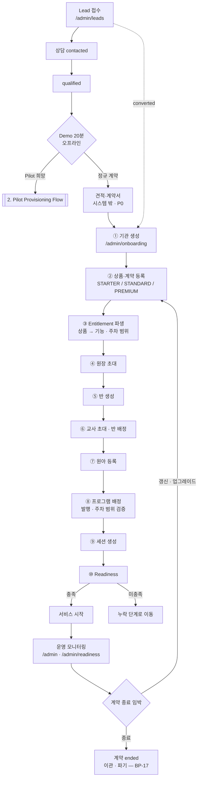
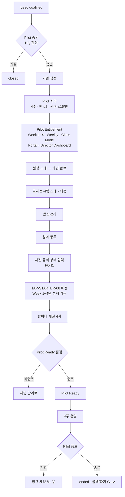
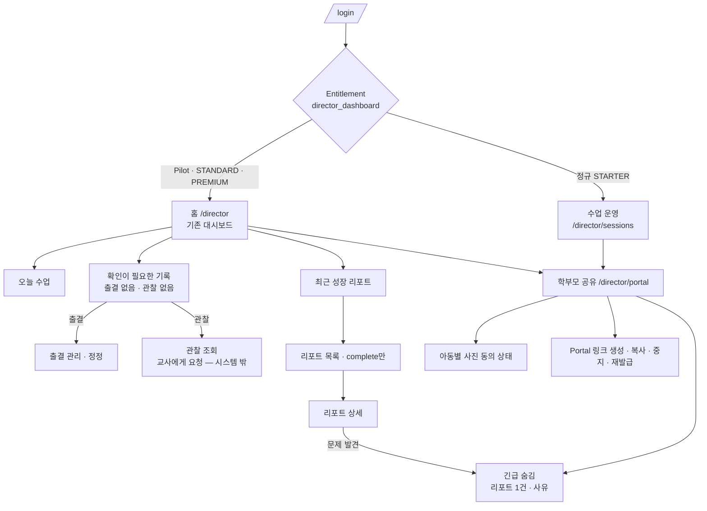
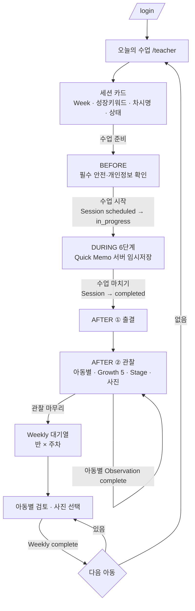
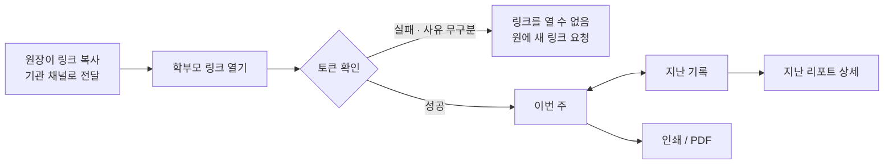

# Role Flows — TeachAble Art Play SaaS Platform 2.0

| | |
|---|---|
| 문서 상태 | PHASE 02 승인본 (검토 반영) |
| 작성 기준일 | 2026-09-26 |
| Branch / 기준 commit | `saas-v2` / `0ceb8ad` |
| 관련 문서 | [ia-overview.md](./ia-overview.md) · [class-mode-flow.md](./class-mode-flow.md) · [report-portal-flow.md](./report-portal-flow.md) · [permission-matrix.md](./permission-matrix.md) |
| 관련 결정 | DEC-030 · DEC-031 · DEC-032 · DEC-033 · DEC-040 · DEC-043 · DEC-044 · DEC-045 · DEC-046 · DEC-047 |

---

## 1. HQ End-to-End Flow (정규 계약)

| 단계 | ENTRY | USER ACTION | SYSTEM RESPONSE | PERMISSION CHECK | NEXT | ERROR / BLOCKED |
|---|---|---|---|---|---|---|
| Lead | `/admin/leads` (CURRENT) | 상태 변경 new → contacted → qualified | 상태 저장 | admin · sales | 상담 | — |
| 상담 · Demo | 시스템 밖 | 데모 진행 | (P1: Demo 계정 PH3-7) | sales | 계약 준비 | — |
| 계약 준비 | 시스템 밖 (P0) | 견적 · 계약서 | — | sales | 기관 생성 | — |
| ① 기관 | `/admin/onboarding` (CURRENT) | 기관명 · 유형 | 기관 `active` | **admin만** | ② | — |
| ② 상품·계약 (**TARGET 신규**) | 온보딩 0단계 · 기관 상세 "계약·이용권" | 상품 · 기간 · 반/원아 좌석 · 시작일 | Contract `draft` → 시작일 도래 또는 HQ 활성화 시 `active` | admin | ③ | 상품 미선택 시 이후 단계 진행 불가 |
| ③ Entitlement | 자동 | — | 상품 → 기능 목록 · 콘텐츠 주차 범위 파생 | 시스템 | ④ | 파생 결과 불일치 → HQ 오류 상태 ([state-error-model.md](./state-error-model.md)) |
| ④ 원장 초대 | CURRENT | 이메일 초대 | 초대 메일 · "초대됨" | admin | ⑤ | 초대 만료 → 재초대 |
| ⑤ 반 | CURRENT | 반 생성 | 반 `active` | admin | ⑥ | 좌석 초과 → 경고/차단 미확정 (IA-12) |
| ⑥ 교사 | CURRENT | 초대 + 담당 반 | 멤버십 · 반 배정 | admin | ⑦ | 원장 위임 여부 PH3-2 |
| ⑦ 원아 | CURRENT | 일괄 등록 | 원아 등록 | admin | ⑧ | 반당 15명 초과 → 경고 (초과요금은 데이터로만, DEC-018) |
| ⑧ 프로그램 배정 | CURRENT | 프로그램 · 버전 선택 | 배정 `active` | admin | ⑨ | 미발행 프로그램 · Entitlement 범위 밖 주차 → 선택 불가 |
| ⑨ 세션 | 배정 상세 (CURRENT) | 차시별 일정 생성 · 일정 변경 · 취소 | `scheduled` | admin | ⑩ | 범위 밖 차시는 목록에 나타나지 않음. HQ 일반 UI는 세션을 `in_progress`로 직접 전환하지 않고 (DEC-046) `scheduled → completed`도 허용하지 않는다 (DEC-047). Emergency Override는 PHASE 05 검토 |
| ⑩ Readiness | `/admin/readiness` | 확인 | 항목별 충족/미충족 | admin | 서비스 시작 | 미충족 항목 링크 |
| 운영 | `/admin` | 확인 | 확인 필요 기관 | admin | — | — |
| 갱신 · 종료 | 기관 상세 | 새 계약 / 종료 | 이전 계약 `ended` | admin | — | 종료 후 접근 모드 IA-10 |

---

## 2. Pilot Provisioning Flow

| 단계 | 완료 조건 (Pilot Ready 점검 항목) |
|---|---|
| Pilot 승인 | Lead `qualified` + Pilot 승인 메모 (P0 수동 판단) |
| 기관 | 기관 `active` |
| Pilot 계약 | 상품 = Pilot · 시작일/종료일(4주) · 상태 `active` 또는 시작일 대기 |
| Pilot Entitlement | 파생 완료 · 콘텐츠 범위 Week 1~4 · Director Dashboard 허용 (DEC-031) |
| 원장 | 원장 1명 이상 **가입 완료** (초대됨 상태 아님) |
| 교사 | 활성 교사 2~4명 · 모든 반에 담당 교사 1명 이상 |
| 반 | 활성 반 1~2개 |
| 원아 | 반마다 1~15명 |
| 사진 동의 | 모든 원아의 동의 상태가 "미확인"이 아님 (G-8). 입력 주체·법적 단위는 IA-6 |
| 프로그램 · 커리큘럼 | 반마다 활성 배정 1개 · 발행 버전 · **Week 1~4 차시의 필수 수업 데이터 존재** (DEC-037 · G-2) |
| 세션 | 반마다 Week 1~4 세션 4개 · 날짜 지정 · `scheduled` |
| 운영 조건 | 교사 오리엔테이션(G-10) · 지원 채널(G-11) — HQ 수동 체크 |

---

## 3. Director End-to-End Flow

| 단계 | P0 | P1 | P2 |
|---|---|---|---|
| 로그인 착지 | 대시보드 권한 있음 → `/director` / 없음 → `/director/sessions` (DEC-044) | — | — |
| 홈 대시보드 | **KEEP**: 오늘 수업 · 출결/관찰 follow-up · 최근 리포트 · `reliable` · `truncated` · 30일 창 | D-1 진행률 · D-2 리포트 누락 목록 · D-3 공유 현황 · D-4 동의 현황 카드 | D-6 콘텐츠 이용 · D-7 교사 부담 신호 |
| 수업 운영 · 이력 · 출결 | 조회 · 출결 정정 · 취소 · 진행 중 세션 완료 유지. **[수업 시작] 직접 전환 제거 (DEC-046) · `scheduled → completed` 직접 완료 제거 (DEC-047)** — Class Mode 적용 세션 | — | — |
| 관찰 조회 | Growth 5 / Stage **읽기** + 고정 안내문 | — | — |
| complete 리포트 | 유형 · 주차 필터 · Weekly 서식 상세 · **긴급 숨김** | 반 단위 일괄 인쇄 D-5 | — |
| 학부모 공유 | **신규**: 아동별 Portal 링크 상태 · 사진 동의 상태 · 노출 리포트 목록 · 긴급 숨김 | — | — |
| 누락 후속조치 | follow-up 링크 이동. 교사 연락은 시스템 밖 | 교사 알림 | — |

**Director가 하지 않는 것**: 리포트 매 건 사전승인 (DEC-030) · draft / AI draft 열람 · Quick Memo 열람 (DEC-035) · 관찰 원문 작성 · **교사 대신 수업 시작** (필수 안전·개인정보 확인은 교사만, DEC-046).

**정규 STARTER 처리**: "홈" 메뉴 숨김 · 직접 URL 접근 시 Not Entitled 안내 (HARD RULE, DEC-031 · DEC-044). 학부모 공유 · 리포트 조회 · 수업 운영은 C-5(원장 공유 활성)를 성립시키기 위해 허용을 권고하나 최종 목록은 **PROVISIONAL** (IA-9).

> *Updated by DEC-056 (2026-09-27)*: STARTER 원장 경계 확정.
> - **EXCLUDED / UPSELL**: `/director` Dashboard · 자동 누락 탐지 · 기간 집계 · Dashboard 확장 카드 · Bulk Print
> - **STARTER에도 제공**: Sessions · History · Attendance read/edit · Observation read · Complete Report read · Parent Portal 관리 · Photo Consent 상태 · Emergency Hide · 단건 Print
> - 제공 화면에서 Dashboard의 **집계 · 누락 탐지 가치를 우회 제공하지 않는다.**

---

## 4. Teacher End-to-End Flow

| 단계 | 교사 행동 | 완료 의미 (DEC-034) |
|---|---|---|
| 오늘 | 세션 카드에서 [수업 준비] (기존 [수업 시작] 버튼도 BEFORE로 이동만 한다. 빠른 [완료]는 없다 — DEC-047) | — |
| BEFORE | 필수 안전·개인정보 확인 → [수업 시작] — **`in_progress`로 가는 유일한 경로** (DEC-046) | Session `in_progress` |
| DURING | 6단계 진행 · 필요 시 Quick Memo | — |
| [수업 마치기] | 확인 1회 — `completed`로 가는 정상 경로 (DEC-047) | **Session completed** = 교실 수업 종료 |
| AFTER ① | 출결 | — |
| AFTER ② | 아동별 기록 → [저장하고 다음 아이] | **Observation complete** (아동별) |
| Weekly | 일괄 조립된 draft 검토 → 작성완료 | **Weekly complete** (아동별) |

**Primary Navigation**: 오늘의 수업 · 수업 이력 · 성장 리포트 — CURRENT 유지 (DEC-033). Weekly 대기열은 "성장 리포트" 안에 있다.

Class Mode 상세는 [class-mode-flow.md](./class-mode-flow.md), Weekly 상세는 [report-portal-flow.md](./report-portal-flow.md).

---

## 5. Parent End-to-End Flow

| 원칙 | 내용 |
|---|---|
| 계정 | 없음. 앱·비밀번호 없음 (DEC-013) |
| 링크 | 아동 1명 = Portal 링크 1개 (DEC-040) |
| 전달 | 원장이 기관 기존 채널로 직접 전달한다. P0에서 시스템은 문자·메일을 발송하지 않는다 |
| 누적 | 같은 링크를 다시 열면 새로 완료된 리포트가 자동으로 보인다 (Teacher Complete ∧ Portal 활성 ∧ 숨김 아님) |
| Navigation | 이번 주 · 지난 기록 (DEC-042) |
| 실패 | invalid · expired · revoked를 구분하지 않는 단일 화면 (DEC-044) |
