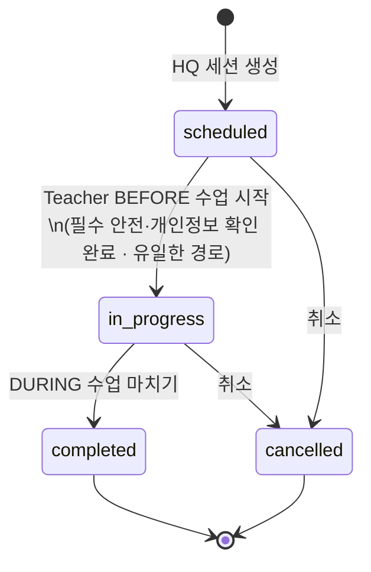
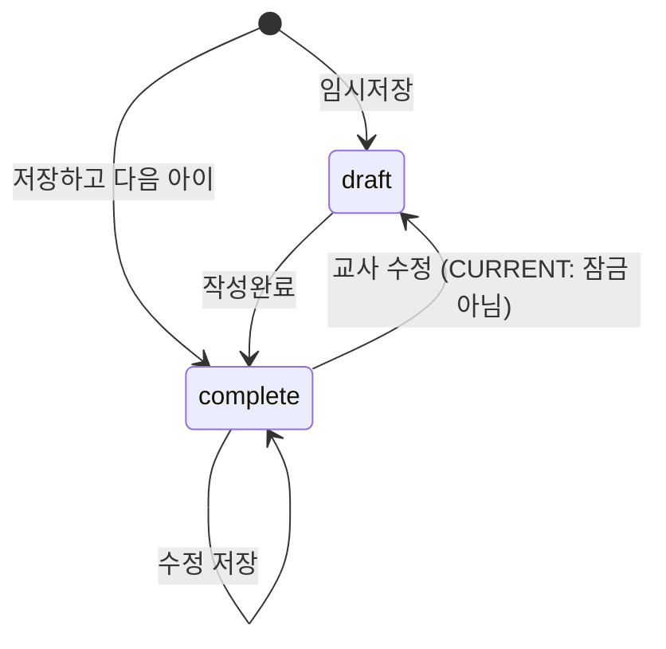
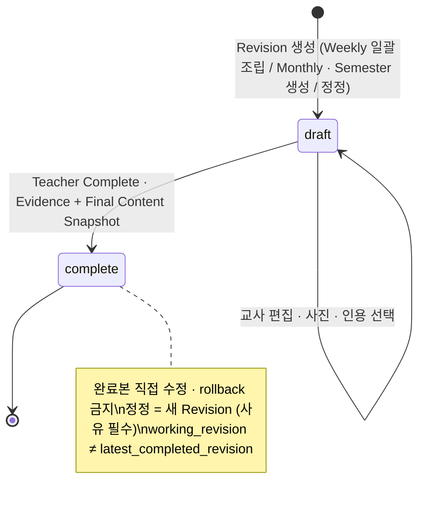
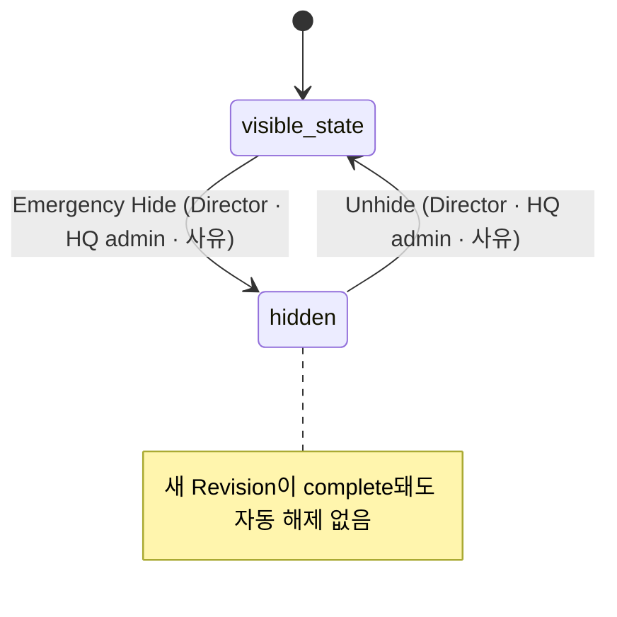
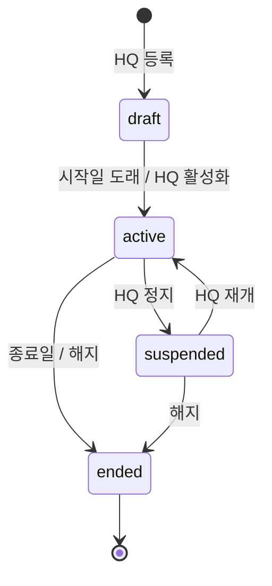
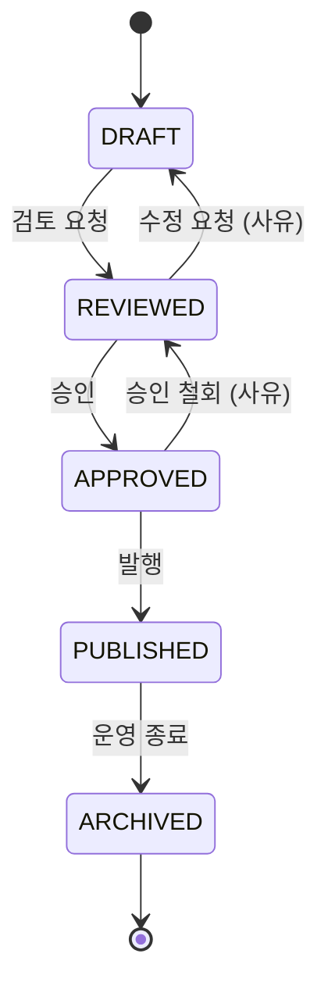

# State & Error Model — TeachAble Art Play SaaS Platform 2.0

| | |
|---|---|
| 문서 상태 | PHASE 02 승인본 (검토 반영) |
| 작성 기준일 | 2026-09-26 |
| Branch / 기준 commit | `saas-v2` / `0ceb8ad` |
| 관련 문서 | [class-mode-flow.md](./class-mode-flow.md) · [report-portal-flow.md](./report-portal-flow.md) · [permission-matrix.md](./permission-matrix.md) · [../01-product/content-governance.md](../01-product/content-governance.md) |
| 관련 결정 | DEC-034 · DEC-036 · DEC-037 · DEC-043 · DEC-044 · DEC-046 · DEC-047 |

> 상태 이름은 제품 개념이다. 실제 DB Enum · SQL은 PHASE 05에서 정한다. CURRENT 값이 있는 경우 CURRENT 값을 우선한다.

---

## 1. "완료" 용어 (DEC-034)

| 용어 | 상태 전환 | 의미 |
|---|---|---|
| **Session completed** | Session `completed` | 교실 수업 진행 종료 |
| **Observation complete** | Observation `complete` | 아동 1명의 관찰 기록 완료 |
| **Weekly complete** | Report `complete` (Weekly) | 아동 1명의 주간 리포트 작성 완료 · 잠금 |

세 상태를 UI · 문서 · 지표에서 같은 "완료"로 부르지 않는다.

---

## 2. State Transitions

### A. Session (CURRENT 값 유지 · Class Mode 트리거 추가)

- **`scheduled → in_progress`는 Class Mode 적용 세션에서 Teacher BEFORE 경로로 단일화한다 (DEC-046).** 교사 오늘 화면 · 원장 수업 운영 · HQ 배정 화면은 이 전환을 직접 일으키지 않는다. 비상 강제 상태변경은 PHASE 05에서 audit log가 있는 예외 경로로 검토하며, P0에는 없다.
- `in_progress` 전환 시 배정 · 반 · 프로그램 · 차시 유효성을 다시 확인한다 (CURRENT). TARGET은 BEFORE 필수 확인 · Entitlement · 이용 기간 · 필수 커리큘럼 데이터를 추가로 확인한다.
- **`scheduled → completed` 직접 전환은 없다 (DEC-047).** CURRENT의 빠른 완료(교사 · 원장 · HQ)는 Class Mode 적용 세션에서 제거한다. `completed`는 `in_progress`에서 Teacher [수업 마치기]로만 도달하며 "교실 수업 진행 종료"만 뜻한다 (DEC-034).
- 취소는 유지한다: `scheduled → cancelled` · `in_progress → cancelled`.
- 1.0의 과거 `completed` 기록은 변경하지 않는다. 이 상태도는 SaaS 2.0 Class Mode 대상 세션의 TARGET FLOW다.
- 데이터 복구 · 운영 오류 정정 · 마이그레이션용 강제 상태변경은 PHASE 05 Emergency Override(admin only · reason · actor · timestamp · audit log)로 검토하며, P0 일반 UI에는 없다.
- `completed` · `cancelled`는 종결 상태다 (CURRENT).
- `completed` 후 Observation 미작성이 Director follow-up에 잡히는 것은 의도된 동작이다.

### B. Observation

- "나중에 작성"은 상태가 아니라 행이 없거나 `draft`인 상태를 건너뛰는 UI 동작이다.

### C. Report

> *Updated by DEC-073 · DEC-074 (PHASE 04)*: PHASE 02 초안의 "PROPOSED — reopen"과 "PROPOSED — 숨김 해제"는 **새 Revision**과 **Director · HQ admin unhide**로 확정되었다. 아래 도식은 확정 모델이다. 상세: [../04-ai-report/report-lifecycle.md](../04-ai-report/report-lifecycle.md)

**Revision (Logical Report 1 : N)**

**Hide (Logical Report 단위 · DEC-043 · DEC-074)**

- **학부모 노출 = latest_completed_revision 존재 ∧ not hidden ∧ 아동 Portal 활성 ∧ Portal / Contract 정책 허용** — **계산값**이며 별도 "published" 상태를 저장하지 않는다.
- 정정 draft 작성 중에도 학부모는 **기존 latest completed revision**을 본다.
- hide는 리포트 내용 상태(draft/complete)와 별개 축이다.

### D. Contract (TARGET)

활성화 트리거(자동 vs 수동) · 종료 후 접근 모드는 PHASE 03 (IA-10 · BP-4 · BP-17).

### E. Content (TARGET · content-governance.md와 동일)

P0에서는 CURRENT 프로그램 · 차시 상태(`draft` / `published` / `archived`)로 운영하고, 5단계 UI는 P1 (HQ-13).

---

## 3. Error / Empty / Blocked States

> 카피 세부는 PHASE 06. 여기서는 의도 · 노출 범위 · 주 행동만 정한다.

### 3-1. Teacher

| 상태 | MESSAGE INTENT | VISIBLE | HIDDEN | PRIMARY ACTION |
|---|---|---|---|---|
| 오늘 수업 없음 | 오늘은 수업이 없다 | 다음 예정 수업 | — | 수업 이력 |
| 프로그램 미배정 | 원에서 준비 중 | 반 이름 | 내부 사유 | 원장에게 문의 |
| Entitlement 없음 · 이용 기간 외 | 이용 기간이 아니다 | 시작일 · 종료일 | 계약 금액 · 상품 내부 정보 | 돌아가기 |
| 콘텐츠 미발행 · 필수 데이터 부족 | 수업 내용이 아직 준비되지 않았다 (DEC-037) | 차시명 | 거버넌스 상태 · 누락 항목 | 돌아가기 |
| Session cancelled | 취소된 수업 | 취소 표시 | — | 오늘로 |
| BEFORE 필수 확인 미완료 | 확인해야 시작할 수 있다 | 남은 필수 항목 수 | — | 필수 항목 확인 |
| 오늘 화면에서 [수업 시작] | 시작은 BEFORE에서 한다 (DEC-046) | — | — | BEFORE로 이동 |
| Observation 없음 (Weekly) | 관찰을 먼저 완료해야 한다 | 관찰 미완료 아동 | — | 관찰로 이동 |
| AI not configured | 직접 작성하면 된다 | 입력란 정상 | 설정 상세 | (AI 버튼 비활성) |
| AI failure | 다시 시도하거나 직접 작성 | 입력 내용 보존 | 오류 원문 | 다시 시도 |
| Photo upload failure | 이 사진만 실패 | 파일명 | — | 다시 올리기 |
| Network interruption | 진행 위치 · 메모는 보존된다 | 미전송 표시 | — | 재연결 후 자동 재전송 · 수동 재시도 |
| Quick Memo 저장 실패 | 메모가 아직 서버에 저장되지 않았다 | 미전송 메모 | — | 재시도 (메모 유지) |
| Stale update | 다른 곳에서 수정되었다 | 최신 내용 | — | 새로고침 후 다시 |
| 리포트 숨김됨 | 학부모 화면에서 숨겨졌다 | 사유 · 처리 시각 | 처리자 신원 세부 (P) | 원장에게 확인 · 정정 경로는 PH3-3 · *Updated by DEC-073 · DEC-074: [정정 Revision 만들기] (사유 필수) → 완료 후 원장 · HQ가 해제* |
| AI 초안 불가 · 거부 (*Updated by DEC-071*) | AI 없이 계속 작성할 수 있다 | 입력 내용 유지 · 일반화된 안내 | 오류 원문 · 모델 정보 | 직접 작성 |

### 3-2. Director

| 상태 | MESSAGE INTENT | VISIBLE | HIDDEN | PRIMARY ACTION |
|---|---|---|---|---|
| 오늘 수업 없음 | 정상 상태 | follow-up | — | — |
| 교사가 아직 수업을 시작하지 않음 | 수업 시작은 교사가 BEFORE에서 한다 (DEC-046) | 세션 `scheduled` · 담당 교사 | [수업 시작] 버튼 없음 | 교사에게 확인 (시스템 밖) · 필요 시 취소 |
| Complete report 없음 | 아직 완료된 리포트 없음 | (P1) 작성 대기 수 | draft 내용 | — |
| Dashboard entitlement 없음 | 상품에 포함되지 않음 | 상품명 · 포함 상품 | — | 수업 운영으로 · HQ 문의 |
| Portal 미생성 | 공유 전 | 아동 목록 · 동의 상태 | — | 링크 만들기 |
| Portal 만료 · 중지 | 재발급 필요 | 사유 (만료 / 중지) · 일시 | 토큰 원문 (재표시 불가) | 새 링크 발급 |
| 사진 동의 미확인 | 사진이 학부모에게 나가지 않는다 | 미확인 아동 | — | 동의 상태 입력 |
| Follow-up 없음 | 모두 기록됨 | 집계 창 · `reliable` | — | — |
| 집계 불가 (`reliable=false`) | 지금은 집계할 수 없다 (CURRENT) | 안내 | 불완전 목록 | 수업 운영에서 확인 |
| 긴급 숨김 완료 | 해당 리포트만 숨겨졌다 | 사유 · 시각 | — | (해제는 PHASE 03) |

### 3-3. Parent

| 상태 | MESSAGE INTENT | VISIBLE | HIDDEN | PRIMARY ACTION |
|---|---|---|---|---|
| Invalid · expired · revoked | **링크를 열 수 없다 (사유 무구분)** | 기관 연락 안내 | 사유 · 아동 존재 여부 · 기관명 | 원에 새 링크 요청 |
| No published report | 곧 공유된다 | 아동 · 반 · 기관 | — | — |
| 이번 주 새 공개 리포트 없음 (*Updated by DEC-060*) | **"현재 새로 공유된 기록이 없습니다."** 이전 리포트를 이번 주처럼 보이지 않음 | 필요 시 "최근 공유 기록 · Week N · 실제 날짜" 카드 | **결석 · 교사 미작성 · 미공개 사유** (구분하지 않음) | 지난 기록 보기 |
| No photo consent | (메시지 없음) | 작품명 | 동의 상태 · 사진 존재 여부 | — |
| No photo | (메시지 없음) | 작품명 | — | — |
| Hidden report | (메시지 없음) | 나머지 노출 리포트 (이번 주 리포트가 숨겨지면 위 "이번 주 새 공개 리포트 없음" 상태) | 숨김 사실 · 사유 | — |

### 3-4. HQ

| 상태 | MESSAGE INTENT | VISIBLE | HIDDEN | PRIMARY ACTION |
|---|---|---|---|---|
| Contract 없음 | 상품 · 계약 먼저 | 기관 | — | 계약 등록 |
| Entitlement 불일치 | 계약과 배정이 어긋났다 | 범위 밖 배정 · 세션 | — | 배정 수정 |
| Onboarding incomplete | 남은 단계가 있다 | 단계 체크 | — | 해당 단계로 |
| Program unpublished · 필수 데이터 부족 | 배정 · Pilot Ready 불가 | 프로그램 상태 · 누락 차시 | — | 커리큘럼으로 |
| Organization suspended | 정지됨 | 정지일 | — | 재활성 (UI는 P1) |
| Pilot Ready 미충족 | 시작할 수 없다 | 미충족 항목 목록 | — | 항목별 이동 |
