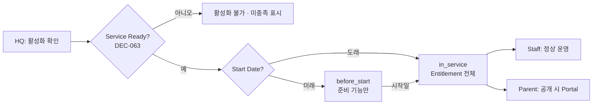
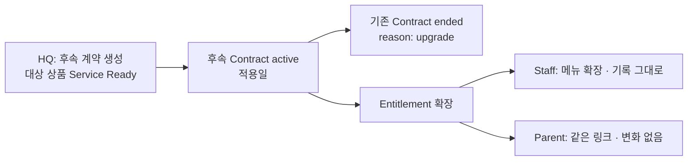
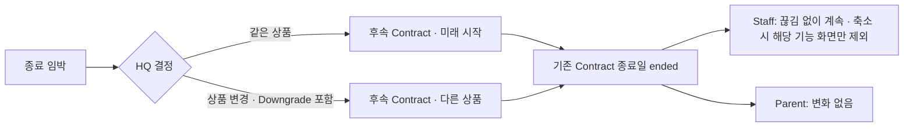
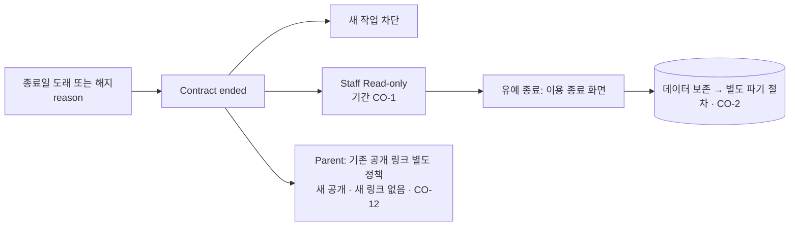
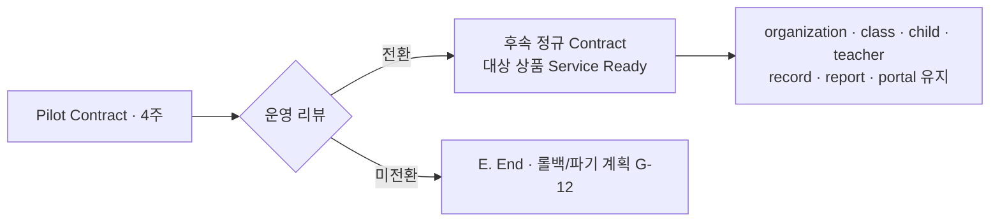
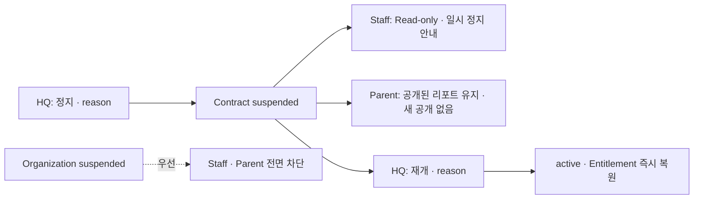

# Admin Flow — Contract & Provisioning

| | |
|---|---|
| 문서 상태 | PHASE 03 승인본 (검토 반영) |
| 작성 기준일 | 2026-09-27 |
| Branch / 기준 commit | `saas-v2` / `b31fdc9` |
| 관련 문서 | [contract-policy.md](./contract-policy.md) · [entitlement-policy.md](./entitlement-policy.md) · [../02-ia/role-flows.md](../02-ia/role-flows.md) · [../02-ia/screen-inventory.md](../02-ia/screen-inventory.md) |
| 관련 결정 | DEC-045 · DEC-048 ~ DEC-054 · DEC-058 · DEC-063 |

---

## 1. Admin P0 Contract Experience (`/admin/organizations/[id]`)

DEC-045 유지: 별도 Product / Contract 관리 화면은 P1. P0는 **기관 상세 안의 "계약 · 이용권" 섹션**과 **온보딩 0단계**에서 운영한다.

| 표시 항목 | 입력 | 비고 |
|---|---|---|
| Offer 유형 (정규 / Pilot) | ✅ | |
| Product · Version | ✅ | Pilot이면 고정 |
| Contract Status + 날짜 파생 상태 | 동작 버튼 | `before_start` · `in_service` · `expired` 표시 |
| Start Date · End Date | ✅ | 변경 시 reason 필수 |
| Contract Class Scope · 기준 인원 15명/반 | ✅ / 상품에서 | |
| **Service Ready 상태** (DEC-063) | 읽기 전용 | Not Ready면 활성화 버튼 비활성 · 미충족 항목 표시 |
| Feature summary · Content range | 읽기 전용 | **파생값. 편집 불가** (DEC-048) |
| 사용량: 서비스 반 수 / Class Scope · 반별 인원 · 초과 인원 | 읽기 전용 | DEC-051 |
| 외부 계약 참조 · 메모 | ✅ | 계약서 번호 등 |
| 이전 · 후속 계약 연결 | 읽기 전용 | 갱신 · 업그레이드 이력 |
| 변경 이력 | 읽기 전용 | §4 |

| 동작 (admin 전용 · sales 불가) | 조건 |
|---|---|
| 계약 생성 (`draft`) | — |
| 활성화 | HQ 확인 · **Service Ready (약속한 것 전체 · DEC-063)** · 효력 겹침 없음 (DEC-049) · Pilot은 Pilot Ready (반당 ≤ 15명 · override 없음) |
| 날짜 변경 · Class Scope 변경 | reason 필수 · 서비스 반 수 미만 감소 불가 |
| 정지 · 재개 | reason 필수 |
| 종료 | reason(유형) 필수 |
| 후속 계약 생성 (Renewal · Upgrade · Pilot 전환) | 미래 시작 가능 · 효력 겹침 없음 |

**P0 제외**: 결제 상태 · 금액 · 할인 · 청구서 · 세금계산서 · Add-on · Entitlement 직접 편집.

**Sales 화면 (DEC-058)**: 같은 섹션을 **읽기 전용 · 집계 수치만** 표시. 원아 명단 · 동의 상태 · 리포트 영역은 표시하지 않는다.

---

## 2. Provisioning

### 2-1. 정규 기관

| 단계 | 화면 | 완료 조건 |
|---|---|---|
| ① 기관 | 온보딩 (CURRENT) | 기관 `active` |
| ② 상품 · 계약 | 온보딩 신규 단계 / 기관 상세 | Contract `draft` · Offer · 상품 · 기간 · Class Scope |
| ③ 원장 초대 | CURRENT | 원장 1명 이상 가입 완료 |
| ④ 반 | CURRENT | Class Scope 이내 활성 반 |
| ⑤ 교사 | CURRENT | 반마다 담당 교사 |
| ⑥ 원아 | CURRENT | 원아 등록 (16명 이상은 초과 기록) |
| ⑦ 사진 동의 | DR-08 (원장) | 동의 상태 입력 (Production 사진 공개 전 CO-9 · CO-10) |
| ⑧ 프로그램 배정 | CURRENT | Class Scope 이내 · 범위 내 주차 · 발행 |
| ⑨ 세션 | CURRENT | 일정 |
| ⑩ 활성화 | 기관 상세 | HQ 확인 ∧ Service Ready ∧ Start Date |

(PHASE 02 [role-flows.md §1](../02-ia/role-flows.md#1-hq-end-to-end-flow-정규-계약)의 ① 기관 → ② 상품·계약 순서와 동일. PHASE 02 문서의 "온보딩 0단계" 표현은 온보딩 흐름 안에서 상품·계약을 기관 생성 직후 첫 설정으로 둔다는 뜻이다. 반 · 원아 등 준비는 `before_start`에서 가능 — 정확한 허용 상태는 PHASE 05)

### 2-2. Pilot

Pilot Ready 점검 항목은 [../02-ia/role-flows.md §2](../02-ia/role-flows.md#2-pilot-provisioning-flow)를 유지하고 다음을 확정 반영한다.

| 항목 | PHASE 03 반영 |
|---|---|
| Pilot Offer 계약 | 별도 Offer · Entitlement 고정 (DEC-054) |
| 반 | 최대 2 · HARD (DEC-051) |
| 반당 원아 | child count > 15 → **Pilot Ready = FALSE · Activation 차단.** P0에서 HQ reason override **없음** (DEC-051). 16명 이상 등록 자체는 준비 과정에서 가능(경고) |
| 필수 데이터 | Week 1~4 필수 수업 데이터 (DEC-037 · DEC-063) |
| 가격 | CO-3 |

### 2-3. 기존 1.0 운영 기관 (전환)

Entitlement 기능 제한을 적용하기 **전에** HQ가 기존 기관마다 Contract Record를 소급 등록한다. 절차 · 기본 상품 매핑은 PHASE 05 · 07.

---

## 3. Contract / Entitlement Flows

각 흐름: HQ action → System state → Entitlement change → Staff experience → Parent experience.

**A. New Contract**

**B. Activation**

**C. Upgrade**

**D. Renewal**

**E. End**

**F. Pilot → Regular**

**G. Suspension**

---

## 4. Audit Requirements

Commerce 관련 변경은 감사 추적 가능해야 한다. 실제 audit 구조는 PHASE 05.

| 이벤트 | 누가 | 언제 | 무엇 (이전 → 이후) | 왜 |
|---|---|---|---|---|
| Contract created | ✅ | ✅ | ✅ | 선택 |
| Contract activated | ✅ | ✅ | ✅ | 선택 |
| Suspended · Resumed | ✅ | ✅ | ✅ | **필수** |
| Ended (만료 · 해지 · 대체) | ✅ | ✅ | ✅ | **필수** (유형) |
| Dates changed | ✅ | ✅ | ✅ | **필수** |
| Class / seat scope changed | ✅ | ✅ | ✅ | **필수** |
| Product changed (후속 계약) | ✅ | ✅ | 이전 · 후속 연결 | **필수** |
| Entitlement changed | 원인 Contract 이벤트로 추적 (파생값은 별도 수동 이벤트 없음) | | | |
| Pilot 반 15명 초과 등록 발생 (Ready 불가 상태 · override 아님) | ✅ | ✅ | ✅ | 선택 |
| Consent state changed | ✅ | ✅ | ✅ | 선택 |
| Emergency Hide (DEC-043) | ✅ | ✅ | ✅ | **필수** |
| **Session Recovery Completion** (DEC-085 · `in_progress → completed`만 · Teacher normal finish와 별개) | Director · authorized HQ Admin | ✅ | ✅ | **필수** |

> *Clarified by DEC-085*: 이전 표기 "Emergency Override (admin만)"은 Session Recovery Completion으로 대체한다. PHASE 05는 **generic unrestricted Emergency Override(어떤 상태든 HQ가 강제 변경)를 정의하지 않는다.** `scheduled → completed`는 Recovery로도 불가하다.
