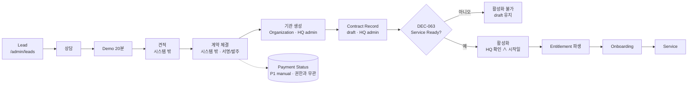

# Commerce Overview — TeachAble Art Play SaaS Platform 2.0

| | |
|---|---|
| 문서 상태 | PHASE 03 승인본 (검토 반영 · Source 상태 정정 · DEC-063 명확화 2026-09-27) |
| 작성 기준일 | 2026-09-27 |
| Branch / 기준 commit | `saas-v2` / `b31fdc9` |
| 대상 독자 | PM · 사업 · HQ 운영 · DB Architect · 개발자 |
| 선행 문서 | [../00-project/project-charter.md](../00-project/project-charter.md) · [../00-project/decision-log.md](../00-project/decision-log.md) · [../02-ia/ia-overview.md](../02-ia/ia-overview.md) |
| PHASE 03 문서 | **commerce-overview.md** · [product-catalog.md](./product-catalog.md) · [contract-policy.md](./contract-policy.md) · [entitlement-policy.md](./entitlement-policy.md) · [sales-privacy-boundary.md](./sales-privacy-boundary.md) · [admin-flow.md](./admin-flow.md) · [open-items.md](./open-items.md) |
| 관련 결정 | DEC-016 · DEC-017 · DEC-018 · DEC-031 · DEC-032 · DEC-045 · **DEC-048 ~ DEC-063** |

> 이 PHASE는 **제품 정책**을 정한다. Feature Code와 Contract State는 정책 이름이며 DB enum · SQL이 아니다. DB 구조 · RLS는 PHASE 05. 특정 결제사를 선택하지 않는다. 가격 · 세금 · 환불 · 법무 정책은 자료가 없으면 미확정으로 남긴다.

---

## 1. Executive Commerce Summary

| 주제 | 확정 내용 | 결정 |
|---|---|---|
| 3계층 | Product (+ Version) → Contract → Entitlement. Entitlement는 Contract에서 파생되며 일반 운영자가 직접 수정하지 않는다 | DEC-048 |
| 계약 단위 | Organization × Product Version × Contract Class Scope × Contract Period. **ONE EFFECTIVE CONTRACT AT A TIME** (미래 시작 후속 계약 · draft는 병존 가능) | DEC-049 |
| 상태 · 활성화 | `draft` · `active` · `suspended` · `ended` + 날짜 파생(`before_start` · `in_service` · `expired`). 활성화 = HQ 확인 ∧ 시작일. **입금은 조건 아님** · Contract ≠ Organization 상태 | DEC-050 |
| 한도 | 서비스 반 수 HARD · 16번째 이상 원아 ALLOW + OVERAGE RECORD · 자동 청구 없음 · Pilot 15명 초과 Ready 불가 · *OVERAGE RECORD = 현재 초과 인원은 계산값 + 경계 변화 이벤트 (DEC-095)* | DEC-051 · DEC-095 |
| 정지 · 종료 | 새 작업 차단 · 기존 기록 Read-only · Portal 기존 링크 별도 정책 · 기관 정지 우선 · 기간 숫자 미확정 | DEC-052 |
| 변경 | Upgrade · Renewal = 후속 계약 · Downgrade는 Renewal 시점만 · 날짜 조정은 수정 + 사유 · 기록 삭제·재생성 없음 | DEC-053 |
| Pilot | 별도 Offer (STARTER 할인판 아님) · 전환 시 모든 데이터 유지 | DEC-054 |
| 권한 | Feature Catalog · 콘텐츠 주차 범위 분리 · 권한 축소 시 기록 삭제 없음 · Semester는 Monthly에 종속되지 않음 | DEC-055 |
| STARTER 원장 | 대시보드 · 누락 탐지 · 집계 · Bulk Print 제외 · 운영 기능은 제공 · 우회 제공 금지 | DEC-056 |
| 리포트 배분 | STARTER W · **STANDARD W+M+S** · PREMIUM W+M+S · PILOT W | DEC-057 |
| 역할 · 개인정보 | Sales 최소 권한 · Photo Consent 운영 책임 · 법적 결론 유보 | DEC-058 · DEC-059 |
| Portal | 결석 · 미공개 사유 무구분 · 이전 리포트를 "이번 주"로 보이지 않음 · 실제 week/date 표시 | DEC-060 |
| 판매 · 결제 | 상담 우선 · Self-signup 없음 · P0 결제 없음 · Adapter P1 · PG P2 · PG 미선택 | DEC-061 |
| 제공물 | 현판 · 상담자료 팩 = Contract Deliverable · 시스템 Branding P2 | DEC-062 |
| **활성화 Gate** | 상품이 판매 중인 것 ≠ 서비스 활성화 가능. Product Version이 **약속한 콘텐츠 · 리포트 · 기능 · 의존성 전체**가 Service Ready여야 활성화. 후반 기능 자동 예외 없음 | **DEC-063** |

---

## 2. 3 Layer Model (DEC-048)

| 층 | 정의 | 누가 바꾸나 | 바뀌면 |
|---|---|---|---|
| **Product** | 판매 정의 (STARTER · STANDARD · PREMIUM) | HQ (P1 관리 화면 · P0는 기준 데이터) | — |
| **Product Version** | 특정 시점의 판매 정의 스냅샷: 기능 묶음 · 주차 범위 · 기준 인원 · 기준 가격 | HQ | **새 버전**. 체결된 계약은 체결 당시 버전 유지 |
| **Contract** | 기관과 체결한 서비스 약정: Offer · Product Version · 기간 · Class Scope · 상태 · 외부 계약 참조 | HQ admin | 감사 기록. 상품 변경은 후속 계약 |
| **Entitlement** | 현재 시스템이 실제 허용하는 기능 · 콘텐츠 주차 범위 · 한도 · 접근 모드 | **직접 수정 없음** | 계약 이벤트로만 변화 |

```
Product "STARTER"              — 판매 정의
  └ Product Version v1          — 8주 · Weekly · 15명/반 · 월 99,000원/반
      └ Contract                 — A유치원 · STARTER v1 · 2개 반 · 2027-03-02 ~ 2027-04-30 · active
          └ Entitlement (파생)    — 오늘: class_mode · weekly_report · parent_portal · Week 1~8 · 서비스 반 ≤ 2
```

| 개념 | 성격 | P0 |
|---|---|---|
| Product · Product Version · Offer | 판매 정의 | ✅ (기준 데이터 · Version v1) |
| Contract · Contract Scope | **계약상 사실** | ✅ |
| Entitlement · Seat/Class Limit | **운영 권한** (계약에서 파생) | ✅ |
| Usage Limit (AI 호출 · 용량) | 운영 권한 | ⛔ P1+ (근거 없음) · *AI 한도는 [04-ai-report AR-10](../04-ai-report/open-items.md)* |
| Add-on · Discount | 계약상 사실 | ⛔ (계약 반 수 · 외부 견적으로 대체) |
| Payment Status | **회계 사실 · 권한과 분리** | ⛔ P1 (manual) |
| Organization Status | 테넌트 보안 상태 | ✅ (CURRENT) |

---

## 3. P0 Commerce Flow (DEC-061)



| 축 | 무엇 | 서비스 개시에 영향 |
|---|---|---|
| **Commercial Contract** | 서명 · 발주 사실(외부 문서) + 시스템 Contract Record | 예 (HQ 확인) |
| **Service Entitlement** | Contract에서 파생 | 예 |
| **Payment Status** | 청구 · 입금 | **아니오.** HQ가 정책상 계약을 정지할지 판단하는 근거일 뿐, 시스템이 자동 정지하지 않는다 |

---

## 4. Purchase Strategy (DEC-061)

| 항목 | 정책 |
|---|---|
| Public self-signup | **P0 · P1 없음.** 현재 이용약관 문구("공개 회원가입은 제공하지 않습니다")와 일치 |
| 공개 사이트 | 상품 정보 · 20분 데모(주 행동) · 도입 상담 · 4주 Pilot 문의 · 구매 문의 |
| "구매하기" | `purchase_interest` Lead. 즉시 결제로 가지 않는다 |
| `PurchaseSection` (주문 → 결제 → 구독 활성화) | CURRENT 코드에 존재하나 **렌더링되지 않음**. 계속 렌더링하지 않는다 |
| 기관 생성 | HQ만 (온보딩) |
| 셀프 가입 · 온라인 결제 도입 조건 | PG 선정(BP-5) · 약관 · 개인정보처리방침 개정(BP-15) 이후 별도 결정 |

---

## 5. Payment Boundary (DEC-061)

| 개념 | 정의 (구현 아님) |
|---|---|
| PaymentProvider | `createRequest` · `getResult` · `handleWebhook` · `refund` · `cancel`을 가진 인터페이스 |
| 첫 구현 후보 | `manual` — 계좌이체 · 세금계산서 기반으로 HQ가 입금을 확인해 기록. 카드 · PG는 같은 인터페이스에 추가 |
| PaymentRequest / PaymentResult | Contract를 참조하는 청구 · 결과 기록 |
| Webhook · Refund · Cancellation | PG 연결 시에만 사용 |

| 시기 | 범위 |
|---|---|
| **P0** | **구현 없음** — 결제 코드 · 인터페이스 · 청구 · 세금계산서 자동화 · 금액 필드 모두 없음 |
| P1 | Payment Adapter 인터페이스 + `manual` payment status 후보 (mvp-scope P1-16) |
| P2 | PG 후보 · 온라인 결제 (BP-5 · BP-15 이후) |

미확정 유지: 환불(BP-1) · 자동갱신(BP-2) · 결제주기(BP-3) · 해지(BP-4) · PG(BP-5) · 초과 청구(BP-6).

---

## 6. Activation Readiness (DEC-063)

**Product가 Catalog에 있거나 공개 사이트에 소개되어 있는 것**과 **실제 기관에 Service Contract를 활성화할 수 있는 것**은 다르다.

| 단계 | 준비되지 않은 상품에서 |
|---|---|
| Marketing · 상품 소개 | 가능할 수 있음 (판매 고지 정합성은 BP-14 사업 판단) |
| Consultation · Quote | 가능할 수 있음 |
| Contract Record `draft` | 가능 |
| **Production Service Activation** | **차단** |

**원칙: Product Version이 계약상 INCLUDED라고 약속하는 Content · Report capability · Feature · Entitlement dependency는 Production Service Activation 전에 모두 Service Ready여야 한다.** "학기 후반에 필요하니 지금 없어도 된다"는 자동 예외는 없다. 일부 기능을 나중에 제공하는 상품을 팔려면 기존 Version을 불완전하게 활성화하지 않고, 향후 별도 결정으로 별도 Product Version 또는 명시적으로 축소된 계약 Offer를 정의한다.

| 요건 | 내용 |
|---|---|
| published curriculum | 상품 버전이 가리키는 프로그램 발행 · 필수 수업 데이터 (DEC-037 기준) |
| 약속한 week range 전체 | STARTER 1~8 · STANDARD 1~16 · PREMIUM 1~24 · PILOT 1~4 |
| 약속한 report capability 전체 | 예: STANDARD = Weekly · Monthly · Semester |
| 약속한 feature · entitlement dependency 전체 | 예: STANDARD · PREMIUM = Director Dashboard |

계산 **방식**은 PHASE 05에서 정하되 "약속한 것 전체" 원칙은 바꾸지 않는다. *→ PHASE 05: 콘텐츠 Readiness는 데이터(발행 상태 + Required Content Set)에서 계산 · 코드 기능 출시는 최소 capability registry + audit · 수동 `is_ready` 없음 (DEC-082 · DEC-096)*

**현재 상태 (2026-09-27 기준 자료)**

| 상품 | 근거 | 판정 |
|---|---|---|
| PILOT | Week 1~4 원본 확정본 (repo 내 SOURCE(guide)) · P0 기능 | P0 완료 + 이관 후 Ready 가능 |
| STARTER | Week 1~6 확정 · Week 7~8 규격 미적용 (BC-3) · "8주 요약" 미정의 (CO-4) | **Not Ready** — Week 7~8 규격화 · CO-4 해결 전 |
| STANDARD | Week 9~16 **SOURCE EXISTS (MIXED)** — Project External Source · repo 내 production-approved operational content 미승격 (BC-1) · Monthly(P1) · Semester(P2) 미구현 | **Not Ready** |
| PREMIUM | Week 17~24 **SOURCE EXISTS (DRAFT / PROPOSAL)** — production-approved operational content 미승격 (BC-2) · STANDARD 요건 미충족 | **Not Ready** |

자료 존재 ≠ Production Ready. 이 표는 PHASE 05 Readiness 계산이 정해지기 전의 **자료 기준 요약**이며, Gate의 실제 판정 근거가 아니다.
