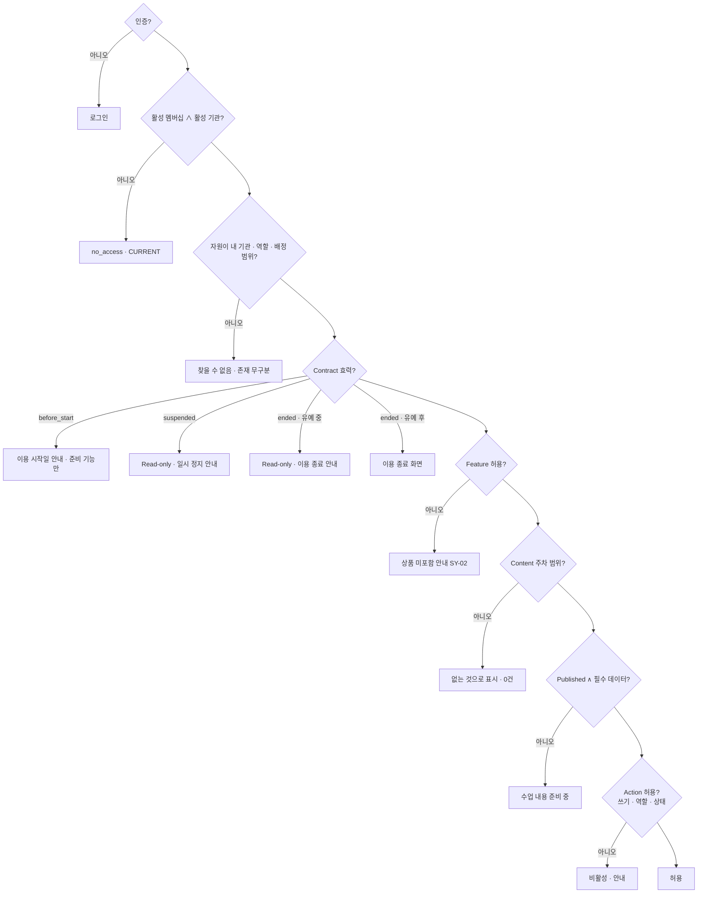

# Entitlement Policy — TeachAble Art Play SaaS Platform 2.0

| | |
|---|---|
| 문서 상태 | PHASE 03 승인본 (검토 반영) |
| 작성 기준일 | 2026-09-27 |
| Branch / 기준 commit | `saas-v2` / `b31fdc9` |
| 관련 문서 | [product-catalog.md](./product-catalog.md) · [contract-policy.md](./contract-policy.md) · [../02-ia/permission-matrix.md](../02-ia/permission-matrix.md) · [../02-ia/state-error-model.md](../02-ia/state-error-model.md) |
| 관련 결정 | DEC-031 · DEC-037 · DEC-044 · DEC-048 · DEC-052 · DEC-055 · DEC-056 · DEC-057 · DEC-060 · DEC-063 |

> 정확한 RLS · 서버 게이트 구현 위치는 PHASE 05 (AD-2). *→ DEC-083: runtime derive · 저장 안 함 · 기관 단위 `org_has_feature` + 반 단위 `class_has_feature` (계약 class scope 포함 — 다른 반의 계약으로 현재 반 기능이 열리지 않음) · [../05-data-security/rls-security-architecture.md](../05-data-security/rls-security-architecture.md)* 본 문서는 판정 규칙과 사용자 경험의 대응만 정한다.

---

## 1. Feature Entitlement (DEC-055)

- Entitlement는 **유효 Contract에서 파생**한다. 일반 운영자는 직접 수정하지 않는다 (DEC-048).
- Feature Catalog와 상품별 배분: [product-catalog.md §6](./product-catalog.md#6-feature-catalog-dec-055).
- 교직원 기본 운영(오늘 · 이력 · 출결 · 관찰 · 리포트 조회 · Emergency Hide · 단건 인쇄)은 유효 계약이면 항상 허용되며 Feature Code가 없다.
- 기능 권한은 **UI 숨김만이 아니라 Server / DB에서 강제**한다 (DEC-016 · DEC-031).

| 요약 | STARTER | STANDARD | PREMIUM | PILOT |
|---|---|---|---|---|
| `class_mode` | ✅ | ✅ | ✅ | ✅ |
| `weekly_report` | ✅ | **✅** | ✅ | ✅ |
| `monthly_report` (P1) | ✖ | ✅ | ✅ | ✖ |
| `semester_report` (P2) | ✖ | ✅ | ✅ | ✖ |
| `director_dashboard` | **✖** | ✅ | ✅ | **✅** |
| `parent_portal` | ✅ | ✅ | ✅ | ✅ |
| `ai_assist` (*Updated by DEC-070*) | **✖** | ✅ C1+C2+C3 | ✅ C1+C2+C3 | ◐ 특수: **C1만** |

`semester_report`는 `monthly_report`를 필수 dependency로 두지 않는다. Observation · Weekly · Monthly 등 허용된 Evidence Source에서 독립 생성할 수 있어야 한다 (source aggregation은 PHASE 04/05). *Updated by DEC-068: Semester 식별자 = Child × Assignment × **Reporting Term** (flexible period).*

**AI capability 사용 가능 = `ai_assist` ∧ 해당 Report Entitlement ∧ 해당 기능 Service Ready** (DEC-070). 예: C2 Monthly Draft는 `monthly_report`가 없는 상품에서 쓸 수 없다. AI 생성 권한은 담당 반 Teacher만. 외부 AI 사용은 AR-8 해결 후 (DEC-071).

**Monthly 기간** (*Updated by DEC-067*): Program 4-Week Block (Week 1~4 · 5~8 · …) — 달력 월 아님.

---

## 2. Content Entitlement

콘텐츠 권한은 기능 권한과 분리한다 (DEC-055).

| Offer / Product | Week range |
|---|---|
| PILOT | 1~4 |
| STARTER | 1~8 |
| STANDARD | 1~16 |
| PREMIUM | 1~24 |

| 규칙 | 내용 |
|---|---|
| Program access | 상품 버전이 가리키는 프로그램만 배정 가능. 구조(상품별 Program vs 24주 단일 계열 + 주차 범위)는 **CO-7 · PHASE 05** |
| Week access | 범위 밖 주차는 **없는 것으로 보인다** (조회 0건 · DEC-044). HQ 단계에서 배정 · 세션 생성이 막힌다 |
| Lesson access | 배정된 반 · 발행된 차시 · 필수 수업 데이터 존재 (DEC-037) |
| Content version | 반 배정은 Program 버전에 고정 (content-governance G-2) |
| Published only | `PUBLISHED` ∧ Entitlement (C-1 · G-7) |
| Contract period | 효력 기간 밖에서는 새 수업 불가 (§4 판정) |
| Archived content | 기존 배정은 계속 동작 · 신규 배정 불가 |
| Upgrade 후 | 적용일부터 확장 범위 배정 가능 · 기존 배정 · 기록 불변 |
| Downgrade 후 (Renewal) | 범위 밖 주차는 새 세션 불가 · **기존 기록은 이력에서 조회 가능** |

---

## 3. Record Preservation (DEC-055 · DEC-052)

> **권한이 줄어도 기존 기록은 삭제되지 않는다.**

| 상황 | 기존 기록 접근 |
|---|---|
| 상품 Downgrade · Entitlement 축소 | **기본적으로 유지.** 막히는 것은 새 작업과 해당 기능 화면(예: Dashboard) |
| Contract `suspended` | Read-only (DEC-052) |
| Contract `ended` | **Contract End / Read-only 정책(DEC-052 · CO-1)의 기간 동안만** Staff Read-only |
| Organization `suspended` | 전면 차단 (우선) |
| 데이터 삭제 | 파기 절차로만 (CO-2). 권한 변화는 삭제를 일으키지 않는다 |

**이 원칙을 영구 로그인 권리로 해석하지 않는다.** 계약 종료 이후의 실제 Staff 접근 가능 기간은 End / Read-only 정책을 따른다.

---

## 4. Evaluation Order

| 단계 | 판정 | UX (PHASE 02 연결) |
|---|---|---|
| 1 | 인증 | `/login` |
| 2 | 멤버십 · 기관 활성 | `no_access` (CURRENT) |
| 3 | **자원 소속** (기관 · 역할 · 배정) | "찾을 수 없거나 접근 권한이 없습니다" — 존재 무구분 (DEC-044) |
| 4 | Contract 효력 | 이용 시작 전 · 일시 정지 · 이용 종료 안내 (SY-02 계열) |
| 5 | Feature | "현재 이용 상품에 포함되지 않은 기능" (SY-02) |
| 6 | Content 범위 | 0건 · 찾을 수 없음 |
| 7 | Published · 필수 데이터 | "수업 내용이 아직 준비되지 않았습니다" (DEC-037) |
| 8 | Action (쓰기 · Read-only · 역할 · 세션 상태) | 버튼 비활성 · 안내 (DEC-046 · DEC-047 포함) |

**자원 소속(3)을 Contract · Feature 판정보다 앞에 둔다.** 다른 기관의 자원 ID에 대해 "상품 미포함"이나 "계약 종료" 안내가 먼저 나가지 않게 하기 위해서다. Contract · Feature 판정은 **자기 기관**에 대한 정보만 드러낸다.

---

## 5. STARTER Director Boundary (DEC-056)

**경계 원칙**: 대시보드의 가치는 "놓친 것을 시스템이 먼저 알려주는 것"(자동 누락 탐지 · 기간 집계)이다. 운영에 필요한 **개별 기록 접근**은 STARTER에도 제공한다.

| 기능 | 분류 |
|---|---|
| `/director` Dashboard (오늘 요약 · follow-up · 30일 집계 · 최근 리포트) | **NOT INCLUDED · UPSELL** |
| 자동 누락 탐지 · 기간 집계 | **NOT INCLUDED · UPSELL** |
| Dashboard 확장 카드 (D-1 ~ D-4 · P1) | **NOT INCLUDED · UPSELL** |
| Bulk Print (P1) | **NOT INCLUDED · UPSELL** |
| Director Sessions (오늘 목록 · 취소 · 진행 중 완료) | **OPERATIONALLY REQUIRED** |
| Session History (목록 · 필터) | INCLUDED |
| Attendance read / edit | **OPERATIONALLY REQUIRED** |
| Observation read | INCLUDED |
| Complete Report read | **OPERATIONALLY REQUIRED** |
| Parent Portal 관리 | **OPERATIONALLY REQUIRED** (C-5) |
| Photo Consent 상태 | **OPERATIONALLY REQUIRED** (C-6 · DEC-059) |
| Emergency Hide | **OPERATIONALLY REQUIRED** (DEC-043) |
| 단건 Print | INCLUDED |

**우회 방지 규칙**

| 규칙 |
|---|
| 제공되는 화면에서 **Dashboard의 집계 · 누락 탐지 가치를 우회 제공하지 않는다** |
| 학부모 공유 화면(DR-08)은 아동별 원자료 목록만 보여준다. "공유율 N%" · "동의율 N%" 같은 집계 카드는 Dashboard 기능 (D-3 · D-4) |
| 수업 이력 화면에 "출결 기록 없음 N건" 같은 누락 요약을 추가하지 않는다 |
| 개별 세션을 열어 확인하는 것은 가능하다 (시스템이 먼저 알려주지 않을 뿐) |

---

## 6. Portal Relation

| 상황 | Parent Portal |
|---|---|
| Contract `in_service` | 정상 (complete ∧ 공개 · 아동 Portal 활성 ∧ 숨김 아님) |
| Contract `before_start` | 공개할 리포트가 아직 없음 |
| Contract `suspended` | 이미 공개된 리포트 표시 유지 · 새 공개 · 새 링크 · 재발급 없음 (DEC-052) |
| Contract `ended` | 기존 공개 링크 별도 정책 · 새 공개 · 새 링크 없음 · 유지 기간은 **CO-12** |
| Organization `suspended` | Portal 실패 화면 (무구분) |
| `parent_portal` Entitlement | 전 상품 포함 (DEC-055) |
| 결석 · 미공개 · 미작성 주차 | 사유 구분 없음 · 이전 리포트를 "이번 주"로 보이지 않음 · "현재 새로 공유된 기록이 없습니다" + 필요 시 "최근 공유 기록 · Week N · 실제 날짜" (DEC-060) |
| 모든 리포트 표시 | 실제 week · date 항상 표시 (DEC-060) |

학부모 경로의 어느 단계에서 실패하든 **하나의 실패 화면**이다 (DEC-044 · AI-14).

---

## 7. Service Ready Gate (DEC-063)

| 판정 지점 | 규칙 |
|---|---|
| Contract 활성화 | Product Version이 **계약상 INCLUDED로 약속한 Content · Report capability · Feature · Entitlement dependency 전체**가 Service Ready가 아니면 활성화 불가. **후반 기능 자동 예외 없음** · *Updated: STARTER는 8주 Summary View 포함 (DEC-069) · STANDARD · PREMIUM은 AI C1+C2+C3 포함 (DEC-070)* |
| Pilot | Pilot Ready (DEC-037 필수 데이터 · DEC-051 반당 ≤ 15명 · **HQ override 없음**) |
| Class Mode 진입 | 필수 수업 데이터 부족 시 차단 (DEC-037) — 활성화 이후에도 차시 단위로 유지 |
| Upgrade | 대상 상품이 Service Ready여야 후속 계약 활성화 가능 |

학기 말 Semester처럼 계약 후반에 처음 쓰이는 기능도 **활성화 전에 Ready**여야 한다 (DEC-063 명확화 · 구 CO-13 해소). 일부 기능을 나중에 제공하려면 별도 Product Version 또는 축소 Offer를 향후 결정으로 정의한다. Readiness 계산 방식은 PHASE 05.
