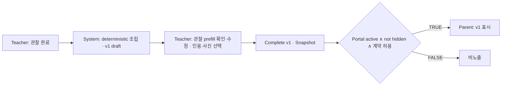
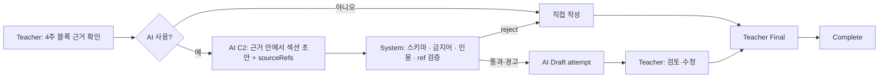
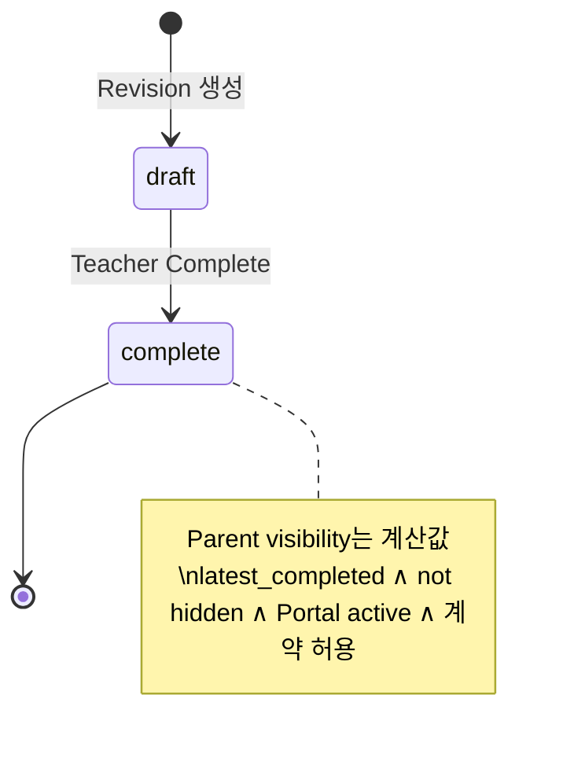
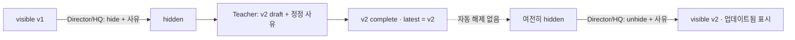
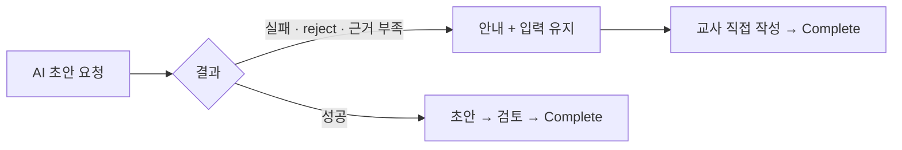
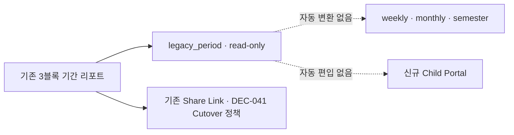

# Report Lifecycle

| | |
|---|---|
| 문서 상태 | PHASE 04 승인본 |
| 작성 기준일 | 2026-09-27 |
| Branch / 기준 commit | `saas-v2` / `11269e6` |
| 관련 문서 | [report-architecture.md](./report-architecture.md) · [ai-architecture.md](./ai-architecture.md) · [../02-ia/report-portal-flow.md](../02-ia/report-portal-flow.md) · [../02-ia/state-error-model.md](../02-ia/state-error-model.md) |
| 관련 결정 | DEC-030 · DEC-034 · DEC-040 · DEC-043 · DEC-052 · DEC-060 · DEC-073 · DEC-074 · DEC-075 · DEC-077 |

> 상태 이름은 제품 개념이다. DB 컬럼 · enum 이름은 PHASE 05에서 정한다.

---

## 1. Logical Report와 Revision (DEC-073)

```
Logical Report  (type × child × assignment × period)
   ├─ Revision v1  complete  ← latest_completed_revision
   ├─ Revision v2  draft     ← working_revision
   └─ HIDE state (logical report 단위)
```

| 개념 | 의미 |
|---|---|
| **working_revision** | 지금 교사가 작성 · 정정 중인 draft Revision (없을 수 있음) · *DB: 포인터 저장 없이 `status = draft` 부분 unique로 파생 (DEC-089)* |
| **latest_completed_revision** | 가장 최근 complete된 Revision. 학부모에게 보일 수 있는 유일한 Revision · *DB: `latest_completed_revision_id` 개념 포인터 · 같은 리포트의 complete revision만 (DEC-089)* |

| 순서 | working | latest_completed |
|---|---|---|
| v1 draft 생성 | v1 | 없음 |
| v1 complete | 없음 | **v1** |
| v2 (정정) draft 생성 | v2 | **v1** (학부모는 계속 v1) |
| v2 complete | 없음 | **v2** |

---

## 2. State Axes (DEC-074)

| 축 | 값 | 단위 | 저장 |
|---|---|---|---|
| REPORT TYPE | weekly · monthly · semester · legacy_period | Logical Report | 저장 |
| CONTENT REVISION | draft · complete | Revision | 저장 |
| HIDE | visible · hidden (+ 사유 · actor · 시각) | Logical Report | 저장 |
| AI GENERATION | requested · generated · failed · rejected + applied 여부 | Generation attempt | 저장 (리포트 상태와 분리) |
| **PARENT VISIBILITY** | TRUE / FALSE | Logical Report | **계산값** |

**별도 "published" 상태를 저장하지 않는다.**

---

## 3. Computed Visibility

**Parent visibility = latest_completed_revision 존재 ∧ report not hidden ∧ Child Portal active ∧ Portal / Contract access policy 허용**

| 근거 | 내용 |
|---|---|
| DEC-030 | Teacher Complete = Publish Eligible. Director 사전승인 없음 |
| DEC-040 | Portal 활성 아동은 latest completed revision을 **추가 Director publish 없이** 본다 |
| DEC-043 · DEC-074 | Hidden이면 차단 |
| DEC-052 | 계약 정지 · 종료 시 기존 공개분 · 새 공개 규칙. 기간은 CO-1 · CO-12 |
| DEC-060 | 이번 주 새 공개가 없으면 이전 리포트를 "이번 주"로 보이지 않음 |

**Complete ≠ Published**: Complete = 교사 내용 확인 완료 · Revision Snapshot 확정. 학부모에게 보이는지는 위 계산으로 결정된다.

---

## 4. Revision / Correction (DEC-073 · PH3-3)

| 규칙 |
|---|
| Completed Revision **직접 수정 금지** · complete → draft **rollback 금지** |
| 정정 = Teacher가 **새 Revision** 생성 (직전 complete 내용을 복사한 draft) · **정정 사유 필수** |
| P0는 minor / major correction을 별도 Workflow로 나누지 않는다 |
| 정정 draft가 있는 동안 학부모는 기존 latest completed revision을 본다 |
| 새 Revision에는 새 Template Version · 새 AI generation 규칙이 적용될 수 있다. 기존 Revision은 불변 |
| 완료된 적 없는 draft만 삭제 가능. Complete Revision hard delete 금지 (파기는 CO-2) |
| Revision 생성 · 편집 권한: 해당 Class Assignment 담당 Teacher (DEC-077) |

| 상황 | 처리 |
|---|---|
| complete · 아직 not visible | 정정 Revision → complete → latest 교체 |
| visible · 오타 | 정정 Revision 작성 중 v1 계속 표시 → v2 complete 시 교체 |
| visible · 잘못된 사진 · privacy · 중대한 사실 오류 | **먼저 Emergency Hide** → 정정 Revision → complete → Director/HQ가 사유와 함께 **unhide** |
| hidden 상태에서 v2 complete | **자동 unhide 없음** |

---

## 5. Emergency Hide / Unhide (DEC-043 · DEC-074)

| 항목 | 내용 |
|---|---|
| 단위 | **Logical Report** (모든 Revision) |
| 권한 | **Director · Authorized HQ(admin)** — hide · unhide 모두. Sales · Teacher 불가 |
| 필수 기록 | 사유 · actor · timestamp · audit |
| 의미 | Report 삭제가 아니다 · Draft 되돌림이 아니다 |
| Teacher | Correction Revision 작성. 숨김 상태 · 사유 조회 |
| 재발행 | = **unhide**. 새 링크 · 새 URL 없음 |

| 구분 | Emergency Hide | Consent Withdrawal | Content Correction |
|---|---|---|---|
| 대상 | Logical Report 전체 | 해당 아동 사진 노출 | 리포트 내용 |
| 수단 | hide 상태 | 동의 상태 → 사진 표시 차단 (DEC-059) | 새 Revision |
| 텍스트 | 전체 비노출 | **유지** (Snapshot 재작성 없음) | 새 Revision 텍스트 |
| 해제 | Director/HQ unhide + 사유 | 동의 재기록 | Revision complete |

법적 처리 범위는 CO-9 · CO-10.

---

## 6. Parent Presentation (DEC-075)

| 규칙 |
|---|
| 이전 Revision history를 보여주지 않는다 |
| 현재 표시 Revision > 1이면 **"업데이트됨 YYYY.MM.DD"** 표시 (Copy · 위치는 PHASE 06) |
| Portal URL은 Revision마다 새로 만들지 않는다. **같은 Portal에서 latest completed revision을 표시** (Portal 만료 정책 CO-12와 분리) |

---

## 7. Deletion

| 대상 | 삭제 |
|---|---|
| 완료된 적 없는 draft | 가능 (audit) |
| Complete Revision · Visible report | **hard delete 금지** — hide · revision 사용 |
| Retention · erasure | CO-2 정책에 따름 |

---

## 8. Concurrency (DEC-077)

낙관적 동시성 (`updated_at` 토큰 · Invariant AI-6). **last-write-wins 금지 · edit lock 없음.** 충돌 시 "다른 곳에서 수정되었습니다 — 최신 내용 확인 후 다시."

---

## 9. Audit Requirements

| 이벤트 | actor · time · report/revision | before/after | reason |
|---|---|---|---|
| report created · revision created | ✅ | — | 정정 Revision **필수** |
| AI requested · generated · failed · rejected | ✅ | validation 결과 | — |
| teacher edited | ✅ | 섹션 단위 (선택) | — |
| revision completed | ✅ | Snapshot | — |
| hidden · unhidden | ✅ | ✅ | **필수** |
| photo display blocked due to consent state | ✅ | ✅ | — |
| Portal share activated · revoked | ✅ | ✅ | revoke 시 선택 |
| draft deleted | ✅ | — | — |

실제 audit 구조는 PHASE 05. *→ DEC-093: domain 행위자 컬럼 + append-only `audit_events` · 본문 · 인용 · AI raw output · token · 보호자 개인정보 미기록 · Director는 audit_events 전체 직접 조회 없음*

---

## 10. Mermaid Flows

**A. No-AI Weekly**


**B. AI-assisted Monthly**


**C. Complete → Visibility**


**D. Published → Hide → Correct → Republish**


**E. AI failure → Manual continue**


**F. Legacy Report**

