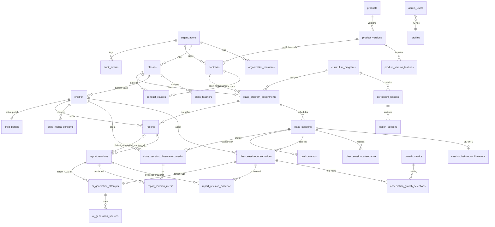

# Target Data Model

| | |
|---|---|
| 문서 상태 | PHASE 05 승인본 (문서 검토 대기) |
| 작성 기준일 | 2026-09-27 |
| 상위 문서 | [architecture-overview.md](./architecture-overview.md) |
| 관련 결정 | DEC-079 ~ DEC-096 |

> 모든 테이블 · 컬럼 · 함수 이름은 **PROPOSED 개념 이름**이다. 타입 · FK 방식 · 제약 표현 · 인덱스는 PHASE 07에서 확정한다. **SQL이 아니다.**
>
> 표기: **[기존]** 현재 존재 · **[확장]** 기존 테이블에 추가 · **[신규]** 새 테이블 · **[legacy]** Cutover 후 read-only.

---

## 1. ERD (개념)

legacy 1.0 테이블(`child_growth_reports` · `child_growth_report_sources` · `child_growth_report_ai_drafts` · `child_growth_report_shares` · `observation_domains` · `class_session_observation_domains`)은 ERD에서 생략했다. Cutover 후 read-only로 유지된다 (§10).

---

## 2. Identity · Tenant

| 테이블 | 구분 | 핵심 | 결정 |
|---|---|---|---|
| `profiles` | [기존] | auth 사용자 프로필 | — |
| `private.admin_users` | [확장] | 전역 HQ 역할 admin · sales (향후 content). **판정 헬퍼 분리** `is_hq_admin` · `is_hq_sales` | DEC-079 |
| `organizations` | [기존] | Tenant 루트 | — |
| `organization_members` | [기존] | director · teacher · active 상태. 한 사용자 여러 기관 가능. `parent` 역할 추가하지 않음 (DEC-016) | DEC-079 |
| `classes` | [기존] | 반 | — |
| `class_teachers` | [기존] | 교사 × 반 배정 · 교사 권한의 기준 · 배정 해제는 audit | DEC-080 |
| `children` | [기존] | `class_id` 직접 연결 유지 · 반 이동은 RPC + audit · 이력 테이블은 DB-1 | DEC-080 |

모든 기관 범위 테이블: `organization_id` 보유 + 부모 참조 복합 FK (DI-1).

---

## 3. Commerce

| 테이블 | 구분 | 핵심 | 결정 |
|---|---|---|---|
| `products` | [신규] | STARTER · STANDARD · PREMIUM 등 상품 식별 | DEC-048 |
| `product_versions` | [신규] | lifecycle `draft` · `published` · `retired` · `published_at` (불변 시점 · 별도 `locked_at` 없음) · offer 유형 regular · pilot · promised content scope · report capability | DEC-081 |
| `product_version_features` | [신규] | version × feature code. `ai_assist`의 C1 · C2 · C3 scope는 **고정 집합으로 검증되는 값** (free text 아님) | DEC-081 · DEC-070 |
| `contracts` | [신규] | 기관 · published version · 상태 · 시작/종료일 · 반당 포함 인원. 날짜 파생 상태는 저장 안 함 | DEC-082 · DEC-050 |
| `contract_classes` | [신규] | 계약 × 반 junction (같은 기관 복합 FK) · 계약 반 수 = 행 수 | DEC-082 |
| `platform_capabilities` | [신규] | 코드로 구현된 기능의 출시 registry (유일한 수동 registry · audit) | DEC-082 · DEC-063 |
| commercial events | [신규 · audit_events 유형 가능] | `overage_started` · `overage_cleared` 등 경계 이벤트 | DEC-095 |

**저장하지 않는 것**: entitlement 결과 · 현재 초과 인원 · 계약 날짜 상태 · 수동 `is_ready`.

**동시 효력 계약 1개 (DI-11)**: Pilot 포함. 강제 수단(exclusion constraint · 활성화 RPC 잠금 등)은 PHASE 07.

---

## 4. Entitlement (계산 · 저장 없음)

| 헬퍼 (PROPOSED) | 입력 | 판정 요소 |
|---|---|---|
| `org_service_mode(org)` | 기관 | 효력 계약 유무 · 날짜 · 상태 → 정상 · 읽기 전용 · 차단 |
| `org_has_feature(org, feature)` | 기관 · feature | 기관 단위 기능 (예: `director_dashboard`) |
| `class_in_effective_contract_scope(class)` | 반 | 현재 effective contract의 `contract_classes`에 속하는가 |
| `class_has_feature(class, feature)` / effective class entitlement | 반 · feature | organization + effective contract + **contract class scope** + product version + version feature + service mode |

반 단위 작업(세션 · 관찰 · 사진 · Weekly · AI C1)은 `class_has_feature`를 쓴다. **다른 반의 계약 범위로 현재 반의 기능이 열리지 않는다.**

---

## 5. Curriculum

| 테이블 | 구분 | 핵심 | 결정 |
|---|---|---|---|
| `curriculum_programs` | [기존 · 확장] | program lineage + version label · published 후 불변 | DEC-084 · DEC-096 |
| `curriculum_lessons` | [기존] | 주차 lesson | — |
| `lesson_sections` | [신규] | lesson × section(§1 ~ §15) content + source reference | DEC-096 |
| `lesson_activities` | [기존] | 유지 (section 구조로의 흡수 여부는 PHASE 07) | — |

**Required Content Set**: §1 · §2 · §3 · §4-A · §4-C · §5 · §6 · §11 · §12 · §13 · §15 — Readiness는 발행 상태 + 필수 섹션 존재로 판정한다 (SOURCE EXISTS ≠ PRODUCTION READY).

---

## 6. Class Operation

| 테이블 | 구분 | 핵심 | 결정 |
|---|---|---|---|
| `class_program_assignments` | [확장] | `id` = stable identity · `origin_contract_id` (provenance · 현재 권한 판정에 쓰지 않음) | DEC-084 |
| `class_sessions` | [확장] | 상태 `scheduled` · `in_progress` · `completed` · `cancelled` 유지 · `week_no` 생성 시 복사(불변) · 시작 · 완료 행위자 · Recovery 사유 · 행위자 · 시각 | DEC-085 |
| `session_before_confirmations` | [신규] | who · when · session · confirmation state. `in_progress` 전환의 필수 조건 | DEC-036 · DEC-085 |
| `class_session_attendance` | [기존] | 유지 | — |
| `quick_memos` | [신규] | 작성 교사 · 세션 · 본문. **author only** · TTL은 CO-2 | DEC-087 |

**세션 상태 전환 (DI-13)**

| 전환 | 경로 | 주체 |
|---|---|---|
| scheduled → in_progress | `start_session` (BEFORE 확인 필수) | 배정 Teacher |
| in_progress → completed | `finish_session` | 배정 Teacher |
| in_progress → completed | `recover_complete_session` (reason 필수 · audit) | Director · authorized HQ Admin |
| scheduled → completed | **금지** | — |
| → cancelled | 현재 규칙 유지 (확대 없음) | 현재와 동일 |

---

## 7. Observation · Growth 5 · Media · Consent

| 테이블 | 구분 | 핵심 | 결정 |
|---|---|---|---|
| `class_session_observations` | [확장] | 세션 × 아동 · `taxonomy` (`legacy_domains` · `growth5`) · draft/complete · `child_voice` 원문 단일 컬럼 | DEC-086 |
| `growth_metrics` | [신규] | Growth 5 카탈로그 · stable code + display label | DEC-086 |
| `observation_growth_selections` | [신규] | 관찰 × 지표 unique · **stage NOT NULL** · 코드 `together` · `after_modeling` · `independent` | DEC-086 |
| `observation_domains` · `class_session_observation_domains` | [legacy] | 구 5영역 · 신규 관찰에서 사용 안 함 (DI-14) | DEC-094 |
| `class_session_observation_media` | [확장] | 세션 × 아동 · hidden/deleted 상태 · 삭제 요청자 · 시각 · Storage 제거 상태(대기 · 완료 · 실패) | DEC-088 |
| `child_media_consents` | [신규] | 아동별 운영 동의 상태(`unknown` · `consented` · `declined` · 철회 표현은 PHASE 07) · recorded_by · recorded_at · 증빙 참조 · audit | DEC-088 |

| Stage code (PROPOSED) | 표시 label |
|---|---|
| `together` | 함께 |
| `after_modeling` | 보고 나서 |
| `independent` | 스스로 |
| (행 없음) | 기록 없음 |

숫자 변환 · 점수 · 평균 없음. **`consented`는 운영 기록이며 법적 공개 허가를 의미하지 않는다.** `unknown` · `declined`는 공개 불가.

---

## 8. Report 2.0

| 테이블 | 구분 | 핵심 | 결정 |
|---|---|---|---|
| `reports` | [신규] | 유형(weekly · monthly · semester) · 아동 · program assignment · 기간 discriminator(주차 · 블록 · reporting term) · 숨김(사유 · 행위자 · 시각) · `latest_completed_revision_id` | DEC-089 · DEC-074 |
| `report_revisions` | [신규] | `revision_no` (표시 · 순서) · `draft` / `complete` · 정정 사유 · template version · final content JSONB · 동시성 토큰 · 완료자 · 완료 시각 | DEC-089 · DEC-090 |
| `report_revision_evidence` | [신규] | revision × 근거 관찰: 교사 노트 · 인용 원문 · Growth 5 선택 · 수업 맥락 · 원천 관찰 ref. **AI 컬럼 없음** | DEC-090 |
| `report_revision_media` | [신규] | revision × media reference. 표시 여부는 조회 시 동의 · 삭제 상태로 계산 | DEC-090 · DEC-073 |

- 식별자별 논리 리포트 1개 (DI-2) · draft revision 최대 1 — **working revision = `status = draft` 부분 unique로 파생** (DI-5).
- `latest_completed_revision_id`는 같은 리포트의 complete revision만 (DI-6 · FK 방식 PHASE 07).
- published boolean 없음 · visibility 계산 · 완료 revision · 스냅샷 UPDATE / DELETE 금지 (DI-4).

---

## 9. AI · Parent · Audit

| 테이블 | 구분 | 핵심 | 결정 |
|---|---|---|---|
| `class_session_observation_ai_drafts` | [기존] | P0 C1 경로 유지 · Director 접근 제거 | DEC-091 · DEC-093 |
| `ai_generation_attempts` | [신규 · P1] | capability · 대상(관찰 FK / revision FK 중 정확히 하나) · 상태 · provenance · validated draft JSONB · sanitized error category · **원 payload 컬럼 없음** | DEC-091 · DEC-078 |
| `ai_generation_sources` | [신규 · P1] | attempt × 근거 junction | DEC-091 |
| `child_portals` | [신규] | 아동 · public portal id · token hash/verifier · 상태 · 발급 · 폐기 시각 · `expires_at` (nullable 확장 지점 · CO-12) · 아동당 활성 1개 | DEC-092 |
| `audit_events` | [신규] | event type · actor · organization · target type/id · time · sanitized reason/category · safe metadata · **append-only** | DEC-093 |

Audit · 로그 금지 내용: child quote 본문 · 교사 관찰 본문 · AI raw output · 사진 binary / path secret · portal token · full prompt · 보호자 개인정보.

---

## 10. Legacy 1.0 (read-only after Cutover)

| 테이블 | 처리 |
|---|---|
| `child_growth_reports` · `child_growth_report_sources` · `child_growth_report_ai_drafts` | Cutover 전 **현재 제약 그대로** (`ai_draft_id` NOT NULL · GR003 포함) · Cutover에서 write RPC 중지 · read adapter로 조회 |
| `child_growth_report_shares` | DEC-041 유지 · 신규 Portal과 merge 없음 |
| `observation_domains` · `class_session_observation_domains` | 과거 관찰 보존 · 구 영역 inactive |

Legacy 조회 유지 기간 · 물리 삭제는 DB-6 (CO-2).
